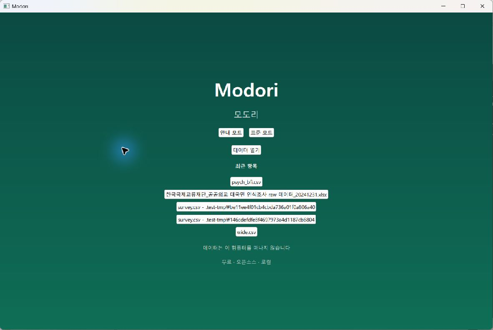
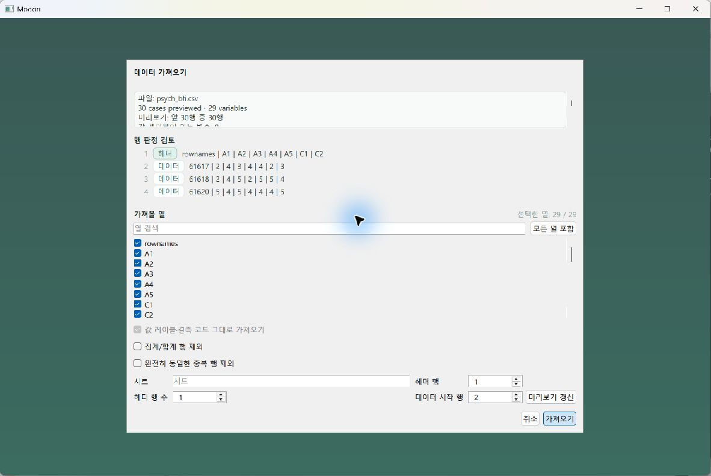
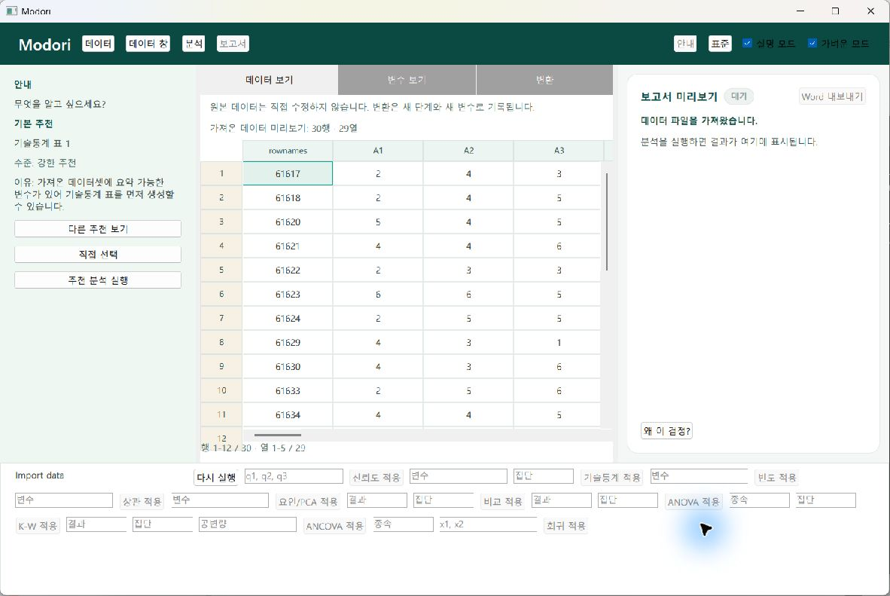
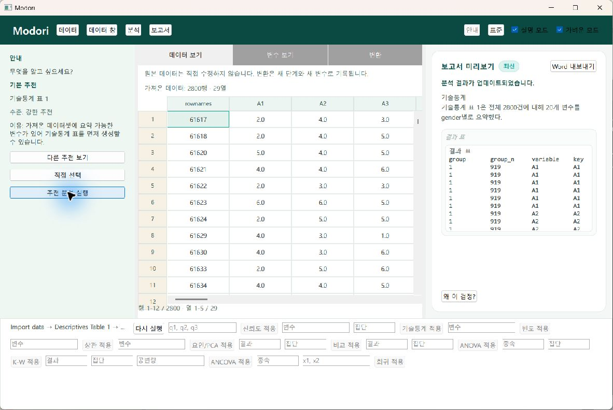
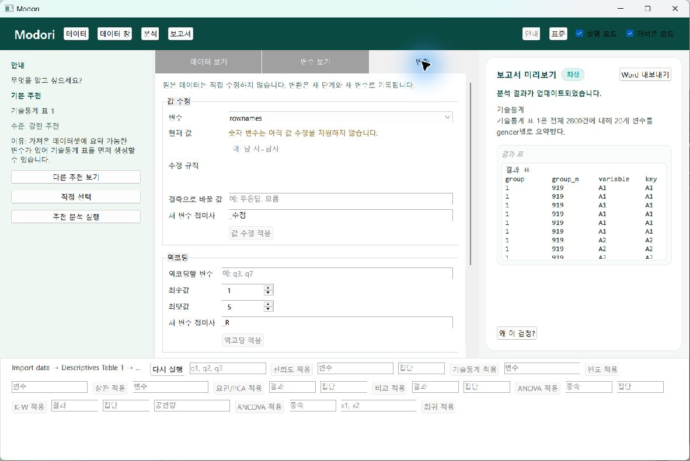
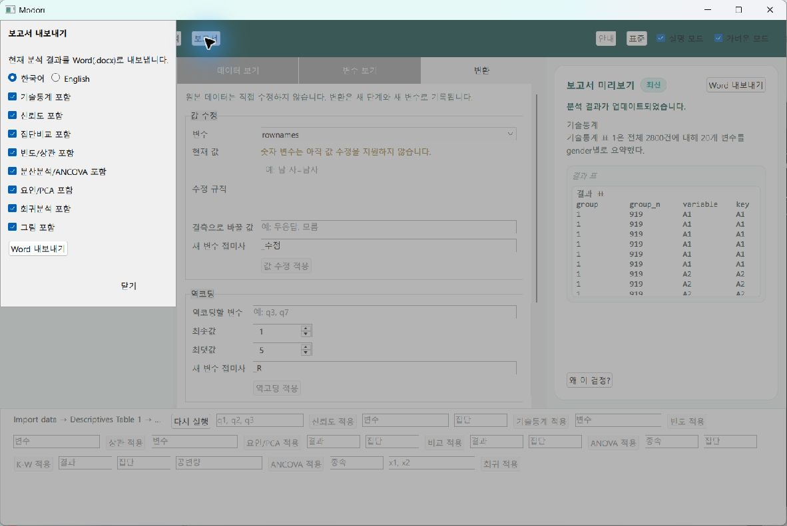

# Modori 오로라 글래스·편의성 사전 감사

- 기준: `release/readiness-1-9` / `ab3b9b966f7880298235fa582e9370adbd9c1bb5`
- 화면 크기: 기본 데스크톱 창 1180×760
- 흐름: 진입 → CSV 가져오기 → 안내 모드 작업 → 추천 분석 결과 → 변환 → 보고서 옵션
- 목표: 오로라 글래스를 적용하되 데이터·결과의 판독성과 작업 효율을 우선한다.

## 전체 판단

기능 흐름과 접근성 이름은 연결되어 있지만, 화면은 여전히 Qt 기본 컨트롤에 가까워 기존 오로라/포슬린 디자인 의도가 거의 보이지 않는다. 가장 큰 편의성 문제는 하단 분석 설정을 한꺼번에 펼쳐 둔 구조, 최근 파일의 경로 노출, 상시 설정을 체크박스로 표현한 점, 그리고 `적용`·`수정`처럼 원본 변경으로 오해할 수 있는 문구다.

## 단계별 증거

### 1. 진입 화면 — 개선 필요

- 강점: 로컬 처리 문구가 첫 화면에 보인다.
- 문제: `Modori` 아래의 `모도리`는 제품 설명이 아니라 중복 표기다. 세 버튼의 우선순위와 시작 순서가 분명하지 않다.
- 문제: 최근 파일이 긴 경로와 테스트 임시 경로까지 버튼 텍스트로 노출되어 신뢰와 스캔 속도를 떨어뜨린다.
- 권고: 오로라 배경 위에 시작 카드와 최근 파일 카드를 분리하고, 파일명·상위 폴더·최근 사용 시점을 구조화한다.

### 2. 가져오기 — 보통

- 강점: 미리보기, 행 판정, 열 선택, 수동 헤더 보정을 한 흐름에서 처리할 수 있다.
- 문제: 세 영역이 같은 시각 강도로 쌓여 핵심 확인 사항과 고급 보정이 구분되지 않는다.
- 문제: 비활성화된 메타데이터 옵션과 하단 보정 필드가 설명 없이 노출된다.
- 권고: 파일 요약과 핵심 확인을 먼저 보여주고, 행/열 보정은 `가져오기 설정`으로 접어 둔다.
- 체크박스 판단: 열 포함은 다중선택이므로 유지한다. 집계/중복 제외도 이번 가져오기 작업의 선택 항목이므로 체크박스가 맞다.

### 3. 안내 모드 작업 — 개선 필요

- 강점: 추천 이유, 데이터, 결과를 한 화면에서 확인할 수 있고 원본 보호 문구가 보인다.
- 문제: `데이터`, `데이터 창`, `분석`, `보고서`는 행동과 결과가 불분명하다.
- 문제: `설명 모드`와 `가벼운 모드`는 지속 상태를 켜고 끄는 설정이므로 체크박스보다 토글이 적합하다.
- 문제: 안내 모드에서도 모든 표준 분석 입력이 하단에 펼쳐져 화면 높이를 크게 소비하고 작업 초점을 흐린다.
- 권고: 안내 모드에서는 하단 직접 설정을 접고, 표준 모드에서만 분석 종류를 먼저 고른 뒤 해당 입력만 보여준다.

### 4. 결과 — 개선 필요

- 강점: `최신` 상태와 요약 문장이 있어 결과 상태를 알 수 있다.
- 문제: 360px 폭의 패널 안에 원시 텍스트 표를 넣어 열이 잘리고 비교가 어렵다.
- 권고: 요약·핵심 수치·주의를 먼저 보여주고, 상세 표는 넓게 보기 또는 별도 결과 시트로 연다.
- 문구: `왜 이 검정?`은 분석 전제까지 설명하는 기능이므로 `이 분석을 선택한 이유`가 더 정확하다.

### 5. 변환 — 개선 필요

- 강점: 원본 데이터가 보호된다는 원칙을 먼저 알린다.
- 문제: `값 수정 적용`, `역코딩 적용`, `척도 점수 적용`은 원본을 즉시 바꾸는 행동처럼 들린다.
- 권고 문구: `값 정리 단계 추가`, `역코딩 변수 만들기`, `척도 점수 변수 만들기`로 결과와 안전성을 드러낸다.
- 문제: 현재 선택에서 지원하지 않는 섹션도 큰 면적으로 남는다. 사용할 수 있는 변환만 먼저 보여주고 나머지는 이유와 함께 접는다.

### 6. 보고서 옵션 — 개선 필요

- 강점: 언어와 포함 항목을 명시적으로 선택할 수 있다.
- 문제: 대화 상자가 왼쪽에 붙은 기본 패널처럼 보여 작업 화면과 위계가 약하다.
- 체크박스 판단: 보고서 섹션은 복수 선택이므로 체크박스를 유지한다.
- 권고: 중앙 글래스 시트로 바꾸고 `한국어 / 영어`, `포함할 분석`, `그림 포함`을 그룹화한다. 현재 결과가 없는 분석은 설명과 함께 비활성화한다.

## 오로라 글래스 적용 원칙

- 진입·가져오기·대화 상자는 오로라와 반투명 글래스를 강하게 사용한다.
- 작업 화면은 헤더·가이드·상태 배지·레일에만 낮은 강도로 적용한다.
- 데이터 그리드와 결과 본문은 불투명한 포슬린/종이 표면을 유지한다.
- `가벼운 모드`에서는 흐림·광택을 줄이되 정보 구조와 대비는 동일하게 유지한다.

## 접근성 한계

QML 접근성 이름과 키보드 대상은 확인했지만, 스크린샷만으로 포커스 순서, 키보드 완주, 화면 확대 재배치, 스크린 리더 발화, 실제 대비 수치를 확정할 수 없다. 구현 후 별도 검증이 필요하다.
