# 크림 자개 UI 구현 감사

- 검토일: 2026-07-15
- 대상: `release/readiness-1-9`
- 화면: Windows Qt/QML 실제 실행 화면, 논리 뷰포트 1180×760(125% 배율 캡처 1475×950)
- 데이터: `tests/fixtures/psych_bfi.csv`
- 원칙: 크림 바탕, 낮은 채도의 자개 반사, 의미가 있는 상태에만 강조광 사용
- 제외: 이미지 생성 목업, 별도 HTML 프로토타입

모든 PNG는 현재 QML과 실제 `UiController`를 연결한 상태에서 캡처했다. 시작 화면에 머문 초기 오캡처는 화면 전환 값을 검증한 뒤 전부 덮어썼다.

## 01 시작 화면

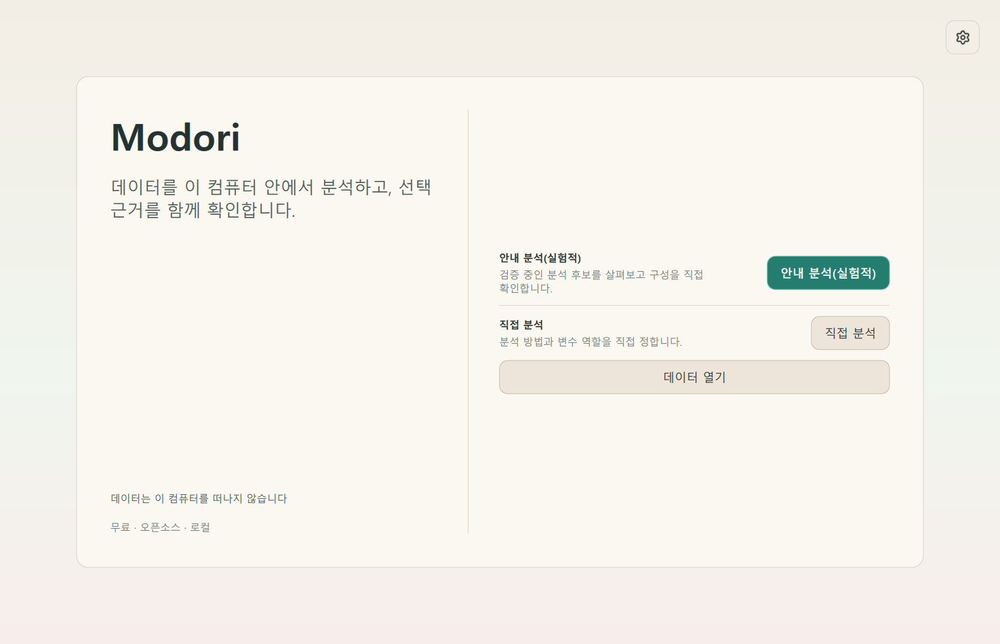

- 위계: 브랜드 약속과 시작 방법을 좌우 두 영역으로 분리했다. 기본 경로인 `직접 분석`과 실험 경로인 `안내 분석(실험적)`을 이름부터 구분한다.
- 문구: 한국어 줄바꿈이 자연스럽고 잘림이 없다. 실험 경로 설명도 검증 중이라는 경계를 유지한다.
- 설정 진입점: 우상단 기어 아이콘은 실제 설정 대화상자를 열며, `설정` 접근성 이름·툴팁·키보드 포커스 테두리를 갖는다.
- 재료: 배경 반사는 흰색 발광 대신 크림 위의 옅은 민트·장밋빛 자개로 제한했다.

## 02 데이터 가져오기

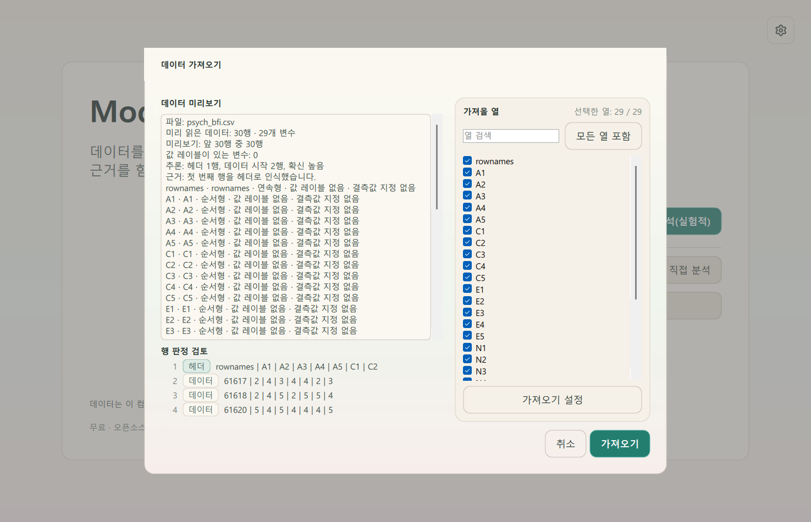

- 위계: 미리보기·행 판정·가져올 열·확정 행동이 한 대화상자에서 읽힌다.
- 문구: `cases`, `variables`, `ordinal`, `no labels`, `no missing`, `high` 노출을 각각 행·변수·순서형·값 레이블·결측값·확신 높음으로 교정했다.
- 제어: 가져올 열과 독립적인 제외 선택은 체크박스로 유지했다. 지속 환경설정이 아니므로 토글로 바꾸지 않았다.
- 대비: 원문 데이터와 판정 표지는 장식보다 높은 대비를 유지한다.

## 03 작업 화면—분석 전

- 위계: 데이터 표, 결과 영역, 분석 구성 레일이 명확히 분리된다. 기본 모드는 `직접 분석`이다.
- 실행 안전성: 분석 단계가 없을 때 상단 `분석 실행`과 하단 `실행`은 비활성화된다. 데이터만 가져온 상태에서 오류를 유도하던 재실행 경로를 막았다.
- 탭: 운영체제 기본 회색 탭을 크림·자개 팔레트와 청록 선택선으로 교체했다.
- 단계명: 내부 영문 단계 `Import data` 대신 `데이터 가져오기`를 표시한다.

## 04 최신 결과

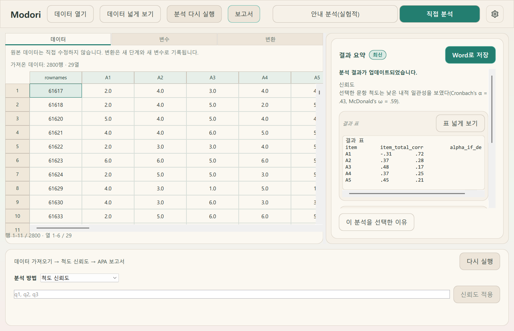

- 위계: 최신 상태 배지, 요약 문장, 결과 표, Word 행동 순으로 읽힌다.
- 문구: 내부 기본 이름 `selected_scale`은 한국어 결과에서 `선택한 문항 척도`로 표시한다. 통계 고유명과 기호는 원형을 유지한다.
- 표: 원자료와 결과 표 모두 크림 배경에서 충분한 문자·격자 대비를 유지하며, 가로 스크롤 가능성을 시각적으로 드러낸다.
- 의미광: 최신 결과와 가능한 Word 저장 행동만 청록 강조를 사용한다.

## 05 결과 표 넓게 보기

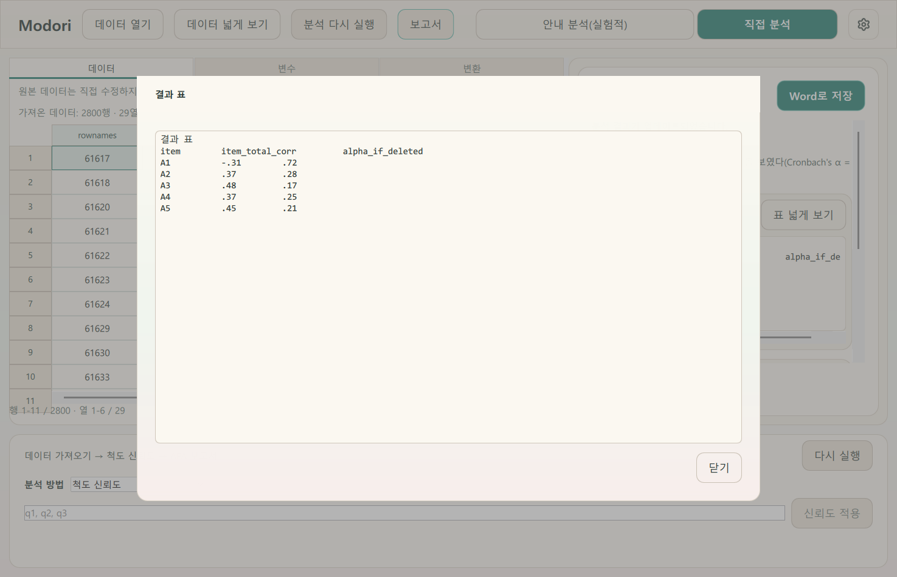

- 위계: 원래 작업 화면을 어둡게 유지하고 결과 표에만 집중하게 한다.
- 동작: 긴 원시 표는 줄바꿈하지 않고 가로·세로 스크롤한다. 닫기 행동은 대화상자 우하단에 고정된다.
- 대비: 표 본문은 장식 없는 표면을 사용해 복사·검토가 쉽다.

## 06 변환

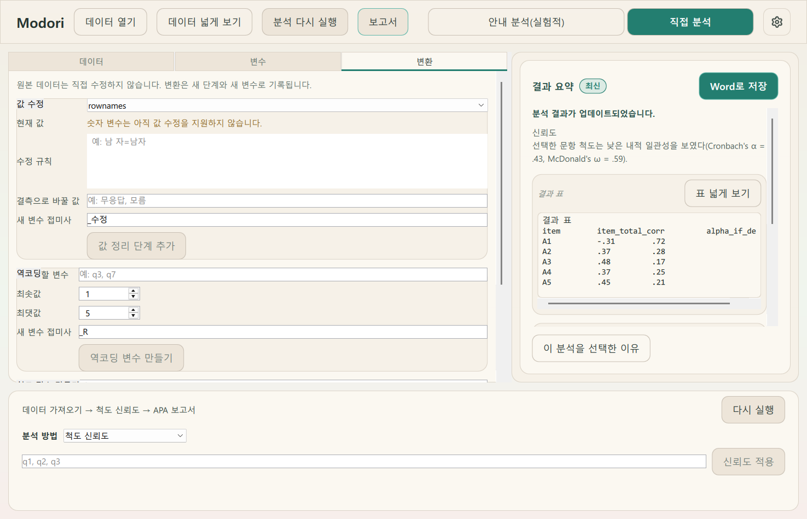

- 위계: 값 정리, 역코딩, 척도 점수 생성이 새 단계·새 변수라는 원칙 아래 분리된다.
- 문구: `값 정리 단계 추가`, `역코딩 변수 만들기`, `척도 점수 변수 만들기`처럼 원자료를 덮어쓰지 않는다는 결과를 동사에 명시했다.
- 제어: 행별 독립 결측 선택은 체크박스로 남기고, 계산 방법·정책처럼 상호 배타적인 값은 콤보박스로 유지했다.

## 07 보고서 내보내기

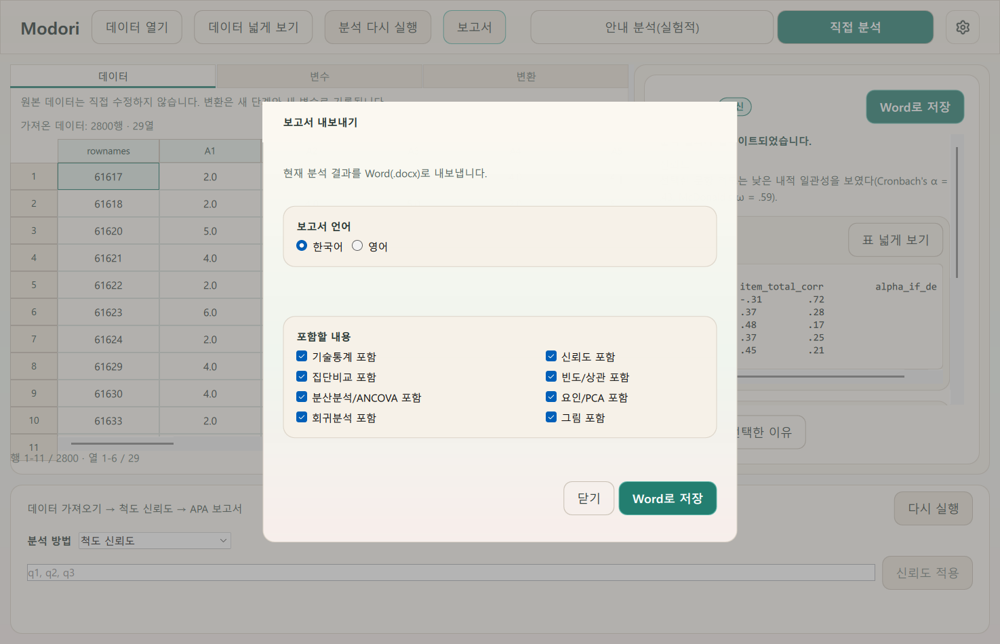

- 위계: 언어와 포함 내용을 분리한 뒤 `Word로 저장`을 최종 행동으로 둔다.
- 문구: 한국어 UI 안의 `English`를 `영어`로 교정했다.
- 제어: 언어는 상호 배타적인 라디오 버튼, 포함 항목은 서로 독립적인 체크박스다. 환경설정 토글로 오해되지 않는다.
- 출처 고지: 실험적 후보에서 확인을 거쳐 실행한 경우에만 Word에 선택 경로 고지를 덧붙인다. 이 정보는 계산 단계·캐시 키가 아닌 현재 UI 세션에만 남으며, 직접 선택 보고서에는 실험 고지가 없다.

## 08 직접 분석 기본값

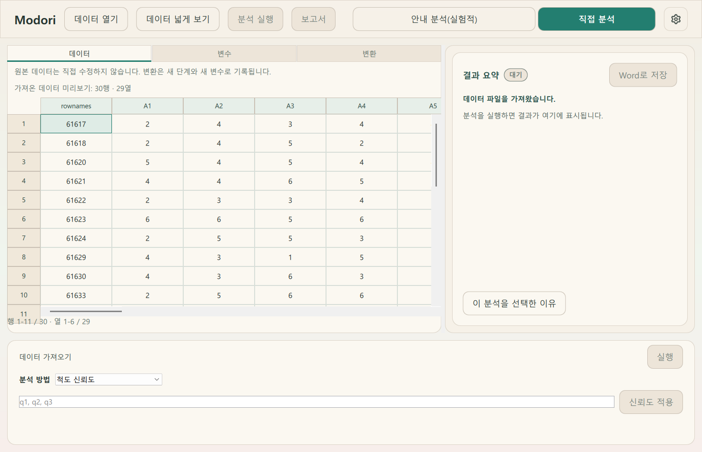

- 한 번에 하나의 분석 방법과 설정 폼만 보인다. 이전처럼 여러 분석 입력이 한 레일에 동시에 노출되지 않는다.
- 방법이나 필드 변경만으로 실행되지 않는다. 먼저 구성을 적용하고, 유효한 분석 단계가 생긴 뒤 별도 실행한다.

## 09 실험적 안내 진입

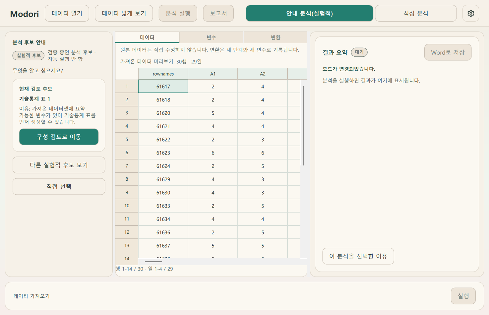

- 상단 모드명과 왼쪽 상태 모두 `실험적` 및 `자동 실행 안 함`을 명시한다.
- 후보는 `현재 검토 후보`로 표현하며 검증되었거나 정답인 분석처럼 보이지 않는다.
- 후보 선택·다른 후보 보기·직접 선택은 파이프라인을 실행하지 않는다.
- 고정 경계: `분석 후보 안내`, `실험적 후보`, `검증 중인 분석 후보 · 자동 실행 안 함`은 폼 스크롤 밖에 고정했다.

## 10 후보 구성—확인 전

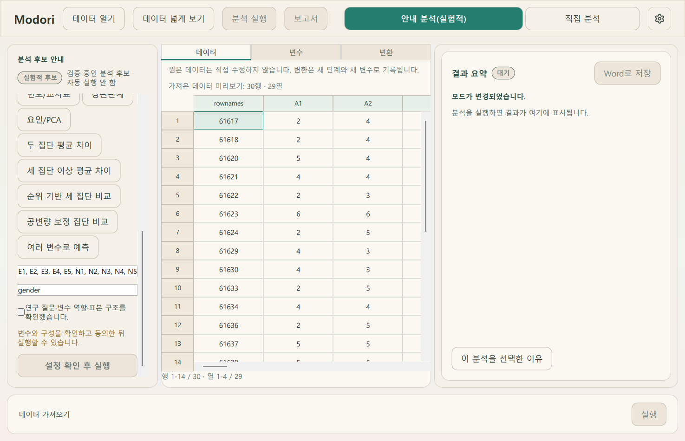

- 후보에서 가져온 변수는 편집 가능한 검토 폼에만 채워진다.
- `연구 질문·변수 역할·표본 구조를 확인했습니다.` 문구를 두 줄로 온전히 표시하도록 체크박스 콘텐츠를 교정했다.
- 확인 전 `설정 확인 후 실행`은 비활성화되며, 경고 문구가 이유를 설명한다.
- 이동: 후보를 준비하면 확인 영역으로 자동 이동하지만, 실험 상태와 자동 실행 금지 문구는 상단에 그대로 남는다.
- 우회 방지: 직접 선택, 모드 이탈, 후보 변경, 데이터·메타데이터·변환 변경 시 후보가 채운 값과 선택 의도를 함께 비워 확인 없는 재사용을 막는다.

## 11 후보 구성—확인 후

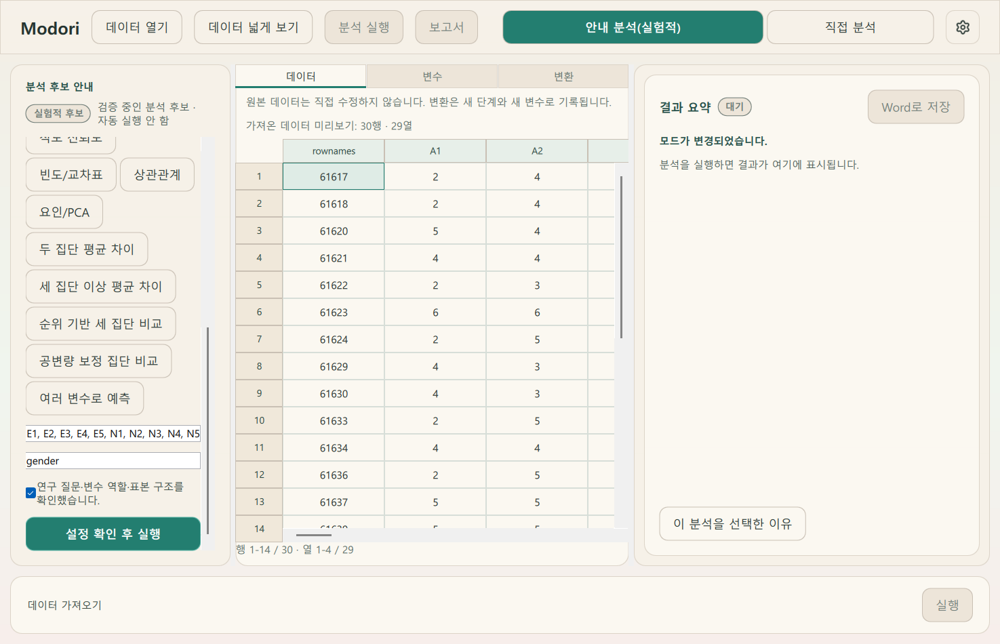

- 명시적 일회성 확인 뒤에만 최종 실행 행동이 청록으로 활성화된다.
- 이 확인은 지속 설정이 아니므로 체크박스가 적절하다. 필드를 다시 편집하면 확인 상태가 해제된다.
- 확인 뒤 실행한 경우에만 현재 분석 선택 출처를 `experimental_candidate_assisted`로 기록한다. 직접 구성에 성공하면 즉시 `manual`로 되돌린다.
- 적용된 실험적 선택 출처는 단순히 직접 선택 화면을 열거나 모드를 바꿨다는 이유로 지우지 않는다. 메타데이터·변환으로 데이터 구성이 바뀌면 출처를 유지한 채 재실행과 보고서 재계산을 막고, 후보 구성을 다시 확인하거나 직접 분석 구성을 저장해야 해제된다.

## 12 시각 효과 줄이기

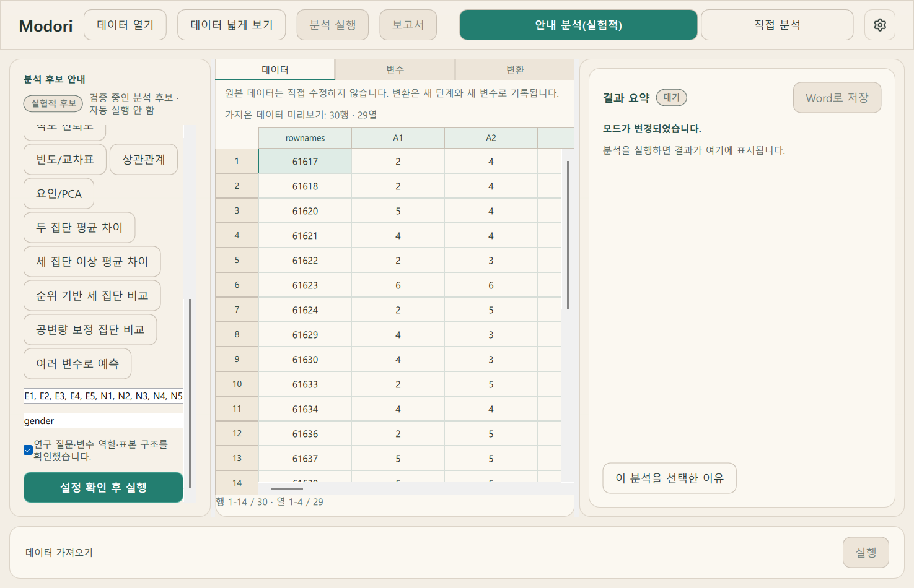

- 자개 그라데이션과 움직임을 줄여도 실험 상태, 변수, 확인 체크, 실행 가능 여부가 그대로 남는다.
- 정보 전달을 색상 효과에만 의존하지 않는다. 텍스트·배지·활성 상태가 동일한 의미를 유지한다.

## 13 변수 화면

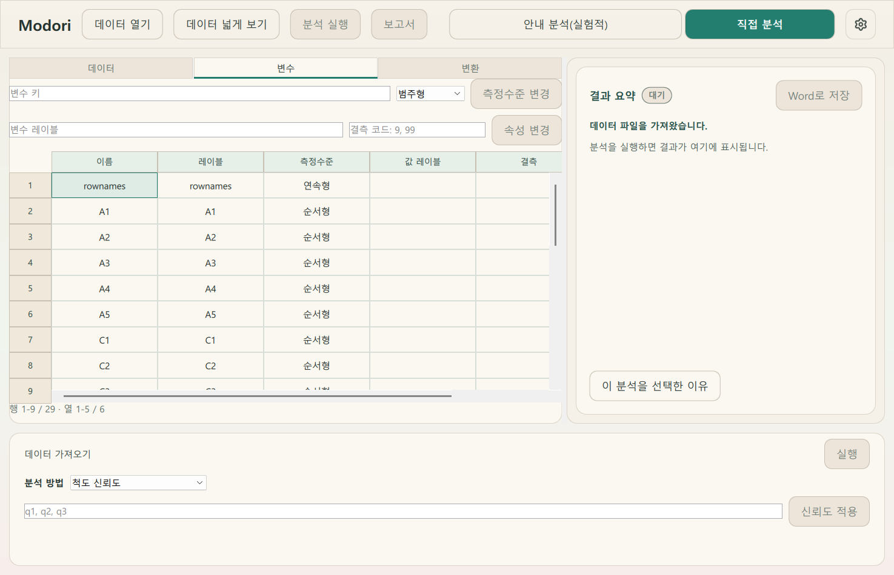

- `nominal/ordinal/scale`을 사용자에게 `범주형/순서형/연속형`으로 표시하면서, 컨트롤러에는 기존 내부 값을 전달한다.
- 측정수준 변경과 속성 변경 버튼을 공통 크림 자개 버튼 스타일로 통일했다.
- 표의 원본 변수 키와 기술형은 데이터 식별 정보이므로 번역하거나 변형하지 않는다.

## 14 기존 폼이 있는 다른 후보

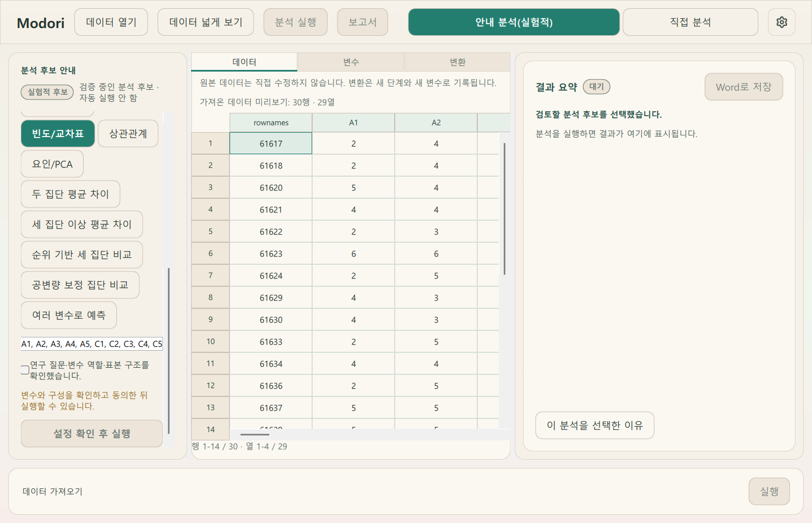

- 빈도/교차표, 상관관계, 요인/PCA, 일원분산분석, Kruskal-Wallis처럼 이미 직접 구성 폼이 있는 후보도 검토 폼으로 값을 옮길 수 있다.
- 화면이 실제로 지원하지 않는 후보만 준비 버튼을 막고, `아직 안내 화면에서 구성할 수 없습니다`라고 한계를 정확히 알린다.
- 후보 선택 직후 결과 영역 문구도 `추천 후보` 대신 `검토할 분석 후보`로 고쳐 검증 수준을 과장하지 않는다.

## 교정 결과

- 발견·수정: 영문 가져오기 요약, 영문 단계명, 영문 측정수준, 내부 척도 이름 노출, 기본 회색 탭·버튼, 분석 없는 재실행, 최초 실행의 `다시 실행` 오표기, 긴 확인 문구 말줄임, 스크롤로 사라지던 실험 상태, 확인 우회, 메타데이터 변경 뒤 남던 확인, 적용 출처의 조기 해제, 레거시 후보 즉시 실행 우회, 지원 폼 후보 차단, `추천 후보` 과장 문구.
- 확인: 설정 기어 진입·포커스, 체크박스/스위치 구분, 직접 분석 기본값, 실험 경계, 확인 전후 실행 게이트, 결과·변환·보고서 흐름, 세션 출처와 Word 고지, 고지 실패 시 미완료 보고서 비공개, 효과 축소 동등성.
- 자동 검증: UI 382건 통과. 저장소 전체 1,285건 통과·4건 건너뜀. 건너뜀은 기존 조건부 항목이며, 경고 1건은 이 작업공간의 pytest 캐시 디렉터리 권한 경고다.
- 별도 범위: 추천 근거 상태 모델, 벤치마크 산출물, 증거 정책 전체 마이그레이션은 이번 화면 조정에 포함하지 않았다.
