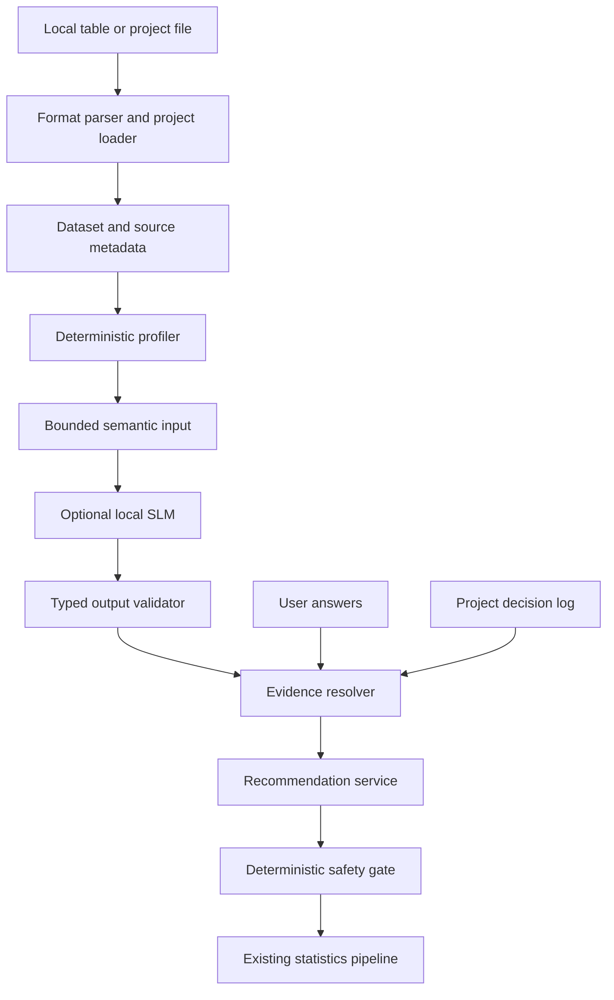

# Modori Semantic Profiling and Recommendation Memory Threat Model

## Executive summary

Modori V1 is a local-only, single-user Windows desktop application. The highest-risk
theme for the proposed semantic profiling feature is integrity, not remote account
takeover: attacker-controlled or simply malformed table content could manipulate a
local language model, poison project memory, or cause stale facts to attach to the
wrong columns and produce an unsafe recommendation. The design must therefore treat
file contents, model output, imported project memory, and user answers as distinct
trust domains. The local model must have no tools, file paths, memory-write authority,
or network path, and deterministic validators must retain final authority.

## Scope and assumptions

In scope:

- Current local import, dataset, recommendation, and pipeline boundaries under
  `src/modori`.
- The proposed project-local semantic profile, optional local SLM adapter, evidence
  resolver, decision log, and recommendation safety gate.
- CSV, XLSX, XLS, SAV, and project JSON opened from the local filesystem.

Out of scope for V1:

- Cloud AI calls, telemetry containing study data, multi-user memory, shared model
  training, web services, and mobile clients.
- A host operating system already compromised with the user's privileges.
- Deliberately false study-design answers supplied by the data owner; the product must
  still detect contradictions that are observable in the data.

Confirmed assumptions:

- The application is local-only and single-user for V1.
- Imported data may contain survey responses and personally sensitive information.
- Semantic memory is project-local and is never reused across projects.
- Any SLM is local, receives only bounded structured input, and has no network, tool,
  filesystem, or direct memory-write capability.

Open question that can change later risk ranking: the concrete local model runtime and
process-isolation mechanism have not been selected. That choice requires a focused
review before the SLM track can ship.

## System model

### Primary components

- Local file/UI boundary: QML paths are converted to local `Path` objects by
  `src/modori/ui/paths.py::local_path_from_qml`.
- Import boundary: `src/modori/table_io.py` parses supported table formats, bounds
  previews, fingerprints schemas, and validates explicit column selections.
- Dataset boundary: `src/modori/core/model.py::Dataset` keeps the frame and variable
  metadata aligned and masks declared missing values for computation.
- Current recommendation boundary: `src/modori/recommendations.py::RecommendationService`
  produces candidates without running analyses.
- Execution boundary: `src/modori/ui/recommendation_controller.py` requires an explicit
  run action before the pipeline executes.
- Project boundary: `src/modori/core/pipeline.py::Pipeline.from_json` applies shape
  limits to untrusted JSON and blocks file-I/O steps unless the caller explicitly
  trusts the project.
- Proposed semantic boundary: a deterministic profiler, bounded local model adapter,
  typed output validator, evidence resolver, and project-local decision log sit between
  `Dataset` and `RecommendationService`.

### Data flows and trust boundaries

- Local file -> table parser: attacker-controlled bytes cross a filesystem boundary;
  format-specific parsers and table limits are the current validation layer.
- Parsed values -> deterministic profiler: untrusted values become reproducible facts;
  no instruction interpretation is allowed.
- Bounded profile -> local SLM: untrusted text fragments cross into a probabilistic
  component; the adapter supplies no paths, tools, network clients, or raw project
  object.
- Local SLM -> schema validator: all model output remains untrusted until strict typed
  validation, allow-listing, and size checks pass.
- User answer -> decision log: operator input is authoritative only for domain intent,
  never for physical facts or calculation safety.
- Resolved claims -> recommendation service: only active, non-conflicting,
  fingerprint-matched claims may influence ranking.
- Recommendation -> calculation pipeline: the deterministic analysis catalog and run
  validators retain final authority; recommendation output cannot bypass them.
- Project JSON -> project loader: third-party project memory is untrusted and cannot
  arrive with `user_confirmed` authority without explicit local review.

#### Diagram

## Assets and security objectives

| Asset | Why it matters | Security objective (C/I/A) |
| --- | --- | --- |
| Raw survey and study data | May contain personal, sensitive, or unpublished research data | C, I |
| Semantic profile and decision history | Can expose study meaning and can steer future recommendations | C, I |
| Recommendation and explanation | A wrong strong recommendation can invalidate downstream research | I |
| Dataset and pipeline state | Silent filtering or mutation changes the population being analyzed | I, A |
| Analysis catalog and safety policies | They are the final limit on what may be recommended and executed | I |
| Local model runtime and weights | Tampering can systematically bias or manipulate semantic claims | I, A |
| Provenance and audit records | Needed to explain, invalidate, and reverse decisions | I, C |
| Application resources | Large or adversarial files can exhaust memory or freeze the UI | A |

## Attacker model

### Capabilities

- Supply CSV, Excel, SAV, or project files containing malformed structures, extreme
  cardinality, misleading labels, or instruction-like text.
- Distribute a project file whose semantic-memory payload claims false authority.
- Influence a legitimate user to confirm an incorrect domain fact.
- Modify local project files if the attacker already has the same user's filesystem
  access; this is lower priority than file-borne attacks because it implies substantial
  local access already.

### Non-capabilities

- No remote API, network listener, shared tenant, or cloud model exists in V1.
- The local SLM has no product tool API, arbitrary file access, direct decision-log
  write, or analysis execution authority.
- An attacker does not gain administrator rights or code execution merely by placing
  text in a table cell; parser/runtime memory-safety defects remain dependency risks.

## Entry points and attack surfaces

| Surface | How reached | Trust boundary | Notes | Evidence |
| --- | --- | --- | --- | --- |
| CSV/XLSX/XLS/SAV import | User opens a local file | File -> parser | Multiple third-party parsers; data and metadata are untrusted | `src/modori/table_io.py::read_full` |
| Import preview | User selects a file | File -> bounded preview | Preview rows/cells are bounded; full-read limits require explicit policy | `src/modori/table_io.py::PreviewReadLimits` |
| Column selection replay | Saved import step runs | Schema -> selection | Exact schema fingerprint currently prevents silent column drift | `src/modori/table_io.py::validate_import_selection` |
| Project JSON | User opens or imports a project | JSON -> object graph | Untrusted dataset limits and file-I/O step restrictions exist | `src/modori/core/pipeline.py::Pipeline.from_json` |
| Cell text sent to local SLM | Proposed semantic profiling | Data -> model | Primary indirect-prompt-injection surface | Proposed `src/modori/semantic/` |
| SLM structured output | Proposed model adapter returns | Model -> resolver | Must remain untrusted and non-authoritative | Proposed `src/modori/semantic/` |
| User clarification answer | Guided recommendation UI | User -> memory | May be mistaken or socially engineered | `src/modori/ui/recommendation_controller.py` extension |
| Project semantic memory | Project reopen/replay | Storage -> resolver | Stale or imported claims can poison ranking | Proposed `ProjectSemanticContext` |

## Top abuse paths

1. An attacker places instruction-like text in a spreadsheet cell -> the local SLM
   treats it as an instruction -> emits a false role claim -> a weak resolver promotes
   the claim -> the app strongly recommends the wrong analysis.
2. A third-party project file labels inferred claims as user-confirmed -> the loader
   trusts the flag -> stale or malicious intent facts bypass clarification -> future
   recommendations are poisoned.
3. A source file is replaced while retaining familiar column names -> fuzzy memory
   remapping attaches prior meanings to different variables -> the wrong outcome,
   group, or repeated-measure role is selected.
4. A high-cardinality or very large text column is profiled without a budget -> memory
   and model context grow without bound -> the desktop app freezes or crashes.
5. Raw samples, prompts, or model outputs are written to diagnostics -> sensitive study
   data is duplicated into logs or support bundles despite the local-only promise.
6. The model runtime or weight file is replaced -> all semantic claims become biased or
   malformed -> recommendations drift without an obvious source-data change.
7. A semantic hypothesis directly toggles import exclusion -> a legitimate but unusual
   row or column is silently removed -> calculation remains numerically correct for the
   wrong dataset.
8. A global cache key omits the project identity -> confirmed facts from one study are
   read in another -> cross-project disclosure and recommendation contamination occur.

## Threat model table

| Threat ID | Threat source | Prerequisites | Threat action | Impact | Impacted assets | Existing controls (evidence) | Gaps | Recommended mitigations | Detection ideas | Likelihood | Impact severity | Priority |
| --- | --- | --- | --- | --- | --- | --- | --- | --- | --- | --- | --- | --- |
| TM-001 | Malicious or contaminated table text | SLM profiling is enabled and sees attacker-controlled strings | Indirect prompt injection manipulates semantic hypotheses | Unsafe recommendation or misleading explanation | Recommendation, profile integrity | Current recommender is deterministic and has no SLM (`src/modori/recommendations.py`) | Proposed model boundary does not exist yet | Pass only bounded data objects; give the model no tools or paths; validate strict JSON; prevent direct recommendation/memory writes; adversarial corpus gate | Count rejected model outputs, instruction-like samples, and hypothesis conflicts without logging raw text | High | High | High |
| TM-002 | Imported project file or mistaken user | Semantic memory is loaded as authoritative | False or stale claims are marked confirmed | Persistent recommendation poisoning | Memory, recommendation | Untrusted project shape limits and unsafe-step blocking (`src/modori/core/pipeline.py::Pipeline.from_json`) | No semantic-memory trust model | Imported claims start untrusted; append-only decision events; explicit confirmation; exact dataset and column fingerprints; undo and clear controls | Audit claim origin/status transitions and stale-claim blocks | Medium | High | High |
| TM-003 | Implementation or support tooling | Prompts, samples, or outputs are logged or persisted | Sensitive values are copied beyond the dataset | Local confidentiality breach and broken privacy promise | Raw data, profile, logs | UI network imports and remote QML content are forbidden (`src/modori/ui/security.py`, `tests/ui/test_security_privacy.py`) | No semantic logging policy yet | Never persist raw model input; redact diagnostics; store aggregate facts and source references only; extend network guard to semantic runtime | Tests scan project/log fixtures for sentinel PII; runtime exposes redacted counters only | Medium | High | High |
| TM-004 | Oversized or adversarial file | Profiler or model adapter lacks independent budgets | Exhaust CPU, memory, context, or UI responsiveness | Denial of service or lost work | Availability, project state | Preview and untrusted-project limits exist (`PreviewReadLimits`, `DEFAULT_UNTRUSTED_DATASET_LIMITS`) | Full semantic profiling budgets are undefined | Cap columns, categories, text bytes, model tokens, wall time, and output size; run cancellably; deterministic fallback when budget is exceeded | Record budget-exceeded codes and profile duration/peak sizes | High | Medium | High |
| TM-005 | Schema drift or identity collision | Prior memory is remapped by name or fuzzy similarity | Attach a valid old claim to a new variable | Wrong roles and analysis | Memory, recommendation | Import selection uses exact schema fingerprint (`validate_import_selection`) | No per-claim invalidation contract yet | Exact project/dataset/column signatures; no fuzzy automatic remap; stale-by-default on rename, reorder conflict, or distribution change | Stale/remap attempt counters and explicit review state | Medium | High | High |
| TM-006 | Design defect or manipulated model output | Semantic inference can mutate curation state | Silently remove rows or columns | Analysis runs on an unintended population | Dataset, pipeline, results | Current import selection is explicit and replayable (`ImportSelection`) | Proposed feature could accidentally collapse suggestion and action | Separate retained, recommendation-ineligible, and explicitly excluded states; only user-confirmed import policy may mutate data; preserve undo/provenance | Regression tests assert recommendations never change dataset fingerprints | Low | High | High |
| TM-007 | Tampered local dependency or model artifact | Attacker can replace packaged runtime/weights or update path is weak | Change model behavior or exploit loader | Systematic semantic drift or code execution through dependency defects | Model, app, recommendation | Packaged dependencies are version constrained; dev audit tools are declared (`pyproject.toml`) | No model artifact selection or integrity policy | Pin runtime and weights; package offline; verify cryptographic hashes before load; forbid dynamic model download; review model license and loader format | Startup integrity check and version/hash in provenance | Low | High | Medium |
| TM-008 | Third-party project content | Semantic payload contains paths, actions, or oversized structures | Reintroduce file access through the memory schema | Unintended file reads/writes or denial of service | Filesystem, availability | Import/report steps are unsafe for untrusted project JSON (`safe_for_untrusted_project_json = False`) | Proposed schema is undefined | Semantic schema must contain no filesystem paths or executable actions; strict key/size/depth limits; reject unknown versions | Negative project-fixture tests for path/action fields | Medium | High | High |
| TM-009 | Cache or storage implementation defect | Memory storage is global or keying is incomplete | Reuse facts across projects | Cross-project disclosure and poisoned recommendations | Confidentiality, memory | V1 has no semantic memory | Isolation not yet implemented | Embed project UUID and dataset fingerprint in every claim/cache key; no global learned memory; clear on new session; cross-project isolation tests | Assert project IDs on every read/write and count mismatches | Low | High | Medium |
| TM-010 | Model/version/data drift | Confidence is uncalibrated or old evidence is reused | Promote uncertain claims to strong recommendations | Overconfident statistical guidance | Recommendation integrity | Analysis catalog already caps recommendation policy (`src/modori/analysis_catalog.py`) | No semantic calibration or release ledger | Calibrate per version; use risk-coverage gates; invalidate inferred claims on version change; never show raw model probability; require locked benchmark evidence per strong family | Slice metrics, calibration error, abstention rate, version drift alerts | Medium | High | High |

## Criticality calibration

- Critical: V1 should reserve this for repeatable arbitrary code execution through a
  parser/model loader, or broad silent exfiltration of study data. No current semantic
  design path requires accepting this residual risk.
- High: wrong strong recommendations, silent dataset mutation, persistent memory
  poisoning, imported-project path actions, or sensitive raw values copied to logs.
- Medium: recoverable local denial of service, model artifact drift detected before a
  run, or cross-project contamination prevented before display.
- Low: rejected malformed model output, a visible extra clarification question, or a
  stale-memory warning that does not affect the dataset or recommendation.

## Focus paths for security review

| Path | Why it matters | Related Threat IDs |
| --- | --- | --- |
| `src/modori/table_io.py` | Untrusted multi-format file parsing, schema fingerprints, and read budgets | TM-004, TM-005 |
| `src/modori/steps/data_prep.py` | Converts imported content and metadata into analysis variables | TM-005, TM-006, TM-008 |
| `src/modori/core/model.py` | Defines dataset integrity and serialized variable metadata | TM-002, TM-005, TM-006 |
| `src/modori/core/pipeline.py` | Project JSON trust decision, shape limits, and unsafe-step controls | TM-002, TM-008 |
| `src/modori/recommendations.py` | Current ranking/default logic that the semantic layer will influence | TM-001, TM-010 |
| `src/modori/analysis_catalog.py` | Final policy ceilings for strong, candidate, caution, and manual-only paths | TM-010 |
| `src/modori/ui/recommendation_controller.py` | User confirmation and explicit-run boundary | TM-002, TM-006 |
| `src/modori/ui/security.py` | Existing local-only/network-import architecture guard | TM-003 |
| `tests/ui/test_security_privacy.py` | Existing executable privacy and no-network checks | TM-003, TM-009 |
| `src/modori/semantic/` (proposed) | Highest-risk model input, output validation, provenance, and memory boundary | TM-001 through TM-010 |

## Quality check

- Covered local table import, project import, user answers, model input/output, memory,
  recommendation, and execution entry points.
- Represented every proposed trust boundary in at least one threat.
- Kept runtime risks separate from packaging and model-supply-chain risks.
- Reflected the confirmed local-only, single-user, no-cloud V1 boundary.
- Marked the local model runtime and isolation mechanism as the remaining security
  design question before implementation.
