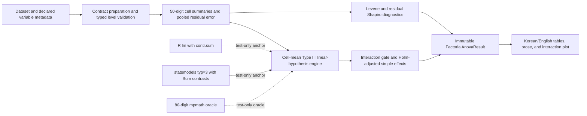

# WS3 Two-Way Factorial ANOVA Design

Date: 2026-07-10 KST

Status: the owner approved the calculation boundary and architecture. This
written specification awaits owner review before an implementation plan is
created.

## 1. Decision Summary

Modori V1 will support one deliberately narrow factorial model:

- two fixed, between-subject factors;
- one numeric scale outcome;
- every factor-level combination observed after listwise deletion;
- unequal cell counts allowed;
- Type III hypotheses defined as equal-cell-weight marginal-mean tests;
- the full factor A, factor B, and A-by-B interaction model;
- interaction-gated omnibus simple effects with Holm adjustment;
- classical pooled-error inference with explicit assumption diagnostics;
- no pairwise posthoc comparisons in V1.

The product will not delegate the meaning of Type III to a library call. It will
compute the approved cell-mean linear hypotheses directly. R, statsmodels, NIST
formulas, and an 80-digit mpmath implementation are reference evidence only.

## 2. Product Boundary

### 2.1 Supported

- Exactly two factors, each with 2 through 6 observed levels.
- Fixed levels that are the levels the user intends to compare.
- Independent rows, one observation per row.
- Complete Cartesian cells with at least 3 complete observations in every cell.
- Balanced or unbalanced cell counts.
- Listwise deletion across outcome, factor A, and factor B.
- Korean-first reports with English parity.
- Main-effect, interaction, simple-effect, cell-summary, assumption, and
  interaction-plot output.

### 2.2 Not Supported

- Empty cells, Type IV hypotheses, or model-dependent estimability recovery.
- More than two factors.
- Repeated, paired, nested, split-plot, mixed, multilevel, or random effects.
- Covariates, weights, survey designs, clusters, or robust/clustered covariance.
- Ordinal, count, binary, or otherwise non-Gaussian outcomes.
- Pairwise posthoc comparisons, estimated marginal means beyond the fixed Type
  III definitions below, or user-authored contrasts.
- Causal language or a claim that observational factor labels represent an
  experiment.

An unsupported design fails closed or is routed to a different analysis. The
engine never silently drops an interaction, changes sums-of-squares type, or
substitutes a one-way ANOVA.

## 3. Why This Type III Definition

In an unbalanced complete-cell design, sample-size-weighted marginal means answer
a different question from equal-cell-weighted marginal means. Modori adopts the
latter: each level of the other factor receives equal conceptual weight,
regardless of how many rows happened to occur in that cell.

This is the complete-cell Type III hypothesis described by SAS for unbalanced
ANOVA: with no missing cells it tests the same effect functions as a balanced
design and is independent of cell frequencies. In a sum-to-zero parameterization,
the same hypotheses are represented by the main-effect and interaction coefficient
blocks. R `contr.sum` and statsmodels `C(..., Sum)` are therefore suitable external
anchors, but neither library defines the product contract.

Type III sums of squares are hypothesis sums of squares. In an unbalanced design
they are not an additive partition of corrected total variation. Reports must not
sum the three Type III effect rows or describe them as percentages of a shared
whole.

## 4. Architecture And Trust Boundary



Product calculation remains local Python. R and mpmath are not runtime
dependencies and never receive user data. The module performs no network access.

The implementation is split by responsibility:

- `factorial_anova_numerics.py`: cell summaries, contrast matrices, hypothesis
  quadratic forms, Holm adjustment, and condition gates.
- `factorial_anova_results.py`: immutable DTOs and cross-field invariants.
- `steps/anova_factorial.py`: schema migration, dataset contract, execution, and
  result assembly.
- `factorial_anova_reporting.py`: language-neutral result-to-table/prose mapping.
- existing report/chart infrastructure: interaction-plot rendering and export.

## 5. Step Contract

Step type: `stats.anova_factorial`

Schema version: `1`

```json
{
  "schema_version": 1,
  "outcome": "score",
  "factor_a": "condition",
  "factor_b": "time_band",
  "factorial_policy": {
    "preset": "complete_cells_type3",
    "alpha": 0.05,
    "factor_levels": {
      "condition": ["control", "treatment"],
      "time_band": ["early", "middle", "late"]
    }
  },
  "language": "ko"
}
```

`alpha` is fixed at `0.05` in schema version 1. It controls the interaction gate,
Holm-adjusted simple-effect decisions, 95% cell-mean intervals, and diagnostic
warning thresholds. A different value is rejected rather than partially applied.

Factor levels are model-backed raw scalar values, not free text. UI selectors use
canonical typed tokens and decode them before the step is committed. Stored level
order is deterministic and is revalidated on every run. Numeric `1` and `1.0`
share one numeric identity; booleans and strings remain type-distinct. Blank or
visually confusable level labels fail closed using the shared NFKC, whitespace,
control-character, and case normalization contract.

The outcome must be `Measure.SCALE`, numeric, finite, and non-boolean. Both factors
must be `Measure.NOMINAL` or `Measure.ORDINAL`. Outcome, factor A, and factor B must
be three distinct columns.

After metadata missing values and listwise deletion are applied, the observed
level set of each factor must exactly equal its declared level set. The cross
product of declared levels must contain every cell, and every cell must contain at
least 3 rows.

## 6. Mathematical Contract

Let factor A have `a` levels, factor B have `b` levels, and order the `a*b` cell
means with B varying fastest:

```text
m = (m_11, ..., m_1b, m_21, ..., m_ab)^T
n = (n_11, ..., n_1b, n_21, ..., n_ab)^T
D = diag(1 / n_ij)
```

Let `H_k = scipy.linalg.helmert(k, full=False)`. Its `k-1` rows are orthonormal
contrasts and each row sums to zero. Let `u_k` be a row vector with every entry
equal to `1/k`.

The three Type III hypothesis matrices are:

```text
L_A  = H_a (x) u_b
L_B  = u_a (x) H_b
L_AB = H_a (x) H_b
```

where `(x)` denotes the Kronecker product. Their ranks are `a-1`, `b-1`, and
`(a-1)*(b-1)` respectively.

For any full-row-rank hypothesis matrix `L` with rank `q`:

```text
h       = L @ m_centered
Q       = L @ D @ L.T
SS_H    = h.T @ solve(Q, h)
F       = (SS_H / q) / MSE
p       = scipy.stats.f.sf(F, q, df_error)
eta_p^2 = SS_H / (SS_H + SSE)
```

`m_centered` subtracts one common grand location from every cell mean. Every row
of `L` sums to zero, so this changes no hypothesis and prevents large-offset
cancellation.

The pooled error is the within-cell error from the saturated cell-mean model:

```text
SSE      = sum_ij sum_k (y_ijk - m_ij)^2
df_error = N - a*b
MSE      = SSE / df_error
```

The engine uses `solve`, never an explicit inverse. `Q` must have its expected
rank, a finite condition number, and condition number no greater than `1e10`.
This is a product safety threshold, not a theorem that every value below it has
identical precision.

The Helmert basis is a numerical basis only. Replacing it with any other
full-rank basis for the same contrast subspace must leave SS, F, and p unchanged
within the approved tolerance.

## 7. Cancellation-Safe Cell Summaries

Each cell is processed independently with one shared conversion of outcome values
to `Decimal(str(value))` under 50-digit precision. The cell mean, within-cell SSE,
and sample SD reuse that conversion. This prevents separate summary paths from
silently using different numeric populations.

The unweighted grand location is computed in Decimal from the cell means. Only
the centered cell means, SSE, and final display means are converted to float.
The test matrices depend on cell counts, not large outcome locations.

This protects calculations after ingestion. It cannot recover distinctions that
were already lost when a source parser represented two source values as the same
float. Import-layer provenance and parser tests remain separate obligations.

The algorithm is `O(N + (a*b)^3)` with at most 36 cells; the cubic term is small.
Decimal values are retained for one cell at a time, so temporary memory is bounded
by the largest cell rather than the whole dataset. Calculation runs on the
existing worker boundary, never the UI thread.

## 8. Simple-Effect Policy

The interaction test is evaluated first at `alpha = 0.05`.

- If `p_AB >= 0.05`, no simple-effect tests are generated.
- If `p_AB < 0.05`, generate all A-within-B and all B-within-A omnibus tests.
- Do not generate pairwise comparisons.

For A within B level `j`:

```text
L_A|B=j = H_a (x) e_j.T
```

For B within A level `i`:

```text
L_B|A=i = e_i.T (x) H_b
```

Each simple effect uses the same full-model pooled MSE and residual degrees of
freedom. All `a+b` simple-effect p-values form one family and receive the Holm
step-down adjustment. Raw and adjusted p-values are both stored; decisions and
prose use adjusted p-values only.

The three planned omnibus Type III p-values are not multiplicity-adjusted. The
report calls them planned omnibus tests and makes no familywise-error claim across
those three rows.

## 9. Cell Estimates And Interaction Plot

For each cell, return raw mean, sample SD, row count, and a pooled-error pointwise
95% CI:

```text
SE_ij = sqrt(MSE / n_ij)
CI_ij = m_ij +/- t.ppf(0.975, df_error) * SE_ij
```

The interaction plot uses factor A on the x-axis, one line per factor B level,
the raw cell means, and these pointwise intervals. The plot does not display
weighted marginal means and does not imply simultaneous confidence coverage.

Factor role order is user-visible and stored. Swapping A and B must map the two
main-effect rows and transpose the plot while leaving the interaction result
unchanged within tolerance.

## 10. Diagnostics And Failure Policy

### 10.1 Diagnostics

- Median-centered Levene test across all cells.
- Shapiro-Wilk test on full-model residuals for `3 <= N <= 5000`.
- Minimum and maximum cell counts and their ratio.
- Zero-variance cell list.
- Hypothesis-kernel rank and condition number for every omnibus and simple test.

SciPy documents that the Shapiro p-value may be inaccurate above 5000 rows, so
the product omits that p-value above 5000 and emits a diagnostic-unavailable
warning. It does not test a deterministic 5000-row subsample and call that the
full residual test.

Levene or Shapiro rejection produces an assumption warning; it does not silently
switch the estimator. A nonfinite diagnostic caused by a constant subgroup is
stored as unavailable with a warning as long as pooled error remains positive.

### 10.2 Hard Failures

- invalid role, measure, schema, language, alpha, or factor-level contract;
- unsupported scalar, boolean outcome, nonnumeric outcome, or nonfinite value;
- fewer than 2 or more than 6 levels in either factor;
- an empty cell or fewer than 3 complete rows in any cell;
- total pooled SSE or MSE not strictly positive;
- invalid residual degrees of freedom;
- hypothesis matrix with unexpected rank or condition number above `1e10`;
- nonfinite cell summary, SS, F, effect size, or survival-tail probability;
- materially negative quadratic-form SS.

A negative SS within `64 * machine_epsilon * max(1, abs(SS))` is rounded to zero;
a more negative result fails closed because a positive-semidefinite hypothesis
quadratic form cannot legitimately be negative.

### 10.3 Warnings

- more than 5% listwise deletion;
- minimum cell count below 10;
- maximum-to-minimum cell-count ratio above 10;
- one or more zero-variance cells while pooled SSE remains positive;
- Levene `p < 0.05`;
- residual Shapiro `p < 0.05`;
- Shapiro omitted above 5000 rows;
- significant interaction, which moves interpretation priority to the
  interaction and Holm-adjusted simple effects.

Warnings disclose limits; they do not prove a design invalid or valid. There is
no automatic Welch, HC3, transformation, trimming, or outlier deletion path.

## 11. Result Contract

`factorial_anova_results.py` defines immutable DTOs:

- `FactorialLevel`
  - raw value, stable display label, and factor key;
- `FactorialCellSummary`
  - both level identities, `n`, mean, SD, pooled SE, and pointwise CI;
- `FactorialEffectResult`
  - `effect` (`factor_a`, `factor_b`, or `interaction`), labels, Type III SS,
    numerator/denominator df, MS, F, p, and partial eta squared;
- `FactorialSimpleEffectResult`
  - tested factor, conditioning factor/level, SS, df, F, raw p, Holm-adjusted p,
    decision, and partial eta squared;
- `FactorialAssumptions`
  - Levene and Shapiro values or explicit unavailable states, cell-count range,
    imbalance ratio, and zero-variance cells;
- `FactorialAnovaResult`
  - roles and level order, complete-case counts, cell summaries, three omnibus
    effects, residual SSE/df/MSE, optional simple effects, assumptions,
    language-neutral warning codes, rendered warnings, method details, chart
    specs, and report template ID.

Cross-field invariants verify counts, effect ranks, residual df, SS/MS/F
identities, p-value bounds, effect-size bounds, simple-effect gate state, Holm
monotonicity, warning alignment, and chart data provenance.

## 12. Reporting And User Flow

The report order is fixed:

1. Supported-design and complete-case statement.
2. Type III definition: equal weighting of the other factor's levels.
3. Interaction result first.
4. Holm-adjusted omnibus simple effects when the interaction gate opens.
5. Marginal main effects with a warning against isolated interpretation when the
   interaction is significant.
6. Cell means and pointwise intervals.
7. Levene, residual Shapiro, cell imbalance, and every warning.
8. Interaction plot.

Prose uses association/difference language. It never says a factor caused the
outcome unless causality is separately established outside the engine, and V1
does not expose such an override.

The configuration UI uses selectors for outcome, factor A, and factor B. Apply is
disabled until roles are distinct and the model-backed level contract is valid.
The UI does not offer sums-of-squares type, posthoc method, or an empty-cell
override because V1 supports no alternative on those dimensions.

## 13. Recommendation Policy

Catalog key: `anova_factorial`.

Promotion state: candidate, configuration required, never default, never
auto-run.

A deterministic recommendation candidate may be emitted only when:

- exactly one plausible scale outcome is available;
- exactly two plausible non-administrative categorical factors are available;
- both factors have 2 through 6 observed levels;
- the complete-case cross product has no empty cell and at least 3 rows per cell;
- no weight, cluster, repeated-ID, paired, or within-subject evidence is known;
- the user still confirms outcome and factor roles.

If more than two plausible factors exist, if design intent is unresolved, or if
independence is contradicted, the recommender abstains or asks a bounded question.
Semantic memory and an optional SLM may rank or explain candidates but cannot
change this engine contract or calculate results.

## 14. Verification Ladder

### 14.1 Contract And Formula Tests

- schema migration, unknown keys, role overlap, measures, typed levels, and
  listwise counts;
- complete-cell and minimum-cell enforcement;
- hand-computed balanced 2-by-2 and 2-by-3 formulas;
- direct checks of `L_A`, `L_B`, `L_AB`, ranks, df, SS/MS/F, and partial eta
  squared;
- interaction gate and one-family Holm adjustment;
- pointwise pooled-MSE intervals;
- warning and unavailable-diagnostic contracts;
- `f.sf` source lock and rejection of CDF complements or direct matrix inverse.

### 14.2 Metamorphic Tests

- row-order invariance;
- outcome-location invariance through at least a `1e12` offset;
- positive outcome-rescaling invariance of F, p, and partial eta squared, with SS
  and MSE scaling by the square of the multiplier;
- factor A/B swap symmetry;
- level-order basis invariance;
- equal-count reduction to balanced textbook formulas;
- extreme cell-count imbalance without changing the equal-cell-weight hypothesis;
- exact boundary tests immediately below and above the `1e10` condition gate.

### 14.3 Independent References

1. statsmodels 0.14.6: OLS with
   `C(A, Sum) * C(B, Sum)` and `anova_lm(..., typ=3)` on balanced and unbalanced
   complete-cell fixtures.
2. Base R 4.5.3: `lm` with `contr.sum`, followed by explicit coefficient-block
   Wald quadratic forms on the same fixtures. No optional R package is required.
3. Test-only 80-digit mpmath cell-mean oracle for unbalanced, high-offset data.
4. NIST balanced two-way formulas as a formula oracle. NIST StRD does not provide
   a certified unbalanced factorial fixture, so no such claim is made.

Ordinary anchored comparisons use both absolute and relative tolerances with a
maximum ceiling of `1e-10`; the high-precision oracle ceiling is `1e-11` where
measured behavior supports it. Every fixture records achieved differences before
the tolerance is frozen. A tolerance cannot be widened solely to obtain a pass.

R-gated reference tests must execute with the workspace-local R runtime in the
release gate. A skipped R test is not passing evidence.

### 14.4 Product And Release Tests

- result table/prose/chart provenance in Korean and English;
- real pipeline configure, serialize, rerun, stale-level refusal, and rollback;
- recommendation opens configuration without mutating or running the pipeline;
- Word report export and chart rendering at desktop and constrained widths;
- 100,000-row unbalanced 2-by-3 Decimal-path benchmark under 5 seconds on the
  current QA host, with the measured runtime recorded rather than assumed;
- full quality and slow-statistics gates;
- fresh Windows package build and packaged launch/engine/public-data smokes;
- clean-VM manual workflow and independent adversarial review.

## 15. Claim Language

Allowed after every exit criterion passes:

> Complete-cell, fixed-effects two-way Type III ANOVA is anchored to base R and
> statsmodels and independently checked against balanced formulas and a
> high-precision unbalanced oracle.

Not allowed:

- "perfectly accurate" or "correct for every factorial design";
- "SPSS-equivalent", "SAS-equivalent", or "JASP-equivalent";
- "robust to unequal variance";
- "causal";
- "supports missing cells";
- "Type III is the universally correct sums-of-squares choice".

Type III is an explicit estimand policy. The evidence can establish that Modori
computes that policy correctly inside the supported boundary; it cannot make the
policy appropriate for every research question.

## 16. Primary References

- NIST/SEMATECH, [Multi-factor Analysis of Variance](https://www.itl.nist.gov/div898/handbook/eda/section3/eda355.htm).
- NIST/SEMATECH, [The two-way ANOVA](https://www.itl.nist.gov/div898/handbook/prc/section4/prc437.htm).
- SAS Institute, [PROC GLM for Unbalanced ANOVA](https://support.sas.com/documentation/cdl/en/statug/63962/HTML/default/statug_glm_sect005.htm).
- R Core Team, [`contr.sum` and contrast matrices](https://stat.ethz.ch/R-manual/R-patched/library/stats/help/contr.sum.html).
- statsmodels 0.14.6, [`anova_lm`](https://www.statsmodels.org/stable/generated/statsmodels.stats.anova.anova_lm.html) and [Interactions and ANOVA](https://www.statsmodels.org/stable/examples/notebooks/generated/interactions_anova.html).
- SciPy, [`scipy.linalg.helmert`](https://scipy.github.io/devdocs/reference/generated/scipy.linalg.helmert.html) and [`scipy.stats.shapiro`](https://docs.scipy.org/doc/scipy/reference/generated/scipy.stats.shapiro.html).
- Holm, S. (1979), "A Simple Sequentially Rejective Multiple Test Procedure",
  *Scandinavian Journal of Statistics*, 6(2), 65-70,
  [doi:10.2307/4615733](https://doi.org/10.2307/4615733).

## 17. Exit Criteria

Implementation may be called a closure candidate only when all of the following
are true:

1. Every contract, metamorphic, numerical, reporting, UI, and recommendation test
   passes.
2. R, statsmodels, balanced-formula, and mpmath anchors execute with no required
   skip and meet their frozen achieved tolerances.
3. Empty cells, invalid level contracts, singular kernels, and zero pooled error
   fail closed with actionable Korean errors.
4. Existing one-way, repeated-measures, ANCOVA, and OLS results show no drift.
5. Full quality, package, packaged smoke, and clean-VM gates pass.
6. The 100,000-row performance measurement passes without weakening the Decimal
   path.
7. An independent reviewer attacks Type III semantics, high-offset behavior,
   simple-effect multiplicity, reporting, and product routing; every actionable
   finding is reproduced before correction.
8. The owner reviews this written specification and the later implementation
   evidence before release promotion.
