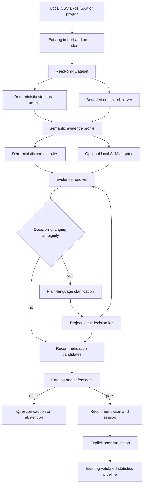
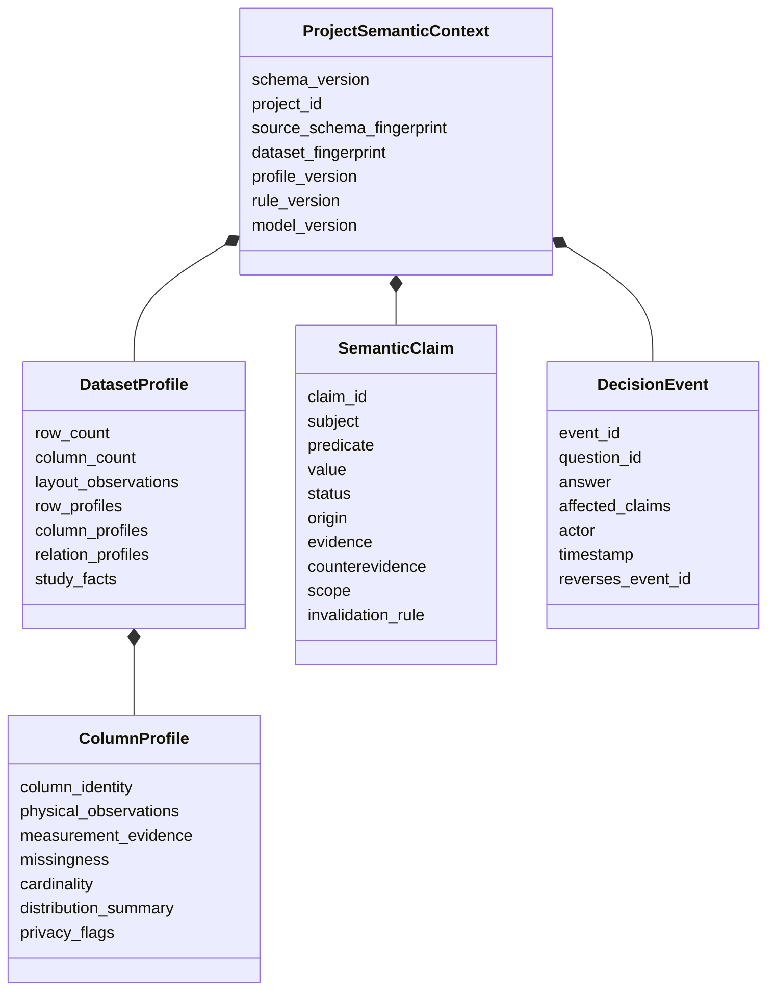

# Semantic Profiling and Project-Local Recommendation Memory Design

Date: 2026-07-10

Status: External-review amendments incorporated and approved for staged execution;
implementation not started

Live product vocabulary and exposure are governed by
`docs/superpowers/specs/2026-07-11-experimental-recommendation-boundary-design.md`.
Until an approved human evidence gate promotes a family, every emitted product
candidate has `evidence_status=EXPERIMENTAL`; historical
`strong`/`candidate`/`caution` terms below are benchmark vocabulary only.

## 1. Purpose

Modori currently recommends analyses using deterministic heuristics over variable
metadata, column names, cardinality, repeated-measure naming patterns, and safe data
shape checks. That is useful, but it cannot reliably distinguish administrative
columns from research variables, infer survey-item relationships from table context,
or remember a user's confirmed study facts inside a project.

This design adds a semantic evidence layer between `Dataset` and
`RecommendationService`. Its purpose is to improve recommendation validity without
weakening calculation correctness, silently curating data, or requiring a novice user
to make statistical decisions.

The feature is valuable only if staged evidence demonstrates material improvement.
Deterministic layers may replace the current heuristic after a frozen deterministic
validation gate. A public 80 percent claim, an optional local SLM, and expansion of
validated recommendation exposure require the larger locked claim corpus. A layer
that does not meet its pre-registered gate is not shipped.

## 2. Current Product Baseline

Verified current behavior:

- `src/modori/table_io.py` detects table layout, fingerprints schemas, bounds previews,
  and supports explicit import-time column selection.
- `src/modori/core/model.py::Dataset` contains the pandas frame and aligned variable
  metadata.
- `src/modori/recommendations.py::RecommendationService` is deterministic and has no
  project memory or model dependency.
- Before the experimental-boundary migration, `src/modori/analysis_catalog.py` uses
  legacy strong, candidate, caution-only, manual-only, or never-recommend routing
  names. The migration replaces them with review-routing policy plus independent
  recommendation evidence status.
- `src/modori/ui/recommendation_controller.py` requires an explicit user run action.
- The statistics pipeline remains deterministic and independently validated. R,
  jamovi, and reference fixtures are QA anchors, not runtime engines.
- `src/modori/ui/security.py` and `tests/ui/test_security_privacy.py` enforce the
  current local-only UI boundary and reject runtime network imports or remote QML
  assets.

The current recommendation layer can propose executable candidates. It does not prove
research-design validity, infer intent reliably from data alone, or achieve a measured
80 percent recommendation-accuracy claim.

The pre-migration catalog marks `reliability`, `compare_groups`, and
`descriptives_table1` as `STRONG`, and their providers can emit the user-facing label
`강한 추천` without recommendation-validity benchmark evidence. This is recorded as
historical `legacy_unvalidated` behavior. The experimental-boundary migration removes
that product wording and automatic live selection while preserving the frozen A
baseline in its adapter.

## 3. Product Decision

Adopt a hybrid, evidence-gated architecture:

1. Deterministic profiling produces reproducible observations.
2. Deterministic context rules produce explainable hypotheses.
3. An optional local SLM may produce additional typed hypotheses.
4. A resolver preserves evidence, counterevidence, conflict, and uncertainty.
5. A novice-facing clarification planner asks only decision-changing questions.
6. Project-local memory stores confirmed facts and reversible decisions.
7. The existing analysis catalog and run validators retain final authority.

The SLM is neither required nor assumed to be beneficial. It is a separately gated
research track. Modori ships the deterministic semantic layer without an SLM if that
is the best validated product.

### Rejected alternatives

#### Deterministic rules only as the permanent endpoint

This is safe and reproducible but has limited ability to understand mixed-language
labels, unusual item naming, or relationships whose meaning depends on neighboring
columns.

#### Model-first semantic interpretation

This offers broader language coverage but makes uncalibrated, version-dependent model
output the system's source of truth. It also creates unnecessary prompt-injection,
privacy, supply-chain, and resource risks. It is rejected.

#### Cross-project or account-level learning

This can propagate a wrong decision or sensitive study concept into unrelated work. It
is outside V1. V1 memory is project-local only.

## 4. Hard Invariants

These rules are release-blocking:

1. Recommendation generation never mutates the dataset or starts an analysis.
2. Inference never removes a row or column. It can only propose a curation action.
3. Only a user-confirmed, replayable import or transformation policy can change data.
4. Model output is always untrusted and cannot write memory, choose a final analysis,
   access files, access the network, or call product tools.
5. The semantic layer never computes statistics for result reporting.
6. The analysis catalog and existing run validators cannot be bypassed.
7. Unknown, conflicting, stale, unsupported, or out-of-distribution cases abstain.
8. Original free text, model prompts, and representative text samples are not stored in
   semantic memory or diagnostics.
9. No semantic fact is reused across projects.
10. A damaged semantic context cannot prevent the calculation pipeline from opening.
11. Every active claim has a source, version, scope, and invalidation rule.
12. A novice user confirms domain facts and research intent, not statistical jargon.
13. Routing tier never implies recommendation evidence. Product exposure uses an
    independent `evidence_status`, and V1 starts every emitted family at
    `EXPERIMENTAL`.
14. Benchmark development, deterministic release validation, and public-claim
    validation use separate data roles and cannot reuse a tuned set as a holdout.

## 5. Architecture



### Authority matrix

| Component | May observe | May infer | May persist | May mutate data | May execute analysis |
| --- | --- | --- | --- | --- | --- |
| Structural profiler | Yes | No | Reproducible observations | No | No |
| Context rules | Yes | Yes | Versioned hypotheses | No | No |
| Local SLM | Bounded input only | Yes | No direct persistence | No | No |
| Evidence resolver | Claims and conflicts | Resolve status | Materialized claim view | No | No |
| Clarification planner | Unresolved claims | Question priority | No | No | No |
| Decision log | User answer | No | Append-only events | No | No |
| Recommendation service | Resolved context | Candidate ranking | No | No | No |
| Import/transform command | Confirmed policy | No | Pipeline step | Yes, transactionally | No |
| Run validator and pipeline | Current dataset/config | Eligibility only | Results/provenance | Existing step semantics | Yes |

## 6. Project and Data Contracts

### ProjectDocument

Semantic memory does not belong in `Dataset`, `Variable`, or analysis `Step.params`.
Introduce a project-level wrapper above `Pipeline`:

```json
{
  "project_schema_version": 2,
  "project_id": "550e8400-e29b-41d4-a716-446655440000",
  "pipeline": {
    "source_dataset": {},
    "steps": []
  },
  "semantic_context": {
    "schema_version": 1,
    "source_schema_fingerprint": "sha256:64-hex-digest",
    "dataset_fingerprint": "sha256:64-hex-digest",
    "profile_version": "profile-v1",
    "rule_version": "rules-v1",
    "model_version": null,
    "claims": [],
    "decision_events": []
  }
}
```

Compatibility rules:

- Existing `{source_dataset, steps}` pipeline JSON loads as a legacy project with an
  empty semantic context.
- Invalid or unsupported semantic context is quarantined while the pipeline opens in
  no-memory mode with a visible warning.
- Third-party project claims do not arrive with local `user_confirmed` authority. They
  are imported as untrusted assertions pending explicit review.
- Semantic schemas contain no filesystem paths, URLs, commands, executable actions, or
  arbitrary extension objects.
- Limits apply before object creation: 16 MiB semantic-context JSON, 10,000 claims,
  10,000 decision events, 20 evidence/counterevidence entries per claim, 512 Unicode
  characters per ordinary string, and maximum nesting depth 8. Exceeding a limit
  quarantines the semantic context; the loader does not truncate it into a potentially
  different meaning.

### Identity and fingerprints

The design uses separate identities for source layout and current analytical data:

- `source_schema_fingerprint` reuses the existing import contract over source type,
  selected sheet/layout, canonical source columns, and their order.
- `dataset_fingerprint` binds the profile to `Pipeline.current_dataset`, not only the
  imported source. It hashes the ordered schema, row count, variable metadata,
  normalized missing masks, and typed values in row order.
- Canonical hashing normalizes text to Unicode NFC, represents missing values with one
  explicit marker, and uses stable typed numeric/date encodings rather than locale
  formatting.
- A source column identity includes project ID, source schema fingerprint, canonical
  key, ordinal position, and source-label hash.
- A derived column identity additionally includes its `origin_step_id` and the
  deterministic transformation provenance.

Any row reorder changes `dataset_fingerprint` and forces regeneration. If row order is
irrelevant, the regenerated semantic claims should be equivalent; metamorphic tests
verify that property. Distribution signatures may diagnose drift but are never used to
fuzzily reattach memory.

User-confirmed facts do not automatically transfer from a source column to a derived
column. A transformation may emit a new semantic claim only when its contract proves
the relationship, such as an explicitly composed scale. Otherwise the derived column
requires independent profiling or confirmation.

### Semantic evidence model



### Claim statuses

Only these statuses are valid:

- `observed`: a reproducible physical or statistical observation.
- `inferred`: a rule or model hypothesis.
- `user_confirmed`: a user-confirmed study fact or intent.
- `rejected`: explicitly rejected or contradicted.
- `stale`: no longer applicable after source, schema, rule, or version change.

Origin and status are separate. For example, an SAV file declaring a variable ordinal
is recorded as the observation "source metadata declares ordinal," not as an
unconditionally true ordinal classification. A user correction can therefore coexist
with the source declaration without rewriting history.

### Example claim

```json
{
  "claim_id": "claim-js3-item-group",
  "subject": "column:JS3",
  "predicate": "member_of_item_group",
  "value": "group:JS",
  "status": "inferred",
  "origin": "deterministic_rule:item-prefix-v1",
  "evidence": [
    "numeric values in range 1..5",
    "JS1 through JS5 share prefix and response domain"
  ],
  "counterevidence": [
    "reverse-scoring status is unknown"
  ],
  "scope": "project",
  "invalidation_rule": "stale_on_schema_or_response_domain_change"
}
```

## 7. Profiling and Semantic Compression

The product does not generate a prose summary as its primary memory. It creates a
typed evidence profile that keeps facts, hypotheses, counterevidence, and user
confirmation separate.

### Full deterministic observations

For every imported column, compute reproducible features as applicable:

- physical dtype and parseability;
- row count, non-missing count, missing ratio, and declared missing codes;
- unique count, dominant-value ratio, and constant/near-constant status;
- finite-value status and numeric range/quantiles;
- integer-like, binary, bounded ordinal, date-like, identifier-like, and free-text
  indicators;
- source name, source label, value-label availability, and source-declared measure;
- normalized-name tokens and adjacent-column position;
- response-domain compatibility with neighboring columns;
- repeated prefix/suffix, numbered item, timepoint, code-label, and derived-column
  relationships.

Row observations include blank, repeated-header, metadata, aggregate/subtotal,
duplicate, malformed-width, and ordinary observation candidates. Detection never
implies deletion.

### Semantic role vocabulary

V1 supports a bounded product vocabulary rather than arbitrary ontology generation:

- identifier;
- grouping variable;
- outcome candidate;
- predictor candidate;
- covariate candidate;
- survey item;
- item group;
- timepoint/repeated measure;
- weight;
- cluster/stratum identifier;
- date/time;
- code column and label companion;
- administrative note;
- free text;
- missing-value marker;
- unknown.

Survey question intent, response domain, valid versus missing values, measurement
level, and item grouping follow a deliberately small subset of DDI concepts. Modori
does not implement the full DDI standard.

### Bounded context input

- Column names and source labels are always available to deterministic rules.
- Numeric columns provide summaries, not raw value lists, to the model adapter.
- A non-free-text column is low-cardinality for model input only when it has at most 20
  distinct non-missing values. It may provide the eight most frequent ephemeral labels,
  ordered by descending frequency and canonical text, after identifier/name-like and
  PII-pattern screening.
- Each ephemeral label is capped at 80 Unicode characters.
- Free-text columns provide only language, length, repetition, format, and privacy-risk
  features by default; their raw cell contents are not sent to the model adapter.
- PII-like values are never passed to the model adapter.
- The adapter receives no source path, project path, row index, user name, report path,
  or object capable of reading additional data.
- Ephemeral samples are discarded after inference and never enter the project file,
  logs, exception text, or diagnostic bundles.

The model adapter processes bounded column batches. Exact token, memory, and wall-time
limits are declared by the selected runtime's release-controlled capability manifest,
which pins the runtime and weight hashes. The SLM feature remains disabled until that
runtime-specific manifest and resource test pass. This gate intentionally prevents an
adapter from acquiring implicit resource defaults during implementation.

## 8. Optional Local SLM Contract

The SLM receives a typed `SemanticInferenceInput` and may return only a typed
`SemanticInferenceOutput`.

Allowed output:

- proposed semantic role claims;
- proposed inter-column relationship claims;
- evidence references to supplied profile fields;
- counterevidence and an explicit unknown state;
- candidate clarification facts, not final user-facing wording.

Forbidden output or behavior:

- analysis recommendation or execution command;
- row/column exclusion command;
- direct decision-log or project write;
- filesystem path, URL, shell command, code, or arbitrary nested payload;
- network access, telemetry, model download, plugin call, or product tool call;
- unbounded natural-language reasoning stored as project state.

Controls:

- strict schema validation and unknown-key rejection;
- input/output byte and item-count limits;
- timeout and cancellation;
- runtime and weight version/hash in provenance;
- malformed, conflicting, or unsupported output discarded as a whole transaction;
- deterministic semantic fallback when unavailable or rejected;
- no automatic retry loop that can freeze the UI;
- no raw prompt or completion logging.

Indirect prompt injection remains possible at the model-output level. The design
contains its impact by ensuring that a compromised model can emit only an untrusted
hypothesis that still faces schema, evidence, conflict, policy, and run validation.

## 9. Evidence Resolution and Memory

### Resolution rules

1. Reproducible physical observations cannot be overwritten.
2. Source metadata, rules, models, and users can make conflicting semantic claims; the
   resolver preserves all origins.
3. A current user-confirmed domain fact outranks a model or rule hypothesis, but cannot
   override a contradictory physical observation.
4. Imported third-party confirmations are untrusted until locally reviewed.
5. Stale claims never participate in recommendation ranking.
6. Unresolved conflicts block candidate selection and validated exposure and can
   trigger one clarification.
7. No confidence number combines incomparable evidence sources before calibration.

### Decision log

- User decisions are append-only events.
- Undo creates a reversal event instead of deleting history.
- The active claim set is a materialized view rebuilt from valid events.
- A user-authored concept or scale label of at most 120 Unicode characters may be
  stored as explicit project metadata after a PII-pattern warning; it is marked
  user-authored and is never confused with source text or model output.
- New project/session creation clears the active project context.
- No global cache may contain semantic claims or user answers.
- Cache keys include project ID, source schema fingerprint, current dataset
  fingerprint, profile version, rule version, and model version.

### Invalidation matrix

| Change | Required action |
| --- | --- |
| Cell values change | Recompute distribution, row, and relationship observations; stale dependent hypotheses |
| Included rows/columns change | Recompute dataset fingerprint and all affected claims |
| Column rename or reorder | No fuzzy remap; exact identity review required |
| Source label/value labels change | Recompute semantic and response-domain claims |
| Missing codes or measure metadata change | Recompute all affected eligibility and recommendations |
| Rule/profile version changes | Stale and regenerate inferred claims only |
| Model version or weights change | Stale and regenerate model-origin claims only |
| Analysis catalog changes | Re-run candidate policy and safety evaluation |
| Semantic context is corrupt | Quarantine context; open pipeline in deterministic no-memory mode |

## 10. Curation State Model

"Unnecessary" is analysis-dependent and cannot be a single destructive flag. Every
row and column has three separate states:

1. Retained in the original dataset.
2. Ineligible for automatic recommendation roles.
3. Explicitly excluded by a user-confirmed replayable policy.

An identifier or free-text note is usually state 2, not state 3. An aggregate row is an
exclusion candidate, not an automatic deletion. Existing `ImportSelection` and row
policy remain the authoritative mutation path.

Regression tests must prove that profiling, inference, clarification, memory replay,
and recommendation leave the dataset fingerprint unchanged.

## 11. Novice Clarification Design

The user is not expected to know statistical terminology. The user is authoritative
for study facts and intent; Modori is responsible for mapping them to statistical
roles and checking compatibility.

### Question planner

For each unresolved fact, simulate the permitted answer branches and recompute the
candidate set. Ask only when an answer changes at least one of:

- top recommendation family;
- recommendation evidence status, review-routing tier, or abstention state;
- paired versus independent design;
- repeated-measure eligibility;
- data-exclusion decision requiring confirmation;
- causal-language permission.

Rank qualifying questions by risk reduction, then user burden. Consider at most 16
unresolved facts, simulate at most three answer branches per fact, ask at most three
questions, and perform at most 144 candidate reevaluations in one planning pass. Joint
exponential branch search is forbidden. The planner has a 500 ms worker-time budget;
on budget exhaustion it uses the highest-priority hard dependency or abstains. Every
question supports `yes`, `no`, and `not sure`; `not sure` never triggers a guessed
answer.

Every question contract requires a reviewed `template_ko`. `template_en` is optional.
The Korean template is the canonical source, Korean is the default UI language, and an
SLM cannot generate final user-facing question wording.

Examples:

- "각 행은 한 사람 또는 한 번의 관측을 나타냅니까?"
- "사전 값과 사후 값은 같은 사람에게서 측정했습니까?"
- "99는 실제 응답입니까, 아니면 무응답을 뜻합니까?"
- "이 열들은 같은 설문 척도의 서로 다른 문항입니까?"
- "주된 목적은 집단 비교, 데이터 요약, 변수 관계 확인 중 무엇입니까?"

Do not ask users to judge normality, homoscedasticity, rank deficiency, numeric
stability, or other conditions the engine can evaluate.

If an answer conflicts with observable data, retain both, explain the conflict in
plain language, and abstain until resolved.

## 12. Recommendation Policy

### Lexicographic decision order

1. The analysis module must be executable and recommendation-eligible.
2. Required roles, measures, and sample/data-shape checks must pass.
3. Required study facts must be observed or confirmed.
4. No blocking conflict or stale dependency may remain.
5. The catalog review-routing policy must permit the proposed candidate.
6. The analysis family's independent evidence status must permit the requested product
   exposure.

A weighted score cannot compensate for a failed earlier condition.

### Evidence status and review routing

Live product candidates have an independent evidence status:

- `EXPERIMENTAL`: inspectable only through the explicit experimental surface, with no
  automatic selection, accuracy wording, or direct execution path;
- `VALIDATED`: reserved for a future family-specific owner promotion after the
  applicable frozen human evidence gate;
- `NOT_APPLICABLE`: the module is manual-only or never routed by recommendation.

Within the experimental surface, deterministic routing uses `PRIMARY`, `SECONDARY`, or
`HEIGHTENED_REVIEW`. These values order a review list; they are not confidence or
accuracy levels. The list states publicly that its ordering is unvalidated, and live
state starts with no selected candidate.

Historical strong precision remains a benchmark release metric. A family can satisfy
that metric only when all mandatory role/design facts are present, no blocking conflict
exists, the run-validator dry check succeeds, and its one-sided 95 percent Wilson
precision lower bound reaches 0.90 with zero E4/E5 failures on the applicable frozen
split. Passing that metric supports, but does not itself perform, a product promotion
to `VALIDATED`.

The three historical strong families receive no grandfathering. They remain
`EXPERIMENTAL` until reevaluated. Additional-family promotion remains subject to the
800-case locked claim gate. High-judgment families such as ANCOVA, mediation, and
moderated mediation retain `HEIGHTENED_REVIEW` routing even if later validated for a
bounded scope.

`Abstain` applies to unsupported, ambiguous, stale, conflicting, out-of-distribution,
or inadequately evidenced cases. Tied candidates are shown as alternatives with no
automatic selection; arbitrary tie-breaking cannot create apparent Top-1 accuracy.

Internal model probabilities are not shown to users. If a future model emits scores,
they are calibrated per version using the post-deterministic 200-case calibration role
described below and used only as one input to abstention policy. The separate 800-case
claim corpus remains untouched until final C2 evaluation.

## 13. Benchmark and Gold Standard

### Benchmark program ownership and economics

The benchmark is a separate data-governance project, not an incidental test-fixture
task. It has four roles:

- benchmark owner: scope, budget, split freeze, and release decision;
- data steward: source license, checksum, sensitivity, PII review, and storage;
- two independent statistically qualified reviewers: initial gold labels;
- adjudicator: documented resolution of reviewer disagreements.

Before committing to the 150-, 200-, or 800-case stages, run a 20-case economics
pilot. Both reviewers independently label every case and record active review minutes;
the adjudicator records resolution minutes. Projected expert hours are:

```text
case_count * ((2 * median_reviewer_minutes) + median_adjudication_minutes) / 60
```

Apply a 25 percent planning contingency to the measured total and multiply by the
actual reviewer/adjudicator rates to produce the monetary estimate. Record setup,
recruitment, data-steward, and project-management costs separately. The owner must
approve the resulting stage budget before corpus expansion. If qualified reviewers or
budget are unavailable, deterministic engineering may continue against non-claim
fixtures, but public accuracy claims, C2 adoption, and new strong promotion remain
blocked.

### Case contract

Every benchmark case contains:

- a data file and source-format metadata;
- a study card describing the research question, unit of observation, sampling,
  grouping, time/repetition structure, weights/clusters, variable meanings, and known
  missing codes;
- facts visible from data versus facts available only through clarification;
- one or more acceptable analysis families;
- preferred analysis when preference is methodologically defensible;
- prohibited analyses and the reason;
- required clarification questions;
- expected abstention when the available information is insufficient.

Each case is evaluated at one or more explicit evidence stages, such as `cold_start`
and `clarified`. At each stage the gold record declares exactly one action class:

- `recommendation_eligible`: at least one recommendation identity is safe to emit;
- `clarification_required`: no recommendation is yet safe and at least one specified
  fact can change the decision;
- `abstention_required`: clarification cannot make a supported recommendation from the
  available product scope.

The engine emits one primary action: `recommend:<identity>`, `clarify:<fact_id>`, or
`abstain:<reason_code>`. This action-class contract prevents a safe question or
abstention from being mislabeled as a recommendation while also preventing those
actions from inflating recommendation accuracy.

An acceptable recommendation identity contains the analysis family, normalized role
assignments, and design mode. For example, the right family with the wrong outcome,
group, predictor, or paired/independent mode is not an exact match.

Multiple valid analyses remain multiple gold labels. R and jamovi validate numerical
outputs after selection; they do not define the recommendation gold label.

### Scorer contract

The scorer executable, schema version, metric definitions, confidence-interval method,
and configuration are hashed and frozen before a frozen split is evaluated. Changing
any of them invalidates that split's reported result.

The scorer's `strong`/`candidate`/`caution` fields are frozen historical evaluation
terms. They do not authorize the same words in product UI, help, reports, or product
documentation and map to live evidence status only through an explicit release
decision.

- Recommendation Top-1 accuracy is evaluated only on `recommendation_eligible`
  case-stage records. It is 1 only when the primary action is `recommend` and its
  complete identity exactly matches any acceptable gold identity; a clarification,
  abstention, missing default, or wrong identity is 0.
- Clarification accuracy is evaluated only on `clarification_required` records. It is
  1 only when the primary action is `clarify` and the fact is in the gold
  decision-changing clarification set.
- Abstention accuracy is evaluated only on `abstention_required` records. It is 1 only
  when the primary action is `abstain` and the reason belongs to the frozen acceptable
  reason class. A recommendation on such a record is never counted as coverage.
- Primary-action exact accuracy across all three action classes is reported as a safety
  diagnostic, never as the public recommendation-accuracy claim.
- A true recommendation tie produces no Top-1 default and lowers recommendation
  coverage. The alternatives may still satisfy the Top-3 case-hit metric.
- Top-3 case hit is evaluated only on `recommendation_eligible` records and is 1 when at
  least one of the first three emitted candidate identities exactly matches an
  acceptable gold identity; otherwise it is 0.
- Recommendation coverage is the number of `recommendation_eligible` records receiving
  a `recommend` primary action divided by all `recommendation_eligible` records.
- Strong precision is the number of emitted strong defaults with an exact acceptable
  identity divided by all emitted strong defaults. A zero denominator is
  `insufficient_evidence`, never a pass. Per-family strong precision uses the same
  definition.
- Partial family/role matches are diagnostic only and never count toward release
  accuracy, precision, or hit-rate gates.
- Question efficiency pools all emitted questions: gold decision-changing questions
  divided by all questions. A zero denominator is reported as `not_applicable`; the
  separate unnecessary-question count must still be zero.
- E1-E5 severity assignment is part of the frozen gold record, not inferred after
  seeing model failures.

### Corpus stages

- 20-case economics pilot: measure review, disagreement, adjudication, and data-steward
  cost. It is not an accuracy set.
- 150-case development corpus: discover taxonomy, ambiguity, question wording, and
  deterministic rule changes.
- 200-case frozen deterministic validation corpus: evaluate A/B/C1/D after all
  deterministic rules and thresholds are frozen. It is not used to tune those layers.
  After deterministic evaluation is complete, it may be used to calibrate C2 because
  C2 has a separate 800-case holdout. If a deterministic rule, threshold, case label,
  or scorer changes after results are exposed, this split is retired to development
  evidence and a new independent frozen validation split is required.
- At least 800 locked claim corpus: public 80 percent claims, C2 adoption, and promotion
  of new strong families only. If outputs or labels are exposed and C2, policy, or the
  scorer is then changed, that corpus cannot validate the changed system; a new locked
  holdout is required.

The locked corpus includes clean and messy CSV/XLSX/SAV, Korean/English/mixed labels,
Likert ties, missing codes, wide/long repeated measures, IDs, weights, clusters,
aggregate/footnote rows, multi-row headers, numeric-coded categories, reverse-item
ambiguity, small/imbalanced groups, misleading names, unsupported designs, prompt
injection, PII-like text, schema drift, and same-data/different-question pairs.

Gold labels require two independent statistically qualified reviews followed by
documented adjudication. Published methods and documented public-study designs anchor
the review. Model reviewers may criticize cases but cannot be the sole gold authority.

Before labeling a frozen validation or claim corpus, the annotation guide must achieve
nominal Krippendorff alpha >= 0.80 for the primary action on the preceding pilot,
mean Jaccard agreement >= 0.80 separately for acceptable recommendation sets and
required-clarification sets, and exact-set agreement >= 0.70 for each. Failure requires
guide revision and independent relabeling before expansion. All disagreements remain
visible in the adjudication ledger.

Until the applicable review tier exists, Modori may run internal experiments but
cannot make the claim or enable the level governed by that tier.

### Corpus storage, license, and privacy

- Synthetic and redistribution-permitted public fixtures live under
  `tests/fixtures/recommendation_benchmark/public/` with deterministic generators where
  practical.
- `tests/fixtures/recommendation_benchmark/manifest.jsonl` records case ID, split role,
  source, source version, license/SPDX identifier or explicit terms, checksum,
  language, sensitivity class, generation seed, and analysis-family coverage.
- Checked-in benchmark data has a 100 MiB total cap. Larger or restricted data is not
  committed or placed in Git LFS by default.
- Restricted cases and all locked labels live outside git under the path supplied by
  `MODORI_RECOMMENDATION_BENCHMARK_ROOT`. The repository stores only non-sensitive
  manifests and hashes for those cases.
- Locked labels are held by the benchmark owner/evaluator. Development agents receive
  cases without labels and submit predictions for scoring.
- Real Korean survey data requires redistribution authority, de-identification, PII
  scan, and manual data-steward approval. Raw free text and direct identifiers are
  removed or replaced with reviewed synthetic equivalents before benchmark use.
- Every derived fixture records the transformation and license compatibility. A case
  without clear rights is excluded rather than copied into the corpus.

### Evaluation tracks

- `cold_start`: data only; evaluate profiling, safe questions, and abstention.
- `clarified`: provide domain answers; evaluate final recommendation.
- `memory_replay`: reopen unchanged and changed projects; evaluate reuse and staleness.
- `adversarial`: evaluate injection, poisoning, privacy, resource, and malformed-output
  containment.

### Ablations

- A: current recommendation rules.
- B: deterministic structural profile.
- C1: B plus deterministic table-context rules.
- C2: C1 plus optional local SLM hypotheses.
- D: the best validated semantic configuration plus confirmed project memory.

Within each applicable corpus stage, compared variants run against the same cases and
the same frozen scorer. C2 is not evaluated for adoption on the 200-case corpus that
calibrated it.

### Deterministic replacement gate

B, C1, and D may replace A after the 200-case frozen deterministic validation when:

- the complete deterministic configuration improves Top-1 point accuracy over A by at
  least five percentage points and the two-sided 95 percent Newcombe method-10 interval
  for the paired difference in correctness excludes zero, or reduces E3/E4 errors by
  at least 30 percent without reducing recommendation Top-1 point accuracy or coverage;
- any historical strong-tier emission used for release scoring independently passes
  the applicable family evidence gate; disabling that tier does not block an
  experimental candidate-only replacement;
- E4 and E5 failures are zero;
- D reproduces unchanged projects exactly, reduces repeated clarification questions by
  at least 70 percent, and applies stale memory zero times;
- all normal calculation, privacy, package, and clean-VM gates pass.

This gate authorizes a deterministic product improvement under the existing safe
"analysis candidate" claim. It does not authorize a public 80 percent claim, C2, or
new-family `VALIDATED` promotion.

### Locked claim and C2 gates

- Recommendation Top-1 accuracy one-sided 95 percent Wilson lower bound >= 0.80.
- Clarification and abstention accuracy are reported separately by evidence stage and
  cannot substitute for recommendation Top-1 accuracy.
- Historical strong-tier precision one-sided 95 percent Wilson lower bound >= 0.90.
- Top-3 case-hit rate one-sided 95 percent Wilson lower bound >= 0.90.
- Coverage on answerable, supported cases >= 0.70.
- Wrong historical strong-tier emission for a high-risk analysis: zero.
- Unauthorized data mutation, raw-text persistence, stale-memory auto-application, or
  cross-project memory reuse: zero.
- Questions per case: at most three.
- Questions that cannot change recommendation, safety level, or curation decision:
  zero.

With 400 evaluated `recommendation_eligible` records, 334 exact Top-1 decisions (83.5
percent) are needed for a one-sided 95 percent Wilson lower bound just above 80 percent.
With 400 strong decisions, 370 exact decisions (92.5 percent) are needed for the lower
bound to exceed 90 percent.

### Material-benefit gates

The deterministic material-benefit criterion is evaluated on the frozen 200-case
validation as defined above. The public claim still requires the absolute 800-case
locked gates.

C2 is adopted only if it improves C1 by at least three recommendation Top-1 percentage
points and the two-sided 95 percent Newcombe method-10 interval for the paired
correctness difference excludes zero, or reduces E3/E4 errors by at least 30 percent
while recommendation Top-1 accuracy and strong precision do not decrease and coverage
decreases by no more than five percentage points. Every absolute release gate must
still pass. If not, the SLM is omitted.

D is adopted only under the deterministic replacement gate. Promotion of a new family
to `VALIDATED` remains disabled when that family lacks enough 800-case locked examples
to satisfy its confidence-bound gate, even if the overall system passes.

## 14. Error Cost Policy

| Severity | Example | Release policy |
| --- | --- | --- |
| E1 usability | Unnecessary but safe abstention or extra question | Measured and bounded |
| E2 recoverable | Non-preferred but acceptable candidate shown as possible | Bounded by Top-1/Top-3 case-hit metrics |
| E3 major | Wrong role, paired/independent confusion, or stale fact used | Release-blocking until corrected |
| E4 severe | Wrong validated or historical strong-tier recommendation, or high-risk automatic promotion | Zero allowed in locked high-risk cases |
| E5 boundary failure | Silent data mutation, raw-data leak, or cross-project memory | Zero allowed |

Average accuracy or a weighted score cannot compensate for E4 or E5.

## 15. Security and Privacy

The repository-grounded threat model is
`docs/security/TongTong-threat-model.md`.

Primary threat classes:

- indirect prompt injection through table cells;
- imported-project memory poisoning;
- stale/fuzzy memory remapping;
- raw text copied into prompts, logs, or support bundles;
- profiler/model resource exhaustion;
- model runtime or weight tampering;
- inference triggering silent curation;
- project cache isolation failure;
- uncalibrated model or data drift.

Mandatory controls:

- local-only, single-user V1 boundary;
- no cloud call, telemetry, dynamic model download, or shared memory;
- extend no-network architecture tests to the semantic runtime boundary;
- no tools, paths, commands, or direct persistence exposed to the SLM;
- strict input/output schemas and resource budgets;
- pinned runtime and weights with cryptographic hash verification;
- project ID and dataset fingerprint on every cache/memory operation;
- untrusted status for imported semantic claims;
- redacted counters only, never raw prompts/completions in diagnostics;
- adversarial tests mapped to TM-001 through TM-010.

The concrete local model runtime is selected only after C1 exists. The selection must
produce a release-controlled capability manifest covering artifact hashes, license,
supported CPU, RAM/disk requirements, input/output budgets, cancellation, and offline
behavior. The manifest ships inside the release-controlled package; normal application
code cannot replace or download it. C2 remains disabled until this focused
model-runtime review passes.

## 16. Performance, Availability, and Recovery

### Execution model

- Deterministic profiling runs in the existing serialized worker boundary, never on the
  QML/UI thread.
- Profiling covers the full dataset up to the existing untrusted-project limits of
  100,000 rows, 1,000 columns, and 5,000,000 cells.
- A larger trusted dataset may receive a partial profile, but partial status prohibits
  `PRIMARY` routing and validated exposure.
- Semantic model inference is asynchronous, cancellable, and bound to the dataset
  fingerprint present when it started.
- Results arriving after a dataset change are discarded.
- The full `dataset_fingerprint` is computed once per immutable current-dataset version
  and cached by project ID plus pipeline version. Recommendation refreshes reuse it.
- Fingerprinting processes at most 100,000 cells per cancellation chunk and has a
  10,000 ms worker-time budget for the supported 5,000,000-cell limit.
- Budget exhaustion produces `fingerprint_pending_or_incomplete`; it never falls back
  to a weaker schema-only identity. Project memory and validated exposure remain
  disabled until a full fingerprint succeeds.
- Model timeout, resource refusal, missing runtime, or invalid output falls back to the
  deterministic configuration without changing data or memory.
- No automatic retry loop is permitted.

### Transaction and recovery

- Decision events and materialized context are saved atomically.
- A failed write preserves the prior valid project state.
- Corrupt semantic context is quarantined rather than repaired heuristically.
- The project opens with the calculation pipeline and deterministic current-data
  recommendations when memory is unavailable.
- The UI offers undo for the latest decision and clear-project-memory with explicit
  confirmation.
- Clearing semantic memory never removes source data, pipeline steps, or results.

## 17. User Experience Contract

Guided mode displays:

- one recommendation or an explicit abstention;
- recommendation level;
- short plain-language reason;
- unresolved fact when one blocks stronger guidance;
- at most three plain-language questions;
- a visible indication when a project-confirmed fact is being reused;
- controls to inspect, undo, or clear remembered decisions;
- explicit run action.

It does not display model names, token counts, raw probabilities, internal evidence
weights, prompt text, or statistical jargon as a substitute for explanation.

Standard mode may expose a compact evidence trail: observed facts, user-confirmed
facts, unresolved claims, and policy limits. It still cannot bypass safety gates.

No recommendation panel change may automatically alter `ImportSelection`, insert a
transform step, or call `rerun`.

## 18. Component Boundaries

Proposed modules:

- `src/modori/semantic/contracts.py`: immutable typed profile, claim, event, and model
  input/output contracts.
- `src/modori/semantic/profiler.py`: deterministic row, column, relation, and privacy
  observations.
- `src/modori/semantic/context_rules.py`: deterministic semantic hypotheses.
- `src/modori/semantic/resolver.py`: conflict, authority, staleness, and active-claim
  resolution.
- `src/modori/semantic/questions.py`: decision-impact simulation and plain-language
  question templates.
- `src/modori/semantic/memory.py`: project-local append-only events and materialized
  context.
- `src/modori/semantic/model_adapter.py`: optional local SLM boundary; disabled by
  default until its separate gate passes.
- `src/modori/project_document.py`: versioned wrapper and legacy migration above
  `Pipeline`.
- `src/modori/recommendations.py`: consume an optional resolved recommendation context
  while preserving the current dataset-only path.

`Dataset`, statistical `Step` implementations, and result DTOs remain free of model
dependencies. UI code orchestrates services but performs no profiling or statistical
reduction.

## 19. Verification Strategy

### Unit and contract tests

- Every observation is deterministic and serializable.
- Claim schemas reject unknown versions, keys, paths, commands, and oversized values.
- Resolver authority and conflict rules cover every origin/status combination.
- Decision reversal reconstructs the prior active claim set.
- Invalid semantic context leaves pipeline loading available.
- Model adapter malformed output is discarded transactionally.
- Recommendation policies cannot exceed catalog ceilings.

### Metamorphic tests

- Row reorder does not change column semantics where order is irrelevant.
- Column reorder changes physical identity and requires review rather than fuzzy remap.
- Harmless formatting changes preserve normalized evidence while source fingerprints
  record the change.
- Renaming, response-domain change, missing-code change, or column replacement stales
  dependent claims.
- Profiling/recommendation never changes the dataset fingerprint.
- Same data plus different research question can yield different valid recommendations.
- Different projects with identical column names never share confirmations.

### Security and robustness tests

- Direct and indirect prompt-injection strings in names, labels, and cells.
- PII sentinels absent from model input logs, project semantic context, and diagnostics.
- Resource limits for high cardinality, long strings, many columns, and malformed model
  payloads.
- Imported project cannot assert local confirmation, paths, or actions.
- Model hash/version change invalidates model-origin claims.
- No-network architecture scan covers UI and semantic runtime code.

### Benchmark and release tests

- A/B/C1/D paired evaluation on development and frozen deterministic validation; after
  that evaluation is final, the 200 records may calibrate C2, while C2 adoption is
  evaluated only on the separate locked claim corpus.
- Per-analysis-family and per-data-slice metrics, not only aggregate scores.
- Wilson confidence bounds and paired improvement intervals.
- Risk-coverage curve, abstention correctness, question efficiency, and replay benefit.
- Frozen scorer hash, primary-action Krippendorff alpha, acceptable-set Jaccard/exact
  agreement, license manifest, and benchmark cost ledger.
- Full regular quality gate, slow statistics gate, package checks, packaged launch,
  clean-Windows VM smoke, and external design/code review before release promotion.

## 20. Delivery Sequence

1. Incorporate the external review into this specification and freeze the staged gate
   policy.
2. Build the case schema, frozen scorer contract, 20-case economics pilot pack, and
   current A baseline protocol.
3. Run the 20-case reviewer-time pilot before approving larger labeling expenditure.
4. Design, implement, and reference-validate WS3 `logistic_regression`.
5. Design, implement, and reference-validate WS3 `anova_factorial`.
6. Freeze the V1 analysis catalog used by recommendation gold labels.
7. Build the 150-case development corpus and implement B, C1, and D without an SLM.
8. Freeze rules and run the 200-case deterministic replacement validation.
9. Ship the deterministic replacement only if its staged gate passes; otherwise retain
   A and revise or stop the failing layer.
10. Decide whether the measured labeling budget and deterministic result justify the
    800-case claim program.
11. Research and select a local SLM runtime only after C1 is measured and the 800-case
    budget is approved.
12. Implement C2 behind a disabled-by-default adapter and security/resource gates.
13. Keep or delete C2 according to the frozen locked criteria.
14. Run full quality, package, clean-VM, privacy, and threat-model gates.
15. Promote the public 80 percent claim or new strong families only when every locked
    claim gate passes.

No later phase is authorized merely because the earlier code exists. Each phase must
produce its required evidence before the next product exposure.

## 21. Acceptance Criteria

The design is implemented only when all of the following are true:

- Facts, hypotheses, user confirmations, rejection, and staleness are distinct and
  traceable.
- Project memory is local, reversible, isolated, and correctly invalidated.
- No semantic action silently changes data or executes analysis.
- Novice questions ask domain facts in plain language and are limited to three.
- Recommendation ranking obeys hard eligibility, review routing, and independent
  evidence status.
- Model absence or failure preserves deterministic function and project integrity.
- Corrupt memory cannot prevent pipeline access.
- Privacy and prompt-injection controls pass adversarial tests.
- A/B/C1/C2/D evidence identifies which layers actually add value.
- The 20-case economics pilot reports measured review/adjudication minutes and a
  stage-specific cost projection before corpus expansion.
- The scorer uses exact candidate identities, explicit clarify/abstain actions, frozen
  tie handling, and no partial credit in release metrics.
- The annotation guide meets the predeclared reviewer-agreement thresholds before a
  frozen corpus is labeled.
- Every benchmark case has a license, checksum, sensitivity class, and storage owner;
  restricted data and locked labels stay outside git.
- B/C1/D can pass or fail the frozen deterministic replacement gate independently of
  the 800-case public-claim program.
- C2, new-family `VALIDATED` promotion, and public 80 percent wording remain blocked
  until the locked accuracy, precision, case-hit, coverage, severe-error, and
  boundary-failure gates pass.
- Historical strong-tier families are not grandfathered automatically; their live
  evidence status remains `EXPERIMENTAL` when applicable family evidence is absent or
  insufficient.
- Any layer without material measured benefit is removed from the product.
- Public wording remains "analysis candidates based on verified data and study facts"
  until the locked evidence supports a stronger claim.

## 22. References

- DDI Alliance, Variable Value Representation and Question Response Domain:
  https://ddi-lifecycle-documentation.readthedocs.io/en/latest/TechnicalGuide/Value%20Representation%20and%20Response%20Domain.html
- W3C, Model for Tabular Data and Metadata on the Web:
  https://www.w3.org/TR/tabular-data-model/
- W3C, PROV-DM: The PROV Data Model:
  https://www.w3.org/TR/prov-dm/
- Hulsebos et al., Sherlock: A Deep Learning Approach to Semantic Data Type Detection:
  https://arxiv.org/abs/1905.10688
- Zhang et al., SATO: Contextual Semantic Type Detection in Tables:
  https://www.vldb.org/pvldb/vol13/p1835-zhang.pdf
- Suhara et al., Annotating Columns with Pre-trained Language Models (Doduo):
  https://arxiv.org/abs/2104.01785
- El-Yaniv and Wiener, On the Foundations of Noise-Free Selective Classification:
  https://jmlr.csail.mit.edu/papers/v11/el-yaniv10a.html
- Guo et al., On Calibration of Modern Neural Networks:
  https://proceedings.mlr.press/v70/guo17a
- Rabanser et al., Failing Loudly: Detecting Dataset Shift:
  https://papers.neurips.cc/paper/by-source-2019-805
- Gebru et al., Datasheets for Datasets:
  https://arxiv.org/abs/1803.09010
- Pushkarna et al., Data Cards:
  https://arxiv.org/abs/2204.01075
- Krippendorff, Reliability of Recording Instructions: Multivariate Agreement for
  Nominal Data:
  https://doi.org/10.1002/bs.3830160305
- Newcombe, Improved Confidence Intervals for the Difference Between Binomial
  Proportions Based on Paired Data:
  https://doi.org/10.1002/(SICI)1097-0258(19981130)17:22%3C2635::AID-SIM954%3E3.0.CO;2-C
- NIST, AI Risk Management Framework 1.0:
  https://www.nist.gov/publications/artificial-intelligence-risk-management-framework-ai-rmf-10
- NIST, Generative AI Profile:
  https://www.nist.gov/publications/artificial-intelligence-risk-management-framework-generative-artificial-intelligence
- NIST, Privacy Framework:
  https://www.nist.gov/privacy-framework
- Greshake et al., Indirect Prompt Injection in LLM-Integrated Applications:
  https://arxiv.org/abs/2302.12173
- OWASP, LLM Prompt Injection Prevention Cheat Sheet:
  https://cheatsheetseries.owasp.org/cheatsheets/LLM_Prompt_Injection_Prevention_Cheat_Sheet.html
