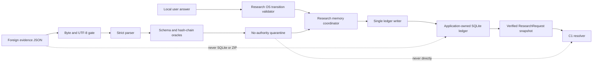

# Decision Ledger and Import Quarantine Design

Date: 2026-07-12

Status: approved for implementation

## 1. Decision

Modori will persist Research OS decisions in one application-owned SQLite ledger per
local project. It will never open an imported SQLite database as a project or merge a
foreign event chain into a local authoritative chain. Portable decision evidence uses
a bounded, canonical JSON bundle that enters a no-authority quarantine and can produce
only imported assertions. A new local decision event is required before a human-owned
fact can satisfy a C1 trust floor.

This is a conditional-go architecture:

- go: application-owned SQLite, canonical event hash chain, deterministic replay,
  declarative evidence bundle, imported-authority downgrade, local promotion, and
  calculation-only fallback;
- no-go: raw SQLite import, ZIP bundles, direct foreign-history merge, a whole-file
  `trusted` switch, fuzzy identity remapping, imported execution or persistence
  authority, and claims of tamper-proof or scientifically validated history.

The nontechnical analogy is a numbered bank passbook behind an airport customs desk.
The ledger proves that pages are in the recorded order. Customs can prove that a
foreign passbook is internally consistent, but it cannot declare the claims inside it
true or grant them local citizenship.

## 2. Scope

### Included

1. Versioned canonical event bytes and SHA-256 event chaining.
2. A per-project SQLite store under a durable local application-data root.
3. Atomic append of events, referenced artifacts, and a rebuildable materialized
   request snapshot.
4. Open-time database and chain verification, deterministic replay, and fail-closed
   recovery.
5. A single-file JSON evidence bundle with strict resource and schema limits.
6. Quarantine stages that keep all foreign facts below C1 authority.
7. A promotion coordinator that creates fresh local events and project identities.
8. Crash, mutation, resource, isolation, and low-end-hardware acceptance gates.

### Excluded

1. QML screens, native file dialogs, recent-file integration, and end-user import UX.
2. Saving or importing dataset row data.
3. Replaying path-bearing import or report steps.
4. A trusted backup-restore mode.
5. Cryptographic identity, non-repudiation, TPM monotonic counters, remote anchors,
   transparency monitors, or multi-user synchronization.
6. Merkle trees, signatures, encryption-at-rest, secure erase claims, or cloud calls.
7. Statistical calculation, automatic execution, model inference, training, or SLM
   persistence.

The implementation provides the tested storage and quarantine foundation. Product UI
integration remains a separately reviewable slice.

## 3. Architectural Boundary

`modori.research_os` remains a pure, deterministic domain core. It must continue to
have no SQLite, filesystem, network, UI, calculation, subprocess, or dynamic execution
imports. Persistence is an outer adapter that may depend on Research OS; Research OS
must never depend on persistence.



The new package is `src/modori/research_memory/`:

- `canonical.py`: constrained canonical JSON bytes and domain-separated hashes;
- `ledger_contracts.py`: immutable event, artifact, head, and receipt contracts;
- `ledger_store.py`: SQLite connection policy, schema, transactions, verification,
  replay, and durable local path policy;
- `evidence_bundle.py`: strict byte-to-bundle decoding and complete-chain export;
- `quarantine.py`: structural and semantic quarantine states and findings;
- `promotion.py`: authority downgrade, new-project rebinding, and local-event
  coordination.

No file receives more than one of parsing, persistence, or semantic-promotion
responsibility.

## 4. Canonical Encoding

### 4.1 Profile

`modori-cjson-v1` is a constrained RFC 8785-compatible profile, not a claim of a full
general-purpose JCS implementation.

Allowed values:

- objects with unique ASCII schema keys;
- arrays with significant order;
- NFC Unicode string values;
- integers in `[-9007199254740991, 9007199254740991]` excluding Boolean values;
- `true`, `false`, and `null`.

Forbidden values:

- floats, decimals, NaN, Infinity, negative zero, bytes, arbitrary Python objects,
  non-string map keys, non-ASCII keys, duplicate keys, lone surrogates, and non-NFC
  strings.

Canonical bytes use UTF-8 without a BOM, no insignificant whitespace, recursively
sorted ASCII keys, and the JSON escapes emitted by the frozen encoder. Golden vectors
cover ASCII ordering, Hangul NFC rejection, controls, quotes, backslashes, safe integer
bounds, Boolean-versus-integer distinction, and unsupported values.

The existing `modori.research_os.contracts.canonical_digest` remains unchanged for
current in-process object identity. Durable ledger and bundle hashes use only
`modori-cjson-v1` so that a persistence feature does not silently change existing
Research OS digests.

### 4.2 Hashes

Every durable hash is 32 raw SHA-256 bytes internally and lowercase 64-character hex
on the wire.

```text
body_digest = SHA-256(canonical_event_body)

event_hash = SHA-256(
    UTF8("modori.decision-ledger.event.v1\0")
    || uint64_big_endian(sequence)
    || previous_event_hash
    || body_digest
)
```

The genesis event uses 32 zero bytes as `previous_event_hash`. The project ID is inside
the canonical event body, which prevents cross-project replay from preserving the same
event hash. Sequence is authoritative; wall-clock time is optional display metadata
and never determines order.

## 5. Ledger Contracts

### 5.1 Event body

Every event body has exactly these fields:

```text
schema_id = modori.decision_event
schema_version = 1
project_id
event_id
sequence
event_kind
subject_digests[]
payload
recorded_at_utc | null
```

Version 1 event kinds are closed:

- `project_created`;
- `clarification_answered`;
- `revision_accepted`;
- `fact_invalidated`;
- `passport_committed`;
- `decision_retracted`;
- `import_accepted_as_assertions`;
- `migration_applied`.

Each kind has an exact payload decoder. Generic extension objects and unknown keys are
forbidden. A new kind or field requires a schema-version change.

### 5.2 Artifacts

Artifacts are canonical mappings for existing immutable Research OS values:

- `QuestionSpec`;
- `EstimandSpec`;
- `StudySpec`;
- `AnalysisPassport`;
- `ClarificationAnswerEvent`;
- `RevisionAcceptanceCertificate`;
- `DecisionEvidenceRef`;
- internal `ResearchRequestSnapshot` references to the current component artifacts;
- authority-free `ImportedAssertion` values extracted from a foreign bundle.

V1 persists only the structured projection already supported by the deterministic
resolver. `QuestionSpec.local_text` must be null and `AnswerValueKind.TEXT` is rejected
with `unsupported_sensitive_payload`. Free-text capture may be converted into reviewed
structured facts before persistence, but the text itself requires a separate,
explicitly approved local-text vault design. This prevents the first ledger release
from silently contradicting the existing no-raw-text memory boundary.

An artifact row stores schema ID, schema version, project ID, object ID where
applicable, its existing Research OS digest, canonical storage bytes, and storage-byte
digest. The two digests have different purposes and are never substituted for each
other. A duplicate artifact digest is idempotent only when every stored byte and typed
identity field matches exactly.

The primary artifact ID is separately domain-separated:

```text
artifact_id = SHA-256(
    UTF8("modori.decision-ledger.artifact.v1\0")
    || UTF8(artifact_kind)
    || 0x00
    || canonical_artifact_body
)
```

Event `subject_digests` contain these artifact IDs, not existing Research OS semantic
digests. Existing semantic digests remain stored and continue to bind passports and
component references.

### 5.3 SQLite schema

The application creates and owns the schema. Imported bytes never reach SQLite's
schema parser.

Authoritative tables:

- `ledger_meta`: one project ID, schema version, canonicalization ID, hash algorithm,
  and creation metadata;
- `ledger_events`: `(project_id, sequence)` primary key, unique event ID, canonical
  body bytes, body digest, previous event hash, and event hash;
- `ledger_artifacts`: immutable content-addressed artifacts;
- `event_artifacts`: exact subject relationships.

Derived tables:

- `ledger_head`: current sequence and event hash;
- `materialized_request`: canonical current QuestionSpec, EstimandSpec, StudySpec,
  evidence references, dataset fingerprint, available variable IDs, surface, and
  remaining question budget;
- `import_sources`: source bundle digest and authority-free disposition.

Derived rows may be replaced transactionally but are never accepted as evidence. They
must match a replay from authoritative rows or be discarded and rebuilt.

Tables are `STRICT`. The database sets a Modori application ID and explicit user
version. Foreign keys, uniqueness, length checks, and closed-kind checks duplicate
critical application validation.

### 5.4 Connection policy

Ledger storage uses a managed local durable root, never `cache_dir()` and never a temp
fallback. The default Windows location is:

```text
%LOCALAPPDATA%\Modori\projects\<local-project-id>\decision-ledger.sqlite3
```

If a secure absolute local directory cannot be established, ledger persistence is
unavailable and the calculation pipeline remains usable without memory.
UNC paths, mapped remote drives, symlink or junction ancestors, caller-selected URI
parameters, and environment-variable overrides in the packaged product are rejected.
Tests may inject an owned temporary local directory through the store constructor.

Connection requirements:

```text
journal_mode = WAL
synchronous = FULL
foreign_keys = ON
trusted_schema = OFF
cell_size_check = ON
mmap_size = 0
busy_timeout = 5000 ms
```

The packaged runtime must provide Python 3.12 or later and SQLite 3.37 or later.
`SQLITE_DBCONFIG_DEFENSIVE` is enabled. Triggers, views, writable schema, loadable
extensions, shared cache, URI parameters supplied by callers, and attached databases
are disabled. Runtime SQLite and Python versions are recorded in `ledger_meta` and
release evidence.

One private writer connection owns mutation. Reader connections use read-only mode.
The runtime authorizer denies UPDATE or DELETE on authoritative tables and denies
schema, attach, extension, and unsafe pragma operations after schema initialization.
Migrations use a separately scoped migrator.

### 5.5 Atomic append

An append request supplies:

- the exact expected head sequence and hash;
- one or more consecutive events;
- all referenced immutable artifacts;
- the expected materialized request snapshot.

The store executes:

1. `BEGIN IMMEDIATE`;
2. read and compare the current head;
3. validate artifact identity and insert missing artifacts;
4. validate sequence, project, previous hash, body digest, and event hash;
5. insert every event and subject relationship;
6. replace the materialized snapshot;
7. update the derived head;
8. replay the affected state and compare it with the supplied snapshot;
9. `COMMIT`;
10. return a receipt only after commit succeeds.

Any mismatch rolls back the transaction. The caller does not receive a committed
`ResearchRequest` before the durable receipt exists.

## 6. Verification and Recovery

### 6.1 Open

Before application rows are consumed:

1. open only the application-selected managed database path;
2. apply defensive connection settings;
3. run `PRAGMA quick_check`;
4. run `PRAGMA foreign_key_check`;
5. validate application ID, user version, exact schema inventory, and schema SQL
   fingerprint;
6. verify the complete event chain from genesis;
7. verify artifact digests and event-artifact references;
8. replay the authoritative chain;
9. compare or rebuild derived rows.

`PRAGMA integrity_check` runs before export, after an unclean-shutdown recovery test,
and in the release gate. No heuristic database repair is allowed.

### 6.2 Failure states

- A derived-state mismatch with a valid authoritative chain rebuilds derived state and
  records a local diagnostic code without raw content.
- Any authoritative database, schema, artifact, or chain failure quarantines the whole
  ledger. The original file is not modified.
- A quarantined ledger returns a typed `memory_unavailable` result. The calculation
  pipeline and deterministic no-memory Research OS path remain available.
- Undo creates `decision_retracted`; it never deletes an event.
- Clear-memory destroys the entire per-project ledger through a separately confirmed
  product operation. V1 makes no forensic secure-erasure claim.

The hash chain is tamper-evident against accidental corruption and partial edits. It
does not detect a whole-database rollback when the database and every local head copy
are restored together. Product and documentation wording must not claim tamper-proof,
identity authentication, or non-repudiation.

## 7. Evidence Bundle

### 7.1 Container

V1 accepts one canonical UTF-8 JSON document and no archive. The top-level mapping has
exactly:

```text
schema_id = modori.evidence_bundle
schema_version = 1
canonicalization_id = modori-cjson-v1
hash_algorithm = sha-256
source_project_id
exported_at_utc | null
head { sequence, event_hash }
artifacts[]
events[]
```

The file is a complete chain from genesis through `head.sequence`. Partial
chains, external attachments, signatures, paths, URLs, commands, code, tool tokens,
dataset rows, prompts, completions, and free-text answers are forbidden.

`head.sequence` and `head.event_hash` are the canonical source-head fields. Quarantine
does not accept a redundant top-level dataset fingerprint. It derives the source
fingerprint only after verifying the complete chain, restoring the typed
`ResearchRequestSnapshot`, and proving that the snapshot's current fingerprint equals
its typed `StudySpec.dataset_fingerprint`; it then compares that derived value with the
local dataset fingerprint. `exported_at_utc` is optional hash-bound display metadata
and grants no freshness or authority.

The exact canonical file bytes are the `source_bundle_digest`. Re-encoding the parsed
mapping must reproduce the input bytes exactly; otherwise the bundle is noncanonical
and is rejected.

### 7.2 Resource limits

Limits are checked before typed object construction:

- file bytes: 16 MiB;
- events: 10,000;
- artifacts: 30,000;
- nesting depth: 8;
- one canonical event body: 8 KiB;
- one canonical artifact body: 128 KiB;
- one ordinary string: 512 Unicode code points;
- one pre-parse container: 30,000 entries;
- one post-parse non-top-level list or mapping: 10,000 entries;
- total decoded nodes, including object keys: 1,000,000.

Top-level `artifacts` has the explicit 30,000-item exception and top-level `events`
uses its 10,000-event ceiling. Every collection inside an event or artifact remains at
10,000. The 16 MiB source-byte ceiling is also the total decoded-string-code-point
ceiling: every decoded code point consumes at least one source byte, while JSON escapes
consume more source bytes per decoded code point. A separate 4,000,000-code-point limit
would reject the required valid 16 MiB and 10,000-event benchmark, measured at
15,684,020 string code points.

A byte-level structural preflight enforces depth, the 30,000-entry allocation ceiling,
and the 1,000,000-node ceiling before `json.loads` constructs the object graph. The
parsed-value walk then applies the path-aware collection limits, ordinary-string limit,
and forbidden-key policy before typed artifacts or events are constructed.

The decoder rejects a UTF-8 BOM, invalid UTF-8, duplicate keys, blank or non-ASCII
keys, non-NFC strings, unsupported JSON values, unknown keys or enums, and values over
budget. It never truncates, repairs, retries, extracts files, loads plugins, or renders
rich content.

### 7.3 Quarantine stages

```text
received
  -> structurally_valid
  -> self_consistent
  -> assertion_ready
  -> locally_confirmed

Any failure -> rejected
Any unresolved semantic conflict -> held
```

- `structurally_valid` means only that bytes, budgets, and schemas passed.
- `self_consistent` means the foreign artifacts and complete hash chain agree with
  themselves.
- `assertion_ready` means applicable identifiers and versions can be compared with the
  local project. It still grants no C1 authority.
- `locally_confirmed` is not an imported state. It exists only after a new local answer
  event is created.

Quarantine is an immutable in-memory result. The product does not automatically copy
the foreign file into application storage or diagnostics.

## 8. Authority and Promotion

### 8.1 New local identity

Every import creates a fresh local project ID. The foreign project ID remains only in
the import-source record and provenance references. If a local project already uses
the foreign ID, the importer never merges, overwrites, or resumes that chain.

### 8.2 Downgrade matrix

| Foreign content | Local disposition |
| --- | --- |
| `user_confirmed` fact | imported assertion; cannot narrow C1 admissible domain |
| observed physical fact | discarded and recomputed from local dataset |
| inferred or lexical fact | imported assertion for question planning only |
| conflict or stale fact | held conflict/stale evidence only |
| passport or recommendation | historical artifact only; locally re-resolved |
| route | revalidated against the current local route catalog |
| path, URL, command, execution token | bundle rejected |
| free text | bundle rejected |

An imported assertion may nominate a clarification but cannot satisfy a human-owned or
physical hard predicate. No model, signature, foreign event kind, or import UI action
can change that rule.

### 8.3 Local promotion

The promotion coordinator accepts a `self_consistent` quarantine result and local
dataset context. It:

1. allocates a new local project identity;
2. records one `project_created` event;
3. records one `import_accepted_as_assertions` event containing only the source bundle
   digest, source head hash, and sanitized imported subject digests;
4. stores foreign fact values only as `ImportedAssertion` artifacts outside the active
   `Fact` graph;
5. leaves a caller-supplied, locally constructed ResearchRequest unchanged, including
   its locally recomputed observations and unknown human-owned facts;
6. runs the current local resolver on that unchanged request;
7. asks a neutral local clarification for any decision-changing human-owned fact,
   without preselecting the imported value;
8. records a normal local `clarification_answered` event if the user answers;
9. records `revision_accepted` when acceptance is required.

Keeping imported proposals outside the active `Fact` graph is stricter than adding an
`IMPORTED_ASSERTION` Fact state: it makes accidental satisfaction of any present or
future trust floor structurally impossible. A later question-planning feature may read
the separate assertion collection but still cannot pass it to C1 as an active fact.

Foreign event hashes may appear as provenance references but are never local event
hashes. The new local chain is intentionally different from the foreign chain.

## 9. Data, Pipeline, and Evidence Separation

A whole project must not gain one trust label.

- Dataset bytes continue through the format-specific table importer and receive a new
  local fingerprint.
- Pure, path-free pipeline transforms may later be replayed through the existing
  untrusted pipeline boundary.
- Import, report, regression-import, and other path-bearing steps remain inert until a
  user explicitly reselects the resource through a future product workflow.
- Decision evidence enters only through the evidence-bundle quarantine.

The new code must not call `Pipeline.from_json(..., trust_project_file=True)`.
Changing or removing the legacy parameter is outside this slice, but architecture tests
ensure the new boundary cannot use it.

## 10. Security and Privacy Claims

Allowed claims:

- local, project-isolated, append-only application history;
- atomic event and snapshot persistence;
- deterministic chain, artifact, schema, and replay verification;
- imported evidence is authority-free until a local event exists;
- corrupt memory fails closed without blocking calculation-only use.

Forbidden claims:

- tamper-proof, authenticated author, expert-reviewed, non-repudiable, securely erased,
  scientifically valid, or proof against an administrator with full local access;
- an imported signature, model agreement, or hash chain establishes truth;
- SQLite integrity proves recommendation validity.

Raw source rows, question text, free-text answer values, model inputs/outputs, paths,
usernames, and report destinations are absent from the bundle and ledger diagnostics.
Short structured choices and variable IDs are permitted. A future explicitly saved
user-authored label requires a separate privacy design.

## 11. Test and Acceptance Program

### 11.1 TDD contract suites

Every production behavior starts with a failing test. Required focused suites:

- `tests/test_research_memory_canonical.py`;
- `tests/test_research_memory_ledger_contracts.py`;
- `tests/test_research_memory_ledger_store.py`;
- `tests/test_research_memory_evidence_bundle.py`;
- `tests/test_research_memory_quarantine.py`;
- `tests/test_research_memory_promotion.py`;
- `tests/test_research_memory_architecture.py`;
- `tests/test_research_memory_crash_recovery.py`;
- `tests/test_research_memory_performance.py`.

### 11.2 Mutation corpus

At least 300 deterministic mutated bundles cover at least these classes:

1. oversize bytes, strings, lists, maps, events, and artifacts;
2. invalid UTF-8, BOM, non-NFC text, lone surrogate, and duplicate keys;
3. unknown schema, version, field, enum, event kind, and hash algorithm;
4. broken body digest, event hash, previous hash, head hash, or artifact digest;
5. sequence gap, duplicate, reorder, fork, truncation, and cross-project replay;
6. missing, duplicate, cyclic, or wrong-project artifact references;
7. forged `user_confirmed`, passport, route, and source identity;
8. path, URL, command, code, tool, worker, persistence, and execution fields;
9. dataset fingerprint mismatch and stale catalog identity;
10. malicious rich text, archive signature, SQLite header, and JSON polyglots.

Every mutation must be rejected or held with an exact closed reason code. No case may
be silently accepted, truncated, or partially promoted.

### 11.3 Crash matrix

Crash injection covers:

1. before `BEGIN IMMEDIATE`;
2. after head read;
3. after artifact insertion;
4. after first event insertion;
5. after materialized snapshot replacement;
6. after head update;
7. immediately before commit;
8. after commit but before the caller receives a receipt.

After reopening, the state must be exactly the old committed state or the complete new
state. Partial, phantom, forked, or acknowledged-but-lost state is forbidden.

### 11.4 Provisional office-hardware gates

Run on Windows with two CPU cores, 8 GiB RAM, and both a low-end SSD and HDD where
available:

- 10,000-event full open and replay: at most 1 second on SSD and 3 seconds on HDD;
- single-event append p95 over 1,000 appends: at most 50 ms on SSD and 150 ms on HDD;
- 16 MiB, 10,000-event bundle validation: at most 2 seconds and 192 MiB peak process
  memory;
- calculation-only startup after a quarantined ledger: no material regression from the
  no-ledger baseline.

These are adoption gates, not achieved performance claims. Results must record CPU,
RAM, storage type, Python version, SQLite version, case count, warmup, repetitions,
median, p95, maximum, and peak memory.

### 11.5 Zero-tolerance gates

- partial or phantom commit: zero;
- acknowledged event loss in the crash matrix: zero;
- imported assertion satisfying a C1 trust floor without a local event: zero;
- path, URL, command, tool, execution, or persistence authority crossing quarantine:
  zero;
- stale or cross-project automatic reuse: zero;
- corrupt ledger blocking calculation-only fallback: zero;
- silent repair, truncation, or partial import: zero.

## 12. Stop Rules

Stop the implementation rather than weaken a gate when any condition persists after
one bounded, evidence-supported remediation attempt:

1. a safe design requires opening imported SQLite or extracting an archive;
2. the packaged Python or SQLite runtime cannot be pinned to the required feature floor;
3. atomic append cannot distinguish committed from uncommitted state after crash;
4. imported confirmation can reach `USER_CONFIRMED` without a new local event;
5. corrupt memory prevents calculation-only operation;
6. office-hardware latency or memory gates remain exceeded after one focused
   optimization that does not weaken durability or validation;
7. a required security property depends on a self-signature, same-model judgment, or
   unverified external identity.

If a stop rule fires, the accepted fallback is the current deterministic Research OS
without persistent memory or imported decision evidence.

## 13. Delivery Order

1. Canonical encoding and immutable ledger contracts.
2. SQLite schema, connection hardening, atomic append, verification, and replay.
3. Evidence bundle encoder/decoder and complete-chain validation.
4. Quarantine states, downgrade rules, and local promotion coordinator.
5. Crash, mutation, architecture, resource, and office-hardware gates.
6. Full test, lint, file-operation audit, package-boundary, and clean-worktree review.

No UI integration begins inside this delivery.
