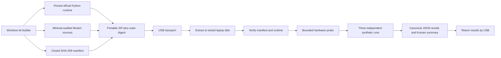

# Portable Office-Hardware Benchmark Kit Design

**Status:** Approved in chat on 2026-07-12; written specification pending user review

**Scope owner:** Decision Ledger and import-quarantine office-hardware gate
**Target:** A previously used, non-empty Windows office laptop operated by a non-developer

## 1. Decision

Build a sealed, offline, x64 Windows benchmark kit from the assigned worktree. The kit
uses an official pinned Python 3.12 embeddable runtime, a minimal audited Modori source
closure, synthetic benchmark data only, a hash manifest, and a one-click Korean
launcher. It runs from a normal user account, writes only below its own directory,
never reads user documents, and produces a small result package that can be returned
for independent review.

The kit is a measurement instrument, not a Modori release, installer, imported
evidence bundle, or product-data migration path. Its results remain research evidence.
No result is automatically promoted to a product claim.

## 2. Why the laptop need not be empty

The benchmark uses no real dataset. It creates deterministic synthetic requests,
SQLite ledgers, and evidence bundles below a kit-owned work directory. The launcher
may query bounded operating-system metadata required to interpret performance, but it
does not enumerate or open files outside the kit root.

Allowed host metadata is limited to:

- Windows version and architecture;
- logical CPU count and total physical memory;
- AC or battery power state;
- the tested volume's filesystem, free space, disk model, bus type, and SSD/HDD media
  classification where Windows exposes them;
- Python and SQLite versions;
- benchmark timings and peak process memory.

The kit must exclude computer name, user name, user-profile path, serial numbers,
network interfaces, IP or MAC addresses, installed-program inventory, document names,
and any content outside the kit.

## 3. Alternatives considered

### A. Copy the linked worktree and install Python on the laptop

Rejected. The worktree's `.git` file points back to paths on the current computer,
copying the repository transfers unnecessary material, and an ad-hoc Python install
adds environment drift and user steps.

### B. Build a PyInstaller single-file executable

Rejected for this gate. It adds a packaging dependency and opaque bootloader, commonly
triggers antivirus heuristics, complicates Python/SQLite provenance, and makes the
measured startup path unlike the implementation being evaluated.

### C. Official embeddable Python plus minimal source closure

Selected. It needs no installation or administrator access, preserves inspectable
Python and SQLite provenance, remains small enough for any ordinary USB drive, and can
be checked file-by-file before execution.

## 4. Architecture



## 5. Kit contents

The archive root has a fixed, versioned name and contains only:

```text
RUN-MODORI-BENCHMARK.cmd
VERIFY-AND-RUN.ps1
README-KO.txt
KIT-IDENTITY.json
MANIFEST.json
runtime/
payload/scripts/benchmark_research_memory.py
payload/scripts/verify_and_run.py
payload/scripts/run_office_research_memory_benchmark.py
payload/src/modori/__init__.py
payload/src/modori/path_policy.py
payload/src/modori/research_memory/*.py
payload/src/modori/research_os/*.py
results/
work/
```

`runtime/` is the unmodified official Windows x64 Python embeddable distribution.
The build records its official source URL and expected SHA-256. The builder itself has
no network capability: it accepts a previously downloaded runtime archive and rejects
any digest mismatch.

`MANIFEST.json` contains the relative path, byte length, and SHA-256 for every immutable
kit file except itself, `RUN-MODORI-BENCHMARK.cmd`, and `VERIFY-AND-RUN.ps1`; it also
excludes the mutable `results/` and `work/` directories. Paths are
lowercase-or-explicit fixed names, relative, slash-normalized, duplicate-free, and
traversal-free. The final ZIP digest anchors the CMD bootstrap, CMD embeds and verifies
the PowerShell bootstrap digest, PowerShell embeds and verifies the manifest digest,
and the manifest verifies the runtime and payload before Python starts. The final ZIP
digest is emitted beside the archive for out-of-band comparison after USB transport.
This is corruption detection with an out-of-band hash, not a digital-signature scheme.

## 6. Execution protocol

1. Plug the laptop into AC power and close deliberately heavy applications.
2. Copy the ZIP from USB to the internal disk being tested.
3. Extract it there. Do not run from the USB drive.
4. Double-click `RUN-MODORI-BENCHMARK.cmd` from a normal user account.
5. The launcher verifies the immutable inventory before importing Modori code.
6. It refuses a modified runtime, missing or extra immutable file, symlink/junction,
   unsupported Windows/architecture/runtime, removable execution volume, inadequate
   free space, or ambiguous output boundary.
7. It records the bounded host profile and runs the full synthetic benchmark three
   independent times without clearing the OS cache or changing power settings.
8. It writes one canonical JSON result, its SHA-256 sidecar, and a Korean plain-text
   summary below `results/`.
9. Copy only those result files back to USB.

The launcher does not install software, alter the registry, change Windows services,
change power plans, request elevation, access the network, or execute downloaded code.

## 7. Filesystem boundary

The resolved kit root is established from the launcher location and must not be a
symlink or junction. All created paths are descendants of exactly two pre-created kit
directories:

- `work/modori-office-benchmark-<random-id>/` for temporary data;
- `results/` for final evidence.

Cleanup is allowed only for a resolved directory whose parent is the resolved `work/`
directory and whose name begins with `modori-office-benchmark-`. The runner never
uses the system temporary directory, current user's home, Desktop, Documents, or an
application-data directory. Existing result files are never overwritten.

The benchmark requires at least 2 GiB free on the tested volume. This is deliberately
far above its expected use and avoids affecting a nearly full personal disk.

## 8. Hardware evidence and claim boundary

The kit distinguishes three statements:

1. `measurement_complete`: the immutable kit and all three runs verified;
2. `provisional_gate_pass`: the recorded timing and memory thresholds passed;
3. `office_hardware_claim_allowed`: always `false` in the kit output.

The third field remains false because neither the running program nor one laptop can
independently establish that a device represents the broader office-PC population or
that a storage model is "low-end." After return, the researcher reviews the observed
hardware, run consistency, and gate results. A product claim additionally requires the
approved evidence policy; the kit cannot grant it.

The provisional thresholds remain those in the approved Decision Ledger design. To
avoid selecting a favorable statistic after the run, open/replay and bundle validation
use the maximum inner repetition from every outer run, durable append uses each outer
run's p95, and memory uses the largest recorded peak:

- 10,000-event open/replay: at most 1 second on SSD or 3 seconds on HDD;
- durable single-event append p95 across 1,000 appends: at most 50 ms on SSD or
  150 ms on HDD;
- 16 MiB and 10,000-event bundle validation: at most 2 seconds;
- peak process working set: at most 192 MiB.

All three outer runs must satisfy the applicable thresholds. Unknown, virtual, USB,
or conflicting storage classification yields `provisional_gate_pass=false` with a
reason code, while preserving the measurements as reference evidence.

## 9. Failure behavior

- Manifest or runtime mismatch: do not import or execute payload code.
- Unsupported Python/SQLite defensive controls: stop and record no performance claim.
- Hardware probe failure: retain a diagnostic result but set both gate booleans false.
- Battery power: refuse the formal run; instruct the operator to connect AC power.
- Benchmark failure: stop after the failing outer run, preserve the error code without
  a Python traceback containing local paths, and retain prior completed runs as
  incomplete research evidence.
- Interrupted run: a later invocation creates a new result identity; it never resumes
  or overwrites a partial run.
- Cleanup failure: report the owned work directory and stop; never broaden deletion.

## 10. Build and supply-chain controls

- Build from a clean named commit on the assigned branch; uncommitted source is
  excluded.
- Include only a declared source allowlist; reject extra files and imported third-party
  dependencies.
- Pin the exact official Python embeddable archive URL and SHA-256.
- The pinned runtime is Python 3.12.10 Windows x64 embeddable at
  `https://www.python.org/ftp/python/3.12.10/python-3.12.10-embed-amd64.zip`,
  SHA-256
  `4acbed6dd1c744b0376e3b1cf57ce906f9dc9e95e68824584c8099a63025a3c3`.
- Record source commit, builder version, runtime version, SQLite version, immutable
  inventory digest, and build timestamp in `KIT-IDENTITY.json`.
- Create a reproducible source/runtime tree. The final ZIP timestamp normalization and
  entry ordering are fixed so repeated builds from identical inputs have identical
  bytes.
- The runtime license and Python copyright notice ship with the kit.
- No signing claim is made. SHA-256 detects corruption and allows out-of-band digest
  comparison but does not replace a trusted digital signature.

## 11. Test strategy

TDD covers:

- exact source and runtime allowlists;
- deterministic ZIP bytes and manifest ordering;
- traversal, absolute path, duplicate, symlink/junction, missing, extra, and modified
  file rejection;
- one-byte mutations in launcher, runtime, source, identity, and manifest;
- output confinement and refusal to overwrite;
- no network imports/calls, no elevation, and no registry/service/power mutation;
- hardware-probe schema parsing with missing, conflicting, virtual, USB, SSD, and HDD
  fixtures;
- AC/battery behavior;
- threshold evaluation across all three outer runs;
- privacy-field denylist and absence of user/computer/network identifiers;
- path names containing spaces and Korean text;
- current-host end-to-end extraction, verification, full execution, result reparse,
  digest verification, cleanup audit, and expected non-qualification of the current
  NVMe host.

The existing full test and Ruff gates remain mandatory. The new file operations are
added to the repository's explicit file-operation audit.

## 12. Acceptance criteria

The kit is ready to hand to the user only when:

1. a clean build from the committed source produces the same archive digest twice;
2. every immutable extracted file verifies before execution;
3. the embedded runtime reports the pinned Python and SQLite versions and required
   defensive SQLite controls;
4. the full benchmark runs three times on the current Windows host and the returned
   JSON reparses and verifies;
5. the current high-end NVMe host is not labeled as office-hardware-qualified;
6. mutation, path, privacy, offline, and cleanup tests pass;
7. the full repository test and Ruff gates pass;
8. the worktree is clean and the final archive and sidecar digests are reported in
   chat.

## 13. Explicit non-goals

- Installing or running Codex on the target laptop;
- copying `.git`, virtual environments, product packages, user datasets, or secrets;
- benchmarking the USB device itself;
- testing Modori's UI or statistical calculation engine;
- importing returned results into the Decision Ledger;
- automatically declaring expert validity, release readiness, or office-PC population
  representativeness;
- erasing, formatting, scanning, or otherwise curating the laptop's existing contents.
