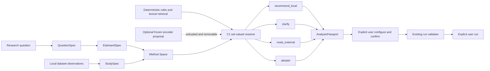

# Modori Research OS Method Space and C1 Design

Date: 2026-07-12
Status: Approved research design; implementation is not authorized by this document
Baseline commit: `788bf06cbe14c686e24c10f6d791cbc78cf1ae69`
Branch: `codex/research-os-contract-design`

## 1. Executive decision

The overall verdict is **conditional-go**.

Modori can credibly pursue a free, local Research OS that recommends, clarifies,
abstains, and routes unsupported work without a generative runtime. It may be possible
to demonstrate higher research-task completeness than SPSS-experienced graduate
students and early-career social-science researchers on a bounded, formally scorable
task population. It is not currently possible to defend superiority over statistical
experts, all SPSS workflows, or social science as a whole.

The approved long-term product direction is:

> Modori is not a clone of every SPSS menu. It aims to exceed SPSS 32 in the
> completeness of social-science research tasks and to connect unsupported analyses
> accurately as a free, local Research OS.

This is an aspiration, not an empirical claim. The first claim-bearing research is
restricted to the named P1 population of Korean- and English-language, unweighted,
formally scorable quantitative tasks. Neither success on P1 nor a survey-only
coverage inventory licenses a claim about social science as a whole.

The differentiator is not free/local operation by itself. jamovi and JASP already
provide free, local statistical environments with broad modules. The differentiator
must be the integrity-preserving chain:

```text
research question
→ target quantity
→ study facts
→ admissible method space
→ recommend_local | clarify | route_external | abstain
→ diagnostics and robustness obligations
→ versioned analysis-route record
```

The approved runtime baseline is deterministic C1 plus lexical retrieval. A frozen
encoder may exist only as a disabled, untrusted experimental sensor and is omitted if
it fails both the material-benefit and office-PC gates. Generative or autoregressive
models are out of scope for the V1 runtime.

## 2. Claims and non-claims

### 2.1 Claims this research may eventually support

- Exact conformance to a frozen decision contract on formalizable cases.
- Safe action selection among local recommendation, clarification, external routing,
  and abstention.
- Lower severe-omission rates or higher complete-valid-artifact rates than a named
  user population using SPSS 32 or working unaided.
- Local calculation coverage and guided-external coverage for a named, sampled method
  population.
- Teacher fidelity on teacher-labeled research records, explicitly not validity.

### 2.2 Claims this research must not support without new evidence

- Model output is human gold.
- Model agreement, multi-agent agreement, or self-grading is independent gold.
- A public 80 percent accuracy claim inherited from an old benchmark threshold.
- Statistical-expert equivalence or superiority.
- Coverage of "most social science." A narrow quantitative-survey frame cannot
  license that umbrella phrase even if it is perfectly sampled and reviewed.
- Coverage of most tasks inside any narrower frame without a frozen sampling frame,
  task unit, weights, strata, nonresponse policy, and uncertainty interval.
- Causal validity from a filled form, column name, regression, mediation coefficient,
  or randomized-looking variable.
- Recommendation validity from numerical agreement between calculation engines.
- Safety from an experimental toggle, disclaimer, or transfer of responsibility to
  the user.

Publication rules, exclusions, strata, and failure disclosure must be frozen before
locked evaluation. Whether a result is published must not depend on whether it is
favorable.

## 3. Repository-grounded findings

The baseline repository has 17 executable module specifications:

```text
reliability
compare_groups
paired_comparison
regression_ols
logistic_regression
descriptives_table1
frequency_crosstab
correlation
anova_oneway
anova_factorial
kruskal_wallis
ancova
factor_pca
repeated_measures_anova
friedman
mediation
moderated_mediation
```

Sixteen can emit recommendation candidates, all sixteen have experimental
recommendation evidence, and `paired_comparison` is manual-only. No method-selection
slice is validated. Local executability is therefore not recommendation authority.

The existing benchmark identity, `family + roles + design_mode`, is too coarse for the
new design. Several modules bundle variants that may target different quantities:

- Student, Welch, and Mann-Whitney;
- paired t and Wilcoxon;
- Pearson and Spearman;
- PCA and exploratory factor analysis;
- coefficient alpha and omega.

The 20-case public pack is an annotation-economics pilot. It is not accuracy or
prevalence evidence. The historical baseline's default selection of
`descriptives_table1` across those cases demonstrates lack of research-intent input;
it does not quantify recommendation accuracy.

The following existing boundaries remain authoritative:

- V1 is local-only and single-user.
- Real user data never goes to a cloud teacher.
- Recommendation never executes automatically.
- Calculation accuracy and recommendation validity are separate ledgers.
- Missing, conflicting, stale, unsupported, and unsafe states fail closed.
- An optional learned component has no file, network, tool, calculation, execution,
  or persistence authority.

This document supersedes only the following older design assumptions:

- A flat family/role/design recommendation identity is no longer sufficient.
- `route_external` is a first-class primary action, not an abstention reason.
- Automatic parametric/nonparametric substitution is not allowed when it changes the
  estimand.
- A generative SLM is no longer a V1 adoption target.
- A fixed 800-case corpus is not presumed adequately powered for a 3 percentage-point
  paired effect.

Historical benchmark schemas remain frozen for replay. New records use an explicit
adapter and mark bundled legacy identities as `ambiguous_legacy` rather than rewriting
history.

## 4. Alternatives considered

### 4.1 Mirror the 17-module catalog

This is cheap and compatible with existing menus, but makes product capability define
its own coverage denominator. It also preserves false equivalences among bundled
variants. Rejected.

### 4.2 Use broad research-task families only

This is useful for navigation and literature coding but too coarse for safety,
replay, exact scoring, external handoff, and estimand preservation. Rejected as the
authoritative contract; retained as a display layer.

### 4.3 Layered, estimand-aware Method Space

The selected design separates family, exact variant, estimand, study design, concrete
roles, run configuration, and independent evidence ledgers. It costs more to curate
but is the only option that supports the Research OS thesis without menu-clone logic.

## 5. Architecture



`AnalysisPassport` is an analysis-route record, not a certificate and not an
execution ticket. It cannot contain a worker token, command, pipeline mutation, or
implicit selection.

Guided and Pro modes are read-only projections of the same canonical contracts:

- Guided asks reviewed, plain-language questions one at a time.
- Pro exposes formal fields, revisions, rule IDs, and provenance.
- Both produce the same action, candidate set and order, blocking facts, conflicts,
  claim limits, experimental or heightened-review disclosure, evidence status, route
  freshness and privacy warnings, and causal limitations.
- Pro has no safety bypass or auto-run privilege.

## 6. Common fact and provenance model

### 6.1 Public states

The closed wire vocabulary is:

```text
observed
inferred
user_confirmed
unknown
conflict
not_applicable
stale
```

These are not a scalar confidence ladder. Internally they are normalized from
orthogonal axes:

```text
applicability = applicable | not_applicable
freshness     = current | stale
resolution    = none | single | conflict
basis         = observed | inferred | user_confirmed
```

`stale` is freshness, `not_applicable` is applicability, `conflict` is resolution,
and the other values describe the basis of an active value. No weighted confidence
may combine these axes.

The public-state normalization order is normative:

1. `freshness=stale` produces `stale`;
2. otherwise `applicability=not_applicable` produces `not_applicable`;
3. otherwise `resolution=conflict` produces `conflict`;
4. otherwise `resolution=none` produces `unknown`;
5. otherwise the single value exposes its `observed`, `inferred`, or
   `user_confirmed` basis.

The internal axes and alternatives remain serialized, so this public projection does
not erase why a fact is stale, conflicted, or inapplicable.

### 6.2 Minimal fact contract

```text
Fact<T> {
  state
  value | null
  alternatives[]
  provenance_refs[]
  reason_code | null
  stale_snapshot | null
}
```

Invariants:

- `observed`, `inferred`, and `user_confirmed` require one value and provenance.
- `unknown` has neither a value nor alternatives.
- `conflict` has no resolved value and at least two incompatible, sourced
  alternatives.
- `not_applicable` has no value and records why applicability was rejected.
- `stale` has no active value and retains the prior value, original provenance, and
  invalidation reason.
- `not_sure` produces `unknown`, never an inferred guess.
- Revalidation creates a new revision; it does not silently revive a stale fact.
- Rejected proposals remain in the append-only decision history and are not an eighth
  live state.

Authority is fact-specific:

- Reproducible physical observations cannot be overridden by a user assertion.
- Intent, construct meaning, target population, pairing meaning, temporal meaning,
  assignment, sampling facts, and causal intent are human-owned.
- Source metadata is recorded as what the source declares, not as unconditional
  scientific truth.
- A conflict between a human assertion and physical evidence remains a conflict until
  explicitly resolved.
- Lexical or encoder evidence can nominate a fact but cannot satisfy a hard gate.

### 6.3 Provenance

Every active fact has a discriminated validity binding appropriate to its origin and
fact type. It does not mechanically bind every possible version. For example, a row
count binds the dataset snapshot but not the Method Space catalog; a user-authored
target-population fact binds its decision event and QuestionSpec revision but may be
independent of row order.

Possible bindings include:

```text
origin_kind
origin_method_and_version
project_id
applicable dataset or schema fingerprint
applicable question, estimand, or study revision
applicable catalog, ruleset, route, or lexical-index version
evidence_refs
event_sequence
invalidation_rule
```

Closed origin classes include data profile, source metadata, user answer, user edit,
question text, deterministic rule, lexical search, catalog policy, frozen encoder,
imported project, and migration.

Imported confirmations become untrusted assertions until locally reviewed. An
encoder, if ever present, is never represented as trusted.

### 6.4 Shared wire envelope

Every canonical specification uses this envelope:

```text
schema_id
schema_version
project_id
object_id
revision
supersedes_revision | null
created_event_ref
```

Version 1 rejects unknown keys, invalid enum values, duplicate IDs, noncanonical
Unicode, and over-budget fields. Adding a field or enum value requires a schema-version
change and an explicit migration. Migrations append provenance and never rewrite an
old saved object in place.

## 7. Canonical specifications

### 7.1 `QuestionSpec`

Purpose: record what the researcher asks without embedding a statistical procedure.

Minimum fields:

```text
question_id and revision
capture_mode: free_text | structured | hybrid
language: ko | en | mixed | und
optional local question text
research_goal
causal_intent
mentioned concepts and role hints
```

The version-1 enums are closed:

```text
ResearchGoal =
  describe | compare | associate | predict | estimate_effect |
  evaluate_measurement | explore_structure | examine_process |
  other_specified

CausalIntent = noncausal | causal

RoleHint =
  outcome | exposure | group | predictor | covariate | mediator |
  moderator | item | repeated_measure | unspecified
```

Method, test, and module IDs are forbidden structured fields. Literal text such as
"run an ANOVA" may be retained as user text but does not bypass the estimand or study
contracts. `causal_intent=causal` records desired claim scope and does not authorize
causal wording.

Raw question text is stored only inside the local project when the user explicitly
saves the project. Imported free-text cells, prompts, and completions never enter this
contract.

### 7.2 `EstimandSpec`

Purpose: define the target quantity independently from the estimator or software.

The durable `EstimandSpec` contains the target functional, not every downstream model
choice. Its minimum fields are:

```text
estimand template and claim basis
target population
unit of analysis
focal outcome, exposure/group, and other target-defining concept roles
contrast
time scope
effect scale
```

The version-1 enums are closed:

```text
EstimandTemplate =
  summary | frequency_distribution | group_contrast | within_unit_change |
  association | conditional_association | prediction_target |
  internal_consistency_coefficient | latent_structure_target |
  indirect_association | conditional_indirect_association |
  causal_effect | other_specified

ClaimBasis =
  descriptive | associational | predictive | measurement |
  exploratory | causal

TargetRole =
  outcome | exposure | group | focal_predictor | mediator |
  moderator | item_set | repeated_measure

ContrastKind =
  pairwise | omnibus | trend | reference_level | user_specified |
  not_applicable

EffectScale =
  distribution | mean | median | probability | proportion |
  difference | ratio | correlation | slope | odds | risk |
  coefficient_alpha | omega_total | omega_hierarchical |
  latent_structure | indirect_effect | prediction_metric |
  other_specified
```

Adjustment sets, nuisance covariates, identification assumptions, prediction
validation regimes, and measurement-model choices are separate typed companions:

```text
IdentificationSpec
PredictionTargetSpec
MeasurementModelSpec
```

They are referenced by a Method Space plan and are not silently folded into the
target quantity. A covariate belongs in `EstimandSpec` only when it defines a
conditional target; a variable used merely for adjustment belongs in
`IdentificationSpec`.

Conditional invariants include:

- A group contrast needs an outcome, grouping/exposure role, contrast, and dependence
  structure.
- Within-unit change needs ordered measurements and a confirmed pairing/repeated-unit
  fact.
- Prediction needs a `PredictionTargetSpec` that fixes the target, horizon, population,
  validation regime, and metric; same-sample fit does not become out-of-sample
  validation.
- An internal-consistency target needs a `MeasurementModelSpec`, confirmed item
  membership, reverse coding, item treatment, missingness policy, and a
  coefficient-specific target. Alpha, omega-total, and omega-hierarchical are not one
  estimand.
- An indirect-association model needs explicit X, M, Y and, when applicable,
  moderator placement.
- A causal effect needs exposure/intervention, comparator, outcome, target population,
  time horizon, and an `IdentificationSpec`. A document may be observed to assert an
  assumption, but that observation does not satisfy the assumption. Substantive
  identification facts remain human-anchored and method-policy constrained. Schema
  completeness still does not prove identification.
- `other_specified` cannot produce `recommend_local` without a versioned Method Space
  mapping.

The requirement to define a target quantity outside the statistical model follows the
social-science estimand framework of Lundberg, Johnson, and Stewart. [Primary
paper](https://doi.org/10.1177/00031224211004187)

### 7.3 `StudySpec`

Purpose: describe how rows and measurements came into existence. It never selects a
method.

Minimum fields:

```text
dataset and source-schema fingerprints
unit of observation and unit of analysis
design family
data layout
temporal structure
dependence structure
assignment mechanism
sampling design
design role bindings
repeated-measure order
missing-code meanings
```

The version-1 enums are closed:

```text
UnitKind =
  person | household | organization | event | encounter |
  item_response | timepoint | aggregate_cell | geographic_unit |
  other_specified

DesignFamily =
  observational | randomized_experiment | quasi_experiment |
  measurement_study | descriptive_administrative |
  aggregate_ecological | mixed_design | other_specified

DataLayout =
  unit_rows | long_repeated | wide_repeated | aggregate_rows |
  contingency_counts | matrix | mixed

TemporalStructure =
  single_wave | repeated_panel | repeated_cross_section |
  event_history | rolling | other_specified

DependenceKind =
  independent | paired | repeated_within_unit | clustered |
  nested | crossed | spatial | network

AssignmentMechanism =
  randomized | as_if_random | nonrandomized | unknown

SamplingDesign =
  census | probability_simple | probability_stratified |
  probability_cluster | probability_multistage | quota |
  convenience | purposive | administrative | unknown
```

Free-form scientific labels are permitted only as bounded user-authored text behind
`other_specified`. They cannot route automatically until a later schema version maps
them to a canonical identity.

Invariants:

- Every variable reference resolves against the exact current dataset snapshot.
- `independent` is mutually exclusive with dependence structures.
- Wide `pre/post` columns do not prove same-unit pairing.
- A weight-like or cluster-like column does not prove it should be used.
- Aggregate rows cannot be silently treated as individual observations.
- Cluster or multistage designs require only their design-applicable cluster, stratum,
  and weight facts before execution. A method route still requires every fact needed
  to choose the exact external identity; unresolved operational prerequisites may be
  listed by an already-valid route, while unresolved method-selection facts require
  clarification.
- Dataset replacement or relevant transformation stales bound facts; no fuzzy remap
  restores them.

### 7.4 `ClarificationSpec`

Purpose: ask one bounded, human-answerable fact only when the answer can change the
decision.

Each question records a fact address, versioned Korean template, optional English
template, why it matters, closed answer schema, `not_sure` branch, decision branches,
dependencies, and lifecycle.

```text
AnswerKind =
  yes_no | single_choice | variable_single | variable_multi |
  ordered_variables | level_choice | bounded_text |
  conflict_resolution

ClarificationTrigger =
  action_change | method_identity_change | role_change | design_change |
  estimand_change | claim_boundary_change | data_policy_change
```

A question is legal only when at least two permitted answers change the primary
action, estimand, method family or variant, role, design, claim boundary, or
user-authorized data policy. Users are never asked to judge normality, rank
deficiency, numerical stability, or anything the engine can compute.

An answer appends a local decision event; it does not mutate data, analysis
configuration, or an existing specification in place. An estimand-changing answer
creates a new draft EstimandSpec revision that requires explicit acceptance. A
data-policy answer uses the existing replayable confirmation path and remains separate
from clarification planning.

The planner may ask at most three inline clarification questions. This is not a
three-field limit on initial structured intake. When more blocking facts are missing,
the user completes the StudySpec rather than receiving a guessed answer.

### 7.5 `AnalysisPassport`

The passport binds exact QuestionSpec, EstimandSpec, and StudySpec revisions; dataset
fingerprint; Method Space version; C1 ruleset digest; lexical-index digest; and
encoder state/version.

It uses one mutually exclusive action payload:

```text
recommend_local:
  surface-authorized stable local set, optional co-primary set,
  exact roles and claim limits, contraindications, evidence status,
  robustness obligations, explicit user configure-confirm-run gate

route_external:
  exact external capability or specialist-consultation route,
  route and selection evidence, prerequisites, privacy boundary,
  no local recommendation or execution gate

clarify:
  current ClarificationSpec references, blocking facts, and why they matter;
  no candidate identity, default, or claim permission

abstain:
  closed reason code and recovery requirements;
  no candidate identity, implied method, or claim permission
```

Every payload also binds component provenance and current/stale status. Rejected
methods and full rule traces live in the resolver audit record. A clarify or abstain
passport may reference rule IDs and blocking facts but cannot expose a de facto method
recommendation.

Permitted claim classes are closed and bounded:

```text
sample_description
population_description
association
within_sample_prediction
out_of_sample_prediction
coefficient_specific_internal_consistency
exploratory_latent_structure
causal_effect
```

The broad label `measurement_quality` is prohibited.

## 8. Method Space

### 8.1 Identity layers

```text
CapabilityIdentity =
  family_id
  + variant_id
  + estimand_template_id
  + design_id
  + role_schema_version

TaskIdentity =
  CapabilityIdentity
  + normalized concrete role assignments
  + QuestionSpec digest
  + EstimandSpec digest
  + StudySpec digest

RunIdentity =
  TaskIdentity
  + data snapshot hash
  + preprocessing DAG hash
  + execution parameters and reference levels
  + engine and dependency versions
  + RNG policy and seed
```

Ordered roles remain ordered. Unordered role sets are canonicalized. Display names do
not identify variables. `estimand_template_id` names a canonical Method Space target;
the project-local `estimand_id` and its target population, contrast, horizon, and
effect scale are bound through the EstimandSpec digest. Two scientifically different
targets therefore cannot collide before recommendation scoring.

### 8.2 Orthogonal evidence axes

The registry does not collapse capability and validity into one status.

| Axis | Controlled values or evidence |
| --- | --- |
| Support | `local_compute`, `guided_external`, `recognized_only`, `out` |
| Calculation evidence | Formula oracle, engine parity, edge and metamorphic tests, report review |
| Recommendation evidence | `not_applicable`, `experimental`, `validated`, `suspended` |
| Route evidence | `unverified`, `recipe_verified`, `roundtrip_verified`, `stale`, `withdrawn` |
| Prevalence evidence | Frozen literature-inventory snapshot only |
| Lifecycle | `draft`, `proof_eligible`, `released`, `deprecated`, `withdrawn` |

Evidence scopes to the exact variant, estimand, design, data/language slice, and
product version. A calculation parity result cannot promote recommendation evidence.
A package upgrade invalidates route evidence until the route is rerun.

Calculation evidence additionally pins implementation digest, module-schema version,
numeric-domain envelope, dependency and engine hashes, oracle version, and report
semantic contract. Recommendation evidence pins ruleset, role schema, corpus manifest,
scorer, evidence stage, language/design slice, and product surface. Route evidence
pins the exact capability identity, export/import contract, tool and package versions,
privacy policy, test fixture, expected diagnostics, and round-trip result digest.

### 8.3 Aliases and deprecation

Aliases are typed:

- `exact`: spelling or acronym with identical semantics;
- `contextual`: terms such as ANOVA or regression that require clarification;
- `engine_menu`: discovery name from SPSS, JASP, jamovi, or R;
- `historical`: old Modori replay key;
- `forbidden_equivalence`: tempting but false mapping.

Mann-Whitney as "the nonparametric t-test" is a forbidden equivalence unless a
specific perspective has been explicitly fixed. Pearson/Spearman, paired
t/Wilcoxon, PCA/EFA, and alpha/omega are not exact aliases.

Retired canonical IDs are never reused. Identity-preserving migrations may be
automatic; semantic migrations require reconfirmation; withdrawn identities fail
closed for new recommendations.

## 9. C1 formal semantics

### 9.1 Stable eligibility

Facts may be Boolean, categorical, set-valued, ordered, or typed references. C1 first
projects each `Fact<T>` into a finite domain using a fact-specific trust policy:

- a current reproducible observation may satisfy a physical hard predicate;
- a current user confirmation may satisfy a human-owned hard predicate;
- source metadata satisfies only the predicate "the source declares X" unless a
  separate policy validates the scientific meaning;
- an inferred, lexical, imported-unreviewed, or encoder proposal never satisfies a
  human-owned hard predicate and does not narrow that fact's admissible domain; it is
  retained only as an untrusted proposal for corroboration or question planning;
- `unknown` expands to the fact registry's admissible domain;
- `conflict` preserves every current incompatible alternative and triggers
  clarification when it can invalidate the returned decision;
- `not_applicable` is an explicit domain value accepted only by predicates that
  declare it legal;
- `stale` contributes no trusted value and behaves as unknown for eligibility while
  separately blocking reuse of the stale revision.

Every hard predicate declares its required trust floor. Let `Omega(F)` be every
complete typed state compatible with this trusted projection, and `H_m(state)` be
method `m`'s hard eligibility predicate.

Rules are declarative and versioned:

```text
Rule {
  rule_id, rule_version, ruleset_version
  scope: capability_identity | fact_code | route_identity
  class: hard | preference
  typed_condition
  effect: exclude | require_fact | add_obligation | add_counterevidence |
          route_candidate | integrity_abstain
  trust_floor
  severity
  source_refs[]
  proof_and_test_refs[]
  introduced_at, expires_at | null
}
```

Preference rules may order an already-safe set but cannot emit, include, or restore a
method. An active ruleset contains one version of every referenced rule.

```text
Stable(m)   iff H_m is true for every state in Omega(F)
Possible(m) iff H_m is true for at least one state in Omega(F)
```

Only stable methods can be returned. The ruleset freezes one lexicographic preference
policy; it cannot choose between Pareto and lexicographic ranking after seeing results.
A weighted score cannot compensate for a hard failure.

C1 keeps four disjoint sets:

```text
co_primary_set              # stable, same estimand, no scientific preference
robustness_set              # predeclared paths preserving the estimand
estimand_changing_set        # requires explicit new EstimandSpec acceptance
external_set                # exact external identities or consultation routes
```

An active hard-rule conflict, gap in action totality, or method that is both required
and prohibited is an integrity error and produces abstention.

### 9.2 Primary-action precedence

Before precedence, C1 derives:

```text
stable_eligible(m)       # hard scientific and capability gates pass
surface_authorized(m)    # recommendation evidence permits this product surface
manual_executable(m)     # user may configure it manually; not recommendation authority
```

`experimental` evidence authorizes exposure only inside the explicit experimental
surface. Ordinary product exposure requires `validated`. A stable but unauthorized
local identity neither becomes a recommendation nor blocks evaluation of a
scientifically valid external or consultation route.

Decision precedence is:

1. Corrupt context, mixed rule versions, empty compatible-state set, active hard-rule
   conflict, security error, or provenance failure produces `abstain`.
2. A human-answerable unknown or conflict produces `clarify` only when an answer can
   invalidate the proposed safe set, change the estimand or claim boundary, resolve
   whether any safe action exists, or change a method-selection prerequisite. A fact
   that merely adds another acceptable alternative does not force clarification.
3. One or more surface-authorized stable local identities produce `recommend_local`.
4. When no surface-authorized local identity exists, an exact stable external method
   produces `route_external` only when its exact selection slice has
   `recommendation_evidence=validated` and route evidence is current
   `roundtrip_verified`. A `recipe_verified` route remains an
   experimental research candidate; `unverified`, `stale`, and `withdrawn` routes are
   hard exclusions.
5. A specialist-consultation route may be returned without a method identity only
   when its scope, privacy boundary, and current route evidence are explicit. It is
   not scored as an executed analysis.
6. All other states produce `abstain`.

For causal targets, unresolved identification first produces clarification. A known
unsupported or violated identification strategy produces abstention, not a software
route. A method route is legal only after identification is supported but local
execution is unavailable. A separately curated specialist-consultation route may help
the user redesign the study but cannot imply that a package repairs identification.

Real scientific ties are returned as an acceptable set without an arbitrary default.
An experimental recommendation does not select or run a candidate automatically.

### 9.3 Best-next-question

For each candidate question and permitted answer, C1 recomputes this signature:

```text
(action, co_primary_set, estimand_id, role_bindings, design_signature,
 claim_permissions, blocking_facts, maximum_risk, route_class,
 data_policy_consequences)
```

Questions with identical signatures for every answer are prohibited. Remaining
questions are ranked lexicographically by:

1. worst-case reduction of severe identification or safety ambiguity;
2. worst-case reduction in distinct decision signatures;
3. number of major blockers removed;
4. answer burden, sensitivity, and user answerability;
5. fixed question ID.

Probabilistic question priors are not used without an independently frozen and
validated source. Repeated state hashes and exhausted question budgets cause C1 to
recompute the normal primary-action precedence from the current facts; if no safe
action exists, it abstains.

**Normative refinement (2026-07-15):** the exact one-question, depth-at-most-three,
risk-lexicographic bounded-minimax policy in
`2026-07-15-risk-bounded-counterfactual-clarification-planner-design.md` supersedes this
subsection's informal ranking and resource-exhaustion behavior. In particular, an
exhausted budget or structural search cap returns a typed abstention and never silently
falls back to this ranking. The implementation evidence and remaining product blocker are
recorded in `docs/qa/counterfactual-clarification-planner-evidence.md`.

### 9.4 Estimand preservation

Every branch has one classified contract:

```text
path_class:
  estimand_preserving_sensitivity |
  identification_sensitivity |
  estimand_changing_alternative
trigger
invariant estimand
varied assumption or identification condition
comparison metric
interpretation rule
branch cap
```

Result values, p-values, diagnostic outcomes, or desired directions can never replace
the predeclared primary path. Diagnostics may only activate predeclared additional
branches or record a limitation. Every executed branch reports its method-appropriate
effect or test summary and conclusion stability; direction and interval are required
only when defined for that method.

Changing the target quantity creates an `estimand-changing alternative`, not a
robustness branch. Examples:

- A population mean contrast may use a Welch strategy; a Mann-Whitney decision rule
  is not an automatic fallback for failed normality.
- Pearson and Spearman answer different association targets and are not selected by a
  normality switch.
- Alpha and omega remain distinct measurement variants, and neither coefficient
  establishes construct validity.
- A causal mediation claim cannot be silently downgraded to an associational indirect
  effect, or vice versa.

The multiple interpretations of t and Wilcoxon-Mann-Whitney decision rules require the
hypothesis and assumptions to be fixed before substitution. [Fay and
Proschan](https://pmc.ncbi.nlm.nih.gov/articles/PMC2857732/) Pretesting equal variance
to choose Student or Welch can also be inferior to a predeclared Welch strategy.
[Delacre, Lakens, and Leys](https://rips-irsp.com/articles/82) Common claims that a high
coefficient alpha proves reliability or internal consistency are not valid.
[Cho and Kim](https://doi.org/10.1177/1094428114555994) Causal mediation requires
strong identification assumptions and sensitivity analysis. [Imai, Keele, and
Yamamoto](https://imai.fas.harvard.edu/research/mediation.html)

## 10. Formalizable and human-anchored boundary

Formalizable means that a decision can be verified once the required facts are fixed.
It does not mean the facts can be inferred from the data.

| Area | Formal/program oracle | Human anchor |
| --- | --- | --- |
| File schema, missing codes, cardinality, empty cells | Direct observation and tests | Meaning of a suspicious code when metadata is absent |
| Variable-role compatibility | Closed role and measurement contracts | Construct meaning and intended role |
| Pairing, repetition, cluster, weight use | Consistency checks after facts are fixed | Whether those design facts are scientifically true |
| Estimand completeness | Required-field and cross-field invariants | Target population, quantity, contrast, theory link |
| Method eligibility | Hard predicates and decision tables | Preference among substantively different valid targets |
| Numerical execution and diagnostics | Program and cross-engine oracles | Consequence accepted by the researcher |
| Causal identification | Formal checks can disprove some claims | Assumptions and substantive causal model |
| Measurement and scale construction | Numeric calculations after item set is fixed | Item membership, content validity, construct validity |
| Interpretation | Fixed limitation and claim-permission templates | Contextual meaning and scientific conclusion |
| External capability | Versioned tool and round-trip checks | Appropriateness of unresolved specialist choices |

No-expert research may establish contract conformance and genuinely independent
program-oracle results in the formal column. It cannot turn a rule author's decision
table into independent scientific gold. Human-anchored results and unreviewed
literature-to-rule mappings remain research-only or claim-blocked.

## 11. P1 program and guarded scope

`proof_eligible` means ready to enter independent recommendation validation; it does
not mean validated.

### 11.1 P1 program

Independent audit found that two of the seven approved research areas are not yet
exact proof identities. The P1 program therefore has a locked-ready core and a blocked
expansion gate rather than relaxing the identity contract.

P1-A, eligible for formal case design after source-rule review:

1. Unweighted descriptive summaries and frequencies without a treatment or baseline
   claim.
2. Unweighted two-way categorical association, with Pearson chi-square and 2x2 Fisher
   as separate variants and explicit sparse-cell policy.
3. Bivariate association with an explicit Pearson or Spearman target; no `auto`
   identity.
4. Independent two-group population mean contrast using a predeclared Welch variant
   and confirmed independence.
5. Paired mean-change contrast using a paired-t variant with pairing and direction
   confirmed.

The current bundled `compare_groups`, paired-test, and correlation auto-routing paths
are not P1 identities. A proof case binds the exact Welch, paired-t, Pearson, or
Spearman variant before execution and cannot inherit a post-diagnostic hidden switch.

`paired_comparison` remains manual-only in the current catalog. Its research inclusion
does not change product routing, evidence status, or exposure without a separate
catalog promotion after validation.

P1-B, approved research areas but blocked from a locked proof set until the exact
identity is frozen:

6. One-way mean comparisons must split at least the classical one-way F/Tukey target
   from a Welch one-way/Games-Howell target and fix contrast, group weighting,
   multiplicity, and missingness. The current classical omnibus plus Levene-triggered
   post-hoc switch is not one proof identity.
7. Internal-consistency work must separate coefficient alpha, omega-total, and
   omega-hierarchical and fix the measurement model, ordinal/continuous item treatment,
   item membership, reverse coding, missingness, and fit obligations. Until then it
   may report calculations but cannot make a broad reliability or measurement-quality
   recommendation claim.

### 11.2 P2 guarded

- Mann-Whitney, Wilcoxon, Kruskal-Wallis, and Friedman until the distribution/rank
  target is explicit.
- One-way omnibus/post-hoc and internal-consistency identities that have not passed
  the P1-B freeze gate.
- Multivariable OLS, logistic regression, and ANCOVA until outcome, adjustment set,
  reference/event, explanatory-versus-predictive goal, time order, and causal intent
  are resolved.
- Factorial ANOVA until fixed-factor structure and the exact contrast/weighting policy
  are resolved.
- Repeated-measures ANOVA and Friedman until unit identity, order, dependence,
  missingness, and reshape policy are resolved.
- PCA and EFA as separate identities with human decisions for construct goal,
  extraction, rotation, and retention.
- Mediation and moderated mediation with time order, model identity, covariates,
  sensitivity obligations, and explicit causal-language boundaries.
- All weights, clusters, complex samples, multiple imputation, causal identification,
  and validated prediction claims.

P2 is not a feature deletion. Manual bounded execution may remain available while the
automatic recommendation claim remains guarded.

## 12. External Method Space

The following are discovery families and begin at `recognized_only`, not as guided
routes:

- complex survey designs and replicate weights via R `survey`;
- linear and generalized mixed models via R `lme4` where its exact supported family
  applies;
- mixed, count, and zero-inflated models via R `glmmTMB` where its exact supported
  family applies;
- CFA, SEM, measurement invariance, and bounded latent growth via R `lavaan`;
- multiple imputation and pooling via R `mice`;
- survival and event-history models via R `survival`;
- meta-analysis and meta-regression via R `metafor`.

No tool-family bundle can become one route. Each family/variant/estimand/design
combination receives a separate capability identity, selection-evidence record, and
round-trip-verified route card before it moves to `guided_external`. Causal and
quasi-experimental estimators, Bayesian hierarchical models, IRT and latent-class
models, qualitative and mixed-method analysis, text, network, and spatial analysis
also begin at `recognized_only`.

A guided route contains the exact method, prerequisites, capability gap, local/free
tool priority, pinned version, user-approved export contract, expected diagnostics,
minimum verification checklist, privacy warning, evidence status, and revalidation
date. It does not download, install, open, upload, or execute automatically.

## 13. Teacher output and silver corpus

The approved product and P1 proof do not depend on a teacher model. A best-available
cloud teacher may be used only on independently sourced public, synthetic, or lawfully
de-identified research-corpus material with documented rights. Imported user or
project data is never sent to a cloud teacher, even if someone describes it as
de-identified, aggregated, or redacted.

Teacher output is structured:

```text
TeacherCaseProposal {
  source_id, rights, lineage
  provider, model, model_version, prompt_version
  primary_action
  analysis_family, variant, estimand, design_mode
  outcome, group, predictor, covariate, repeated-role assignments
  missing_decision_facts
  contraindicated_analyses
  supporting_evidence
  counterevidence
  concise_rationale
  uncertainty_and_conflict_flags
  per_field_validation_status
}
```

Records receive one status:

- `accepted_oracle`: every adopted field passed an independent formal or program
  oracle;
- `research_only`: useful teacher proposal without independent validity evidence;
- `quarantine`: conflict among source, rule, program, or teacher outputs;
- `reject`: rights, contract, evidence, safety, or provenance failure.

Teacher self-scores and same-model grading are discarded. Cross-model agreement is a
disagreement diagnostic, not gold. Only independently oracle-verifiable fields may be
eligible for future selective distillation. Human-anchored teacher fields remain
research-only. No training is authorized by this design.

## 14. Corpus generation and contamination control

1. Record source, version, rights, language, sensitivity, and transformation lineage.
2. Split by source, study, generator, and teacher lineage before augmentation.
3. Generate deterministic synthetic cases from frozen design-factor grids.
4. Add public-study abstractions only when redistribution and transformation rights
   are clear.
5. Run formal, program, and metamorphic validators before corpus admission.
6. Detect exact duplicates, MinHash near-duplicates, semantic near-duplicates, and
   normalized StudySpec duplicates.
7. Maintain a denylist of public benchmark sources and locked evaluation artifacts.
8. Blind teacher/provider identity during human review.
9. Keep locked cases and labels outside Git; store only hashes and non-sensitive
   manifests in the repository.
10. Retire a holdout if cases, labels, scorer, thresholds, or rules are exposed before
    a changed system is evaluated.

Authentic multi-analyst studies are robustness-attack material, not simple gold. In a
73-team study of the same data and hypothesis, analysis decisions and results varied
substantially and most numerical variation remained unexplained. [PNAS primary
paper](https://doi.org/10.1073/pnas.2203150119)

## 15. Evaluation ledgers

The project keeps independent ledgers and never reports their average as one accuracy
number.

| Ledger | Unit and metrics | Allowed interpretation |
| --- | --- | --- |
| Teacher fidelity | Exact field match, F1, coverage against teacher proposal | Reproduces teacher behavior |
| Contract conformance | Exact action/identity/set against independently implemented formal rules | Implements the frozen contract; not automatically scientific validity |
| Source-rule validity | Independently reviewed literature-to-rule mappings and external program oracles | Valid only for the reviewed formal task slice |
| Workflow planning | Valid decision record, time, correction and harmful-revision rates | Improves named users' analysis planning |
| Workflow execution | Valid executed analysis on symmetrically executable tasks | Improves named users' execution on that task slice |
| Human validity | Expert-adjudicated human-anchored cases | Valid only for the reviewed slice |
| Coverage | Local, guided, recognized, out, unknown by sampled stratum | Capability prevalence, not recommendation accuracy |

The planning outcome is:

```text
valid_decision_record = 1
```

only when the target and estimand, primary action, exact method identity and roles,
contraindications, assumptions and diagnostics, limitations, provenance, and local or
external route are all correct and no severe or boundary failure occurs.

The execution outcome is separate:

```text
valid_executed_analysis = 1
```

only on tasks that both compared products can execute under a symmetric task contract.
It additionally requires correct preprocessing, parameters, numerical results,
diagnostics, and report semantics. A correct clarification, abstention, consultation,
or external route can pass planning but never counts as an executed analysis.

## 16. Counterexample and tail-attack plan

Locked attacks include:

- the same data with different questions or estimands;
- a one-fact toggle between independent, paired, repeated, weighted, or clustered
  designs;
- misleading names, mixed Korean/English labels, and reordered columns;
- missing codes that look like valid values;
- reverse-item and scale-membership ambiguity;
- empty cells, complete separation, tiny or imbalanced groups, high-dimension/low-n,
  and constant or collinear variables;
- aggregate and repeated-header rows;
- post-treatment covariates and unsupported causal intent;
- unknown methods and out-of-scope qualitative tasks;
- prompt-injection-like strings and PII-like text in cells;
- row, label, language, and harmless metadata metamorphic transformations;
- result-value and p-value changes that must not rewrite the pre-result primary path;
- deliberately wrong recommendations used only in a separate user error-recovery
  study.

## 17. Minimizing human review

P1-A formal cases do not require an external expert to score every implementation
invariant. Participants are baseline systems, not judges. However, C1 rules cannot
generate both the system answer and its own scientific gold. Rule authorship,
source-to-rule mapping, scorer implementation, and program oracles are separated.
Unreviewed rule-based results are labeled contract conformance only. Scientific
recommendation validity requires independent source-rule review or a genuinely
independent program oracle for the declared slice.

If qualified review becomes available, sample in this order:

1. all C1-oracle, source-rule, and system-system disagreements;
2. all severe-risk emissions and causal or construct claims;
3. all new Method Space identities and routes;
4. a stratified random agreement sample;
5. expand only until the predeclared interval or agreement target is met.

Without qualified review, human-anchored fields remain unknown and cannot be used for
recommendation-validity or broad coverage claims. Teacher or model consensus does not
replace the missing review.

## 18. Local model and hardware research

The shipping baseline has no model dependency and targets no more than 10 MB of
additional lexical resources.

Any optional semantic sensor must meet all of these product-artifact gates:

- preferred additional package at most 150 MB; hard cap 200 MB;
- semantic worker private memory at most 500 MB;
- warm p95 at most 500 ms;
- cold p95 at most 2 seconds;
- no UI-thread execution;
- exact deterministic fallback with no automatic retry;
- product INT8 artifact evaluated directly, not inferred from FP32 results;
- generic target-CPU compatibility, fixed hashes, license, conversion recipe, and
  SBOM.

The first compatibility experiment, if later authorized, is the official AVX2 INT8
artifact of `paraphrase-multilingual-MiniLM-L12-v2`, with
`multilingual-e5-small` as a semantic comparator only after a generic AVX2 artifact is
audited. [MiniLM model card](https://huggingface.co/sentence-transformers/paraphrase-multilingual-MiniLM-L12-v2),
[E5 model card](https://huggingface.co/intfloat/multilingual-e5-small)

The encoder may retrieve a reviewed prototype or suggest a fact hypothesis. It cannot
emit a method, action, URL, command, explanation, or persistent decision. It is
counterfactually non-authoritative within one evidence stage: removing every
encoder-origin proposal cannot change the action, candidate set, claim permission, or
hard-gate result. It may rank already-legal clarification hypotheses or retrieval
items; any later action change must arise from independent deterministic corroboration
or an explicit user answer. It is removed unless its end-to-end clarified workflow
improves by the predeclared material margin without accuracy, precision, coverage,
hardware, language, or family regression. The historical 3 percentage-point Top-1
gate cannot by itself authorize a component that is forbidden to decide Top-1.

## 19. Security, privacy, and supply-chain ledger

| Risk | Mandatory control | Stop condition |
| --- | --- | --- |
| User-data cloud disclosure | Product network zero; teachers receive only allowed research cases | Any user-row disclosure |
| Unsafe recommendation | Stable-set C1, hard gates, conflict preservation | Any locked E4 false recommendation |
| Nearest unsupported fallback | First-class route or abstain | One silent method substitution |
| User overreliance | Counterevidence, claim limits, no auto-selection/run | Harmful revision or calibration regression |
| Corpus leakage | Lineage split, deduplication, locked external labels | Holdout exposure or post-exposure tuning |
| Model/runtime tampering | Pinned single-file artifact, standard-op allowlist, signatures, SBOM | Dynamic download, custom op, external data, or unverifiable artifact |
| External-link drift | Versioned route cards, expiry, round-trip evidence | Stale or unverified route emitted |
| Persistence poisoning | Project/fingerprint/version binding; imported assertions untrusted | Cross-project or stale reuse |
| Selective claims | Frozen scorer, strata, exclusions, and publication rule | Outcome-dependent disclosure decision |

No learned worker receives filesystem, network, registry, subprocess, tool, calculation,
execution, or persistence authority. External routes do not automatically export,
open, install, or run anything.

## 20. Coverage inventory

Coverage is a separate prevalence study. It does not extend the recommendation
benchmark.

The initial population should be named narrowly, for example:

> Primary quantitative analysis tasks in Korean- and English-language empirical
> survey research from selected social-science disciplines, 2023 through 2026 YTD.

Papers are the sampling units. The primary estimator gives each sampled paper equal
base weight and normalizes that paper's declared primary tasks to sum to one. This
prevents a paper with many tables or models from dominating. A separate task-population
estimand is permitted only with explicit cluster-size and task-inclusion weights.

Stages:

1. A purposively diverse 200-300-paper development sample grows the ontology and
   coding guide; it produces no prevalence estimate.
2. Freeze a `CoverageFrameSpec` containing registry sources, journal/DOI or record
   universe, query and retrieval date, discipline mapping, study and survey classifier,
   language rule, year/type filters, inaccessible-full-text and nonresponse policy,
   cross-registry duplicate resolution, inclusion probabilities, task-selection rule,
   and estimator.
3. Freeze the ontology, alias registry, coding guide, scorer, and analysis plan.
4. Draw an independent probability sample across at least psychology, sociology,
   education, political science/public administration, communication, economics,
   social/public health, and social work; treat 2026 YTD separately.
5. Oversample Korean-language work and use recorded inclusion and nonresponse weights
   for population estimates.
6. Freeze paper labels before joining them to the current capability registry.
7. Report recognition, exact local-compute, local-plus-guided, full-primary-workflow,
   out-of-scope, and unknown rates separately by discipline, year, language, design,
   and paradigm with weighted intervals.

A 600-record inventory is exploratory unless its frozen frame and final precision and
design-effect calculation support the named claim. Fifty papers per discipline-year
cell implies a capacity scenario near 1,600 before language oversampling; it is not a
probability design or guaranteed sample size until `CoverageFrameSpec` exists. The
final sample is determined by the predeclared precision target, nonresponse plan, and
estimator, not convenience.

If external experts are unavailable, trained coders may extract observable method and
software facts; ambiguous estimands and validity judgments remain unknown. No
"most social science" claim is permitted from that reduced review. Even a complete
review of this narrow quantitative-survey frame cannot support that broader phrase.

## 21. Machine and human pilot

### 21.1 Machine stages

- 120 contract and schema cases;
- 480 development cases;
- 360 independent cases to estimate eligible and discordant rates and set sample
  size;
- 660-2,400 locked benefit cases, selected before exposure from the paired-power
  calculation;
- 360 separate high-risk guard cases.

The old 800-case value is not assumed sufficient. For a 3 percentage-point paired
difference, approximate required size ranges from about 580 to 2,331 as discordance
rises from 5 to 20 percent under two-sided alpha .05, 90 percent power, independent
matched pairs, and no clustering inflation. The final size comes from a predeclared
crossed or cluster-aware simulation using planning-split discordance and source
clustering. Related cases from the same source or study are not counted as independent
replications.

Zero observed failures in 360 independent guard cases has an approximate one-sided
95 percent binomial upper bound near 0.83 percent; it is a release stop screen, not
evidence that population risk is zero.

### 21.2 Human workflow pilot

Primary comparator population:

> SPSS-experienced social-science graduate students and early-career researchers.

The primary comparison is researcher-plus-Modori versus researcher-plus-SPSS 32
desktop with the cloud AI Output Assistant disabled. A secondary cloud-assisted SPSS
or generative-service lane uses public or synthetic data only. SPSS 32's AI Output
Assistant is a watsonx.ai service that interprets selected procedure output and can be
disabled. [IBM documentation](https://www.ibm.com/docs/en/spss-statistics/32.0.0?topic=system-ai-output-assistant)

The pilot has two non-interchangeable tracks.

Planning-completeness track:

- 60-90 participants;
- 6-8 matched tasks per participant;
- randomized Modori/SPSS tool assignment with a within-participant crossover on
  different matched cases and Latin-square order balancing;
- a tool-neutral response form and rubric, so Modori-specific passport fields do not
  create points that SPSS users cannot earn;
- formal or program oracle scoring, not participant voting;
- blinded scoring, standardized tool training, equal time, and frozen allowed aids;
- crossed participant-by-case analysis for generalization;
- separate planning accuracy, execution accuracy, time, question burden, and
  calibration.

Correction and reliance track:

- the same case receives an unaided predecision and a post-tool decision;
- tool assignment, case set, and order are randomized;
- beneficial correction, harmful correction, error recovery, and calibration are
  computed only from these same-case pairs;
- deliberately wrong recommendations, if used, belong only to this separately
  consented attack track and never enter product-accuracy scoring.

The pilot estimates participant and case variance, discordance, attrition, order
effects, and major-stratum variance. A provisional main range is 180-300 participants
across 120 locked tasks, but crossed participant-by-case simulation fixes sample size,
task allocation, repeated judgments per case, attrition allowance, and the severe-harm
bound. The range itself is not evidence of power.

Recommended product-level smallest effect of interest:

- a provisional smallest meaningful effect of 10 percentage points in
  `valid_decision_record`; the main study is powered so the confidence-interval lower
  bound must exceed +10 percentage points, with no severe-risk or major-stratum harm;
- time is secondary;
- the optional semantic sensor receives a separate question-efficiency and end-to-end
  clarified-workflow gate because it has no direct action authority.

The defensible eventual claim names the participant population, task population,
language, product versions, action coverage, exclusions, effect, interval, and worst
stratum. It never says "better than humans" or "better than experts" without those
qualifiers.

## 22. Formal proof obligations and stop rules

C1 must satisfy, through finite-domain exhaustive checks, SAT/SMT analysis where
appropriate, property tests, and metamorphic oracles:

- action totality and mutual exclusivity;
- hard-rule satisfiability, overlap, gap, conflict, and unreachable-rule detection;
- deterministic traces independent of input fact and rule order;
- trust non-escalation: less trusted evidence cannot open a recommendation;
- failure monotonicity: adding a hard failure cannot make a method eligible;
- information monotonicity under the declared information order: weakening a
  consistent trusted fact into `unknown` cannot create a stable method. Removing a
  stale, invalid, or lower-authority conflicting proposal is conflict resolution and
  is tested separately;
- estimand identity for automatic robustness paths;
- route safety and reconstructible round-trip provenance;
- finite question termination and question relevance;
- rule, catalog, route, and fingerprint version isolation;
- explanation completeness for every inclusion, exclusion, question, route, and
  abstention.

The closed severity taxonomy is:

| Code | Meaning | Example |
| --- | --- | --- |
| E1 | Safe usability loss | Unnecessary but harmless question or abstention |
| E2 | Recoverable analytical loss | Nonpreferred but still acceptable alternative |
| E3 | Major decision error | Wrong role, dependence structure, stale fact, or missing required diagnostic |
| E4 | Severe scientific error | Unsafe recommendation/route, unsupported strong claim, or silent estimand change |
| E5 | Boundary failure | Data disclosure/mutation, auto-execution, cross-project reuse, or irreconstructible provenance |

Average accuracy cannot compensate for E4 or E5. Immediate stop conditions apply to
every locked ledger and any later deployment-shadow audit, not only a high-risk slice:

- any E4 unsafe recommendation or route;
- any E5 boundary failure;
- unauthorized data disclosure or mutation;
- silent causal-to-associational or mean-to-rank estimand substitution;
- active hard-rule conflict or mixed-version trace;
- question loop or nontermination;
- unreconstructible external result provenance;
- use of an exposed holdout as confirmatory evidence after a criterion, threshold,
  rule, or scorer change;
- family or language harm hidden by aggregate improvement.

A repair is rational only when the cause traces to one rule or policy, the repair adds
the counterexample, increments the ruleset version, and reruns the complete invariant,
metamorphic, and regression suite plus every affected stratum. The failed locked set is
retired to development evidence; a fresh independently locked confirmation set is
required.

There is one global E4/E5 repair cycle per candidate release. Any E4 or E5 in the fresh
post-repair confirmation cycle, whether the same class or a different one, ends that
release attempt and moves the affected identity or architecture to guarded, external,
recognized-only, or out of scope. There is no third confirmatory attempt under the
same release claim.

Deterministic replacement of the current baseline requires at least a 5
percentage-point exact improvement with a paired interval excluding zero, or at least
a 30 percent reduction in E3/E4 errors without accuracy or coverage loss, plus zero
E4/E5 failures. This is an internal component gate, not a public
superiority claim.

## 23. Research sequence

1. Freeze the contracts and rule vocabulary in this research specification.
2. Build the Method Space ontology on a development-only literature sample.
3. Write the P1 decision tables and identify every human-owned blocking fact.
4. Construct scorer implementations and program oracles independently from C1 rule
   implementation, and obtain independent source-to-rule review before calling the
   result recommendation validity rather than contract conformance.
5. Generate and attack development cases; retire unsound identities rather than
   relaxing criteria.
6. Estimate discordance and fix locked sample sizes.
7. Evaluate deterministic C1 and lexical ablations.
8. Evaluate an optional frozen encoder only if the no-model system leaves a material,
   measurable semantic gap and hardware research is authorized.
9. Run the human workflow pilot after the formal P1 slice is stable.
10. Make only the claim supported by the applicable ledger and named population.

This sequence is research and design. It does not authorize product code, model
training, benchmark mutation, package changes, VM payload changes, or connection to
the calculation engine.

## 24. Defaults and remaining research questions

The following defaults are adopted unless new evidence disproves them:

- Product views are named Guided and Pro.
- A causal request with unresolved identification clarifies first. A known unsupported
  or violated identification strategy abstains. It routes to an exact external method
  only when identification is supported and local execution is unavailable. A
  separately verified specialist-consultation route may help redesign the question
  but cannot imply a valid estimator. A noncausal local alternative is offered only
  after explicit user choice and is recorded as an estimand change.
- Raw user question text is project-local and saved only through explicit project
  save.
- `route_external` requires a specific verified resource; generic recognition alone
  is `recognized_only` and produces abstention rather than a route.
- The encoder is absent from ordinary production packages and, if researched, exists
  only in a separate disabled research build until every adoption gate passes.
- Multi-dataset, multilevel, qualitative, and mixed-method representation is outside
  the P1 canonical schema; Method Space may recognize it without pretending full
  support.

Open research questions:

- Whether a second order-insensitive analytical fingerprint is needed alongside the
  exact replay fingerprint.
- How many external routes can be maintained with annual round-trip verification.
- Which P2 identities can be reduced to formal slices without construct or causal
  judgment.
- Whether the 10 percentage-point workflow effect is the final smallest effect of
  interest after pilot cost and harm estimates.
- Whether a population coverage claim is economically rational under the review
  burden, or whether Modori should publish a transparent capability registry instead.

## 25. Primary evidence boundary

Official provider material supports product-feature and artifact facts only. It is
not independent performance evidence. Independent research supports the following
design conclusions:

- Narrow, highly structured statistical prompts can perform much better than broad
  autonomous analysis, so structured inputs and oracles are not optional.
- Julius performance varies substantially across statistical, social-science, and
  causal tasks. [Independent 2026 evaluation](https://doi.org/10.1007/s11135-026-02898-5)
- Prompt detail can materially change generative statistical correctness, and wrong
  methods, coding errors, and unrequested data alteration occur. [JMIR 2025
  study](https://doi.org/10.2196/63550)
- Human-plus-AI performance is not guaranteed to exceed the better party, so workflow
  effects and harmful reliance must be measured directly. [Preregistered
  meta-analysis](https://www.nature.com/articles/s41562-024-02024-1)
- Fixed benchmark accuracy and generalized accuracy are different estimands and
  require explicit participant, case, and system variation. [NIST AI evaluation
  guidance](https://www.nist.gov/news-events/news/2026/02/new-report-expanding-ai-evaluation-toolbox-statistical-models)

These findings motivate the deterministic, estimand-first, selectively abstaining
design. They do not prove Modori's future validity; only the locked research program
can do that for its declared scope.
