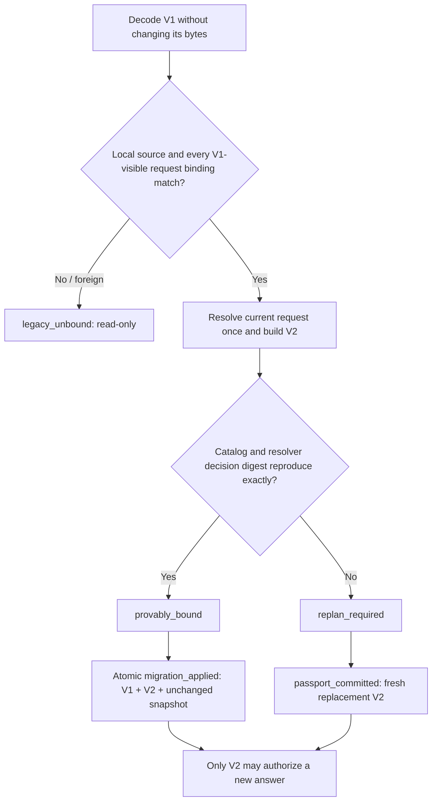

# AnalysisPassport V2 and Explicit Migration Design

**Date:** 2026-07-15
**Status:** awaiting written-spec review after approval of the architecture direction
**Branch:** `codex/research-os-contract-design`
**Baseline:** `3d7f1fdad9aa84dd91d3d9b4e3a2a84432e5c664`

## 1. Decision

Modori will introduce `modori.analysis_passport` schema version 2, retain exact
read-only decoding of version 1, write only version 2 for new decisions, and prohibit a
version 1 clarify passport from authorizing a new answer transition.

Version 2 replaces the parallel version 1 clarification arrays with one typed
`clarification_ref` that binds the exact question revision and the counterfactual plan
that selected it:

```text
clarification_ref:
  question_id
  question_version
  question_digest
  fact_address
  planner_version
  clarification_plan_digest
  source_decision_digest
```

It also adds `request_binding_digest` and `clarification_registry_digest`. The first
commits to every ResearchRequest input, including the surface, question budget,
available-variable set, and complete decision-evidence references. The second binds the
question catalog against which the resolver and transition operate. Merely fixing the
selected question while leaving those decision inputs movable would create a narrower
version of the same replay defect.

The V2 clarify payload carries the complete canonical `ClarificationPlan` as well as its
digest. A digest without its preimage would be a lookup promise, not self-verifying
evidence. The locked all-unknown P1 plan is 14,267 canonical JSON bytes with 15 root
evaluations, so retaining it is proportionate and does not require a model or a large
runtime.

Migration is deliberately selective:

1. `provably_bound`: the current request matches every V1-visible binding and reproduces
   the version 1 resolver decision digest, including the complete planner trace; emit an
   equivalent version 2 passport and adopt it only through a durable migration event.
2. `replan_required`: the request still matches the version 1 passport, but the exact
   decision cannot be reproduced; run the current resolver and create a fresh version 2
   passport without claiming equivalence.
3. `legacy_unbound`: the source context is absent, foreign, unverified, or no longer
   matches; preserve the version 1 value for inspection only.

No missing version, digest, plan, or provenance value is inferred. No version 1 bytes
are rewritten. Migration proves replay equivalence to the deterministic resolver; it
does not prove that the statistical recommendation is scientifically valid.

## 2. Repository Audit Findings

The design responds to six concrete facts in the current implementation.

1. `ClarifyPayload` version 1 stores only parallel `question_ids` and
   `blocking_fact_addresses` arrays.
2. `ClarificationAnswerEvent` already stores `question_version` and `question_digest`,
   but the source passport does not bind them.
3. `ClarificationTransitionService` currently compares the answer only with the current
   registry question. A version 1 passport can therefore be paired with a later question
   revision having the same ID.
4. The post-planner `resolver_decision_digest` commits to the entire
   `ClarificationPlan.to_mapping()`, including the selected question version and digest.
   It cannot be inverted, but it can be verified by deterministic re-resolution of the
   exact bound request.
5. The Decision Ledger can decode only the current Python `AnalysisPassport` type. Its
   reserved `migration_applied` event has never been used and presently verifies neither
   a source passport nor a target passport. SQLite itself does not need a schema change
   for a passport-body version change.
6. Version 1 does not bind the request's product surface, remaining question budget,
   available-variable tuple, complete `DecisionEvidenceRef` identities, or clarification
   registry digest. Some of these values affect resolution or answer validation even
   when the component and dataset digests remain unchanged.

The decisive consequence is that a version 1 passport alone is insufficient migration
evidence. Post-planner version 1 values may qualify through exact digest reproduction.
Pre-planner values, multi-question values, and values whose catalog or decision changed
must be replanned or held as legacy.

## 3. Alternatives Considered

### A. Add optional fields to version 1

Rejected. This would make two meanings share one schema version, change the digest of
old records, and permit decoders to confuse absent evidence with evidence that was never
captured. It is the easiest implementation and the least defensible provenance model.

### B. Version-tagged passport with strict V1 and V2 clarification payloads

Selected. The envelope version selects one of two closed top-level field sets and one of
two closed clarification payload shapes. Version 1 remains byte-for-byte decodable;
version 2 is the only writable shape. A shared tagged decoder avoids duplicating all
non-clarify action logic while retaining schema-specific exact-key validation. Internal
Python representation choices must not make absent V1 evidence look like optional V2
evidence.

This is a discriminated union, not a dataclass with optional migration fields:

```text
schema_version = 1 -> ClarifyPayloadV1(question_ids[], blocking_fact_addresses[])
schema_version = 2 -> ClarifyPayloadV2(clarification_ref, clarification_plan)
```

### C. New schema ID such as `modori.analysis_passport_v2`

Rejected. A new ID would split one concept into unrelated artifact families, duplicate
ledger metadata and quarantine dispatch, and make supersession harder to verify. The
existing `SchemaEnvelope.schema_version` is the correct discriminator.

## 4. Version 2 Wire Contract

### 4.1 Top-level passport

The version 2 top-level mapping keeps the version 1 semantic fields and adds two exact
input/catalog commitments:

```text
envelope
question_ref
estimand_ref
study_ref
dataset_fingerprint
method_space_version
method_space_digest
ruleset_version
resolver_decision_digest
decision_evidence_digests[]
request_binding_digest
clarification_registry_digest
recommend_local | null
clarify | null
route_external | null
abstain | null
```

The action remains an exclusive union. The recommend, external-route, and abstain
payload shapes do not change. A version 2 passport always uses envelope
`schema_id = modori.analysis_passport` and `schema_version = 2`.

`request_binding_digest` is the canonical digest of this closed mapping:

```text
schema_id = modori.research_request_binding
schema_version = 1
question_ref
estimand_ref
study_ref
current_dataset_fingerprint
available_variable_ids[]
surface
question_budget_remaining
decision_evidence_refs[]  # complete canonical mappings, not only event digests
```

The ordered variable and evidence tuples are preserved exactly. The existing explicit
passport fields remain independently validated; the binding digest closes the request
inputs that V1 omitted and detects cross-field splicing. V2's
`clarification_registry_digest` equals the exact current
`ClarificationRegistry.digest()`.

The ledger artifact wrapper remains `schema_version = 1`; that number versions the
ledger artifact envelope, not the AnalysisPassport body. Tests and documentation must
keep these two version domains explicit.

### 4.2 `ClarificationRef`

```text
question_id: closed nonblank ID
question_version: positive integer
question_digest: lowercase SHA-256
fact_address: closed dotted fact address
planner_version: closed nonblank ID
clarification_plan_digest: lowercase SHA-256
source_decision_digest: lowercase SHA-256
```

`ClarifyPayloadV2` contains exactly one `clarification_ref` and one complete canonical
`clarification_plan`. Lists of references are intentionally not used: the accepted
planner contract asks one question per round. Adding batch questions would require a
future schema version rather than silently weakening this invariant.

Cross-field invariants:

- `source_decision_digest == AnalysisPassport.resolver_decision_digest`;
- the reference equals the selected question ID, fact address, version, and digest in
  the exact `ClarificationPlan` used by the service;
- `clarification_plan_digest == ClarificationPlan.digest()`;
- recomputing the closed clarify `ResolutionDecision.semantic_signature` from the plan
  and selected reference yields `source_decision_digest`;
- the referenced question is active when the passport is created; and
- all version 2 mappings have exact keys and reject Boolean integers, unknown fields,
  duplicate action payloads, malformed digests, and mixed V1/V2 payload shapes.

The plan is decoded through new exact `from_mapping()` contracts for the plan and its
nested trace values. Derived values such as rank keys must recompute exactly. The trace
contains question IDs, fact addresses, hashes, risk counts, and resource counters, but no
raw dataset value, free text, path, URL, command, or execution instruction.

Schema version 2 freezes planner contract
`research-os-counterfactual-minimax-v1`. A future incompatible plan format requires a
new passport schema version or an explicitly designed versioned plan decoder; changing
the planner constant must not make historical V2 artifacts unreadable.

## 5. Read, Write, and Transition Policy

### 5.1 Dual read, V2-only write

The tagged passport decoder first decodes the envelope, accepts only versions 1 and 2,
and selects the exact top-level field set and clarification payload decoder for that
version. Re-encoding a version 1 passport must reproduce its current mapping and digest
exactly.

`ResearchOsService.resolve_and_plan()` accepts only a version 2 passport envelope,
resolves once, and returns one immutable `ResolvedPassport` containing the decision and
its V2 passport. It computes the request, registry, resolver-decision, and plan digests
once. Existing `plan()` delegates to that operation and returns only the passport. The
migration path consumes the same resolved bundle instead of running the planner twice.
No new API creates version 1 values.

### 5.2 V2 answer validation

For a clarify answer, the transition service must establish all three equalities:

```text
answer question identity == V2 clarification_ref
current active registry identity == V2 clarification_ref
answer source_passport_digest == exact V2 passport digest
```

It then performs the existing project, component revision, dataset fingerprint,
decision-evidence, question-budget, replay, answer-shape, and variable checks. It also
recomputes the exact current `request_binding_digest` and registry digest before applying
an answer. The embedded plan lets it verify the plan digest and resolver decision digest
without a second planner search.

A version 1 clarify passport raises a typed `PassportMigrationRequired` transition
failure before candidate construction. It never falls through to the current-registry
comparison. Already-recorded historical version 1 events remain replayable because
ledger replay restores committed snapshots; it does not manufacture a new transition.

Planner version is provenance, not perpetual runtime authority. A V2 passport remains
answerable only while its exact question revision is still active. A later planner
version alone does not invalidate an already-issued passport; a changed question digest
does.

## 6. Explicit Migration Contract

### 6.1 Closed outcomes

```text
PassportMigrationDisposition =
  provably_bound | replan_required | legacy_unbound

PassportMigrationAssessment:
  disposition
  source_passport_digest
  reason_codes[]
  reproduced_decision_digest | null
  equivalent_passport | null
  replacement_passport | null
```

`provably_bound` carries only `equivalent_passport`. `replan_required` carries only
`replacement_passport`, produced by the same single resolver call but explicitly not
labeled an equivalent migration. `legacy_unbound` carries neither. The distinct fields
make it structurally impossible for a fresh decision to be presented as a converted
one.

The assessment is pure and has no file, network, SQLite, tool, calculation-engine, or
execution authority. Its source is restricted to a version 1 clarify passport. Other
version 1 actions remain readable history and are refreshed, when needed, through normal
planning rather than migration.

“Locally trusted” is not a caller-set Boolean. The durable coordinator must load the
source passport artifact by content ID from an already verified local Decision Ledger.
Running the pure assessment over an arbitrary object proves, at most, mathematical
digest equivalence and cannot authorize adoption. An unpersisted rollout-era V1 value is
replanned into a fresh V2; a quarantine-origin value remains foreign.

### 6.2 Binding reproduction

For a locally trusted version 1 clarify passport and the current ResearchRequest:

1. Verify every request input V1 actually recorded: project ID, component references,
   dataset fingerprint, and ordered decision-evidence digests.
2. Verify the current Method Space version, digest, and ruleset version against the
   passport.
3. Resolve and materialize a current V2 passport for the exact request once through
   `resolve_and_plan()`.
4. Compute
   `canonical_digest({"semantic_signature": decision.semantic_signature})`.
5. Require the decision to be one-question `clarify` and require the reproduced digest
   to equal the version 1 `resolver_decision_digest`.
6. Require the reproduced plan's selected ID and fact address to equal the version 1
   arrays, and its selected question revision to equal the current active registry.

If every condition passes, SHA-256 collision resistance plus deterministic canonical
encoding binds the exact plan that produced the version 1 decision. The equivalent V2
copies all V1 semantic fields, uses the reproduced plan to create
`clarification_ref`, and binds the exact current request and registry through the new V2
digests. This is decision-equivalent reissuance; it does not claim that V1 had recorded
the newly explicit request fields.

Target envelope requirements for an equivalent migration:

```text
schema_id == source.schema_id
schema_version == 2
project_id == source.project_id
object_id == source.object_id
revision == source.revision + 1
supersedes_revision == source.revision
created_event_ref == migration event ID when persisted
```

If the request binding matches but catalog identity, action, plan, selected question, or
resolver digest differs, the result is `replan_required`. The already-materialized
`replacement_passport` may become clarify, recommend, route, or abstain; it is a new
result and retains no claim of equivalence to V1.

If the request binding cannot be established, the source is foreign/imported, or the
source context is unavailable, the result is `legacy_unbound`. A separate fresh plan may
still be created from a valid current local request, but it is not a migration of the
legacy record.

### 6.3 Migration decision matrix

| Source and current evidence | Outcome | Allowed action |
| --- | --- | --- |
| All V1-visible local request bindings and catalog match; resolver digest and one-question plan reproduce | `provably_bound` | Atomically append migration and then use equivalent V2 |
| All V1-visible local request bindings match; current resolver output differs for any reason | `replan_required` | Use the single-pass replacement V2; re-ask if it clarifies |
| Component, dataset, evidence, or project binding differs | `legacy_unbound` | Preserve V1 read-only; independently plan current state if requested |
| Foreign or quarantine-origin passport | `legacy_unbound` | Never promote it into local transition authority |
| V1 has multiple questions or predates the bound planner | `replan_required` when request matches, otherwise `legacy_unbound` | Never invent question revision values |
| Malformed or unknown-version bytes | quarantine/reject before assessment | No passport object and no migration |



## 7. Decision Ledger Integration

Migration does not alter the SQLite schema or rewrite an artifact. The existing reserved
`migration_applied` event is activated only for a provably equivalent passport migration.
Its existing payload remains unchanged:

```text
from_schema_version = 1
to_schema_version = 2
resulting_snapshot_artifact_id
```

Its sorted subjects must contain exactly:

- one source V1 AnalysisPassport artifact;
- one target V2 AnalysisPassport artifact; and
- the unchanged current ResearchRequestSnapshot artifact.

Typed event verification identifies source and target by their passport-body envelope
versions and enforces:

- same project and passport object ID;
- exact revision/supersession lineage;
- exact equality of component refs, dataset, Method Space, ruleset, resolver decision,
  decision evidence, and non-clarify null payloads;
- recomputed target `request_binding_digest` equality with the event's request snapshot;
- V1 one-question ID/address equality with the V2 clarification reference; and
- recomputation of the source V1 resolver decision digest from the target's complete
  clarification plan;
- the target envelope's `created_event_ref` equals the event ID.

The coordinator reruns the pure migration assessment before constructing the event. The
append is one existing atomic ledger transaction and does not change the materialized
request. Failure leaves both the head and snapshot unchanged.

Normal ledger opening verifies this lineage and recomputes the plan, target, and source
decision commitments without requiring today's resolver to reproduce an obsolete
catalog. A separate semantic migration audit may rerun the pinned catalog when
available. Lack of that historical runtime is reported as audit unavailable, not ledger
corruption; a digest mismatch is reported as audit failure. The event remains a
tamper-evident record of the local coordinator's verified operation, not a digital
signature or independent scientific oracle.

A fresh or replanned V2 is recorded, when memory is available, with the already-reserved
`passport_committed` event rather than `migration_applied`. This distinction prevents a
new current decision from masquerading as an equivalent conversion. Both events bind the
exact unchanged request snapshot. If memory is unavailable, ordinary V2 planning remains
available, but the migration API is not invoked and the result is treated as a fresh V2
replacement because durable append-only provenance cannot be claimed.

No existing historical V1 artifact is bulk-converted. A V1 artifact already supporting
an answer event remains part of that immutable event's evidence forever.

## 8. Import and Quarantine Boundary

Evidence bundles may contain V1 or V2 passport artifacts, and both must decode strictly
for integrity inspection. Neither version is imported as a Fact, user confirmation,
decision authority, migration candidate, or executable instruction.

The quarantine layer continues to extract only authority-free imported assertions. It
never returns a passport object through its promotion result. A foreign passport cannot
be made local by matching its dataset fingerprint, resolver digest, question digest, or
planner version. Local re-resolution from a separately valid local ResearchRequest is a
new local decision, not promotion of the foreign passport.

## 9. Failure and Recovery Semantics

| Failure | Required behavior |
| --- | --- |
| V1 presented for a new answer | typed `PassportMigrationRequired`; no candidate |
| Answer and V2 reference differ | reject; no mutation |
| Registry and V2 reference differ | reject as stale; fresh plan required |
| Plan digest or source decision digest is spliced | passport construction/decoding rejects |
| V1 deterministic reproduction differs | `replan_required`; never copy missing fields |
| Current request no longer matches V1 | `legacy_unbound`; do not merge contexts |
| Migration ledger append crashes | atomic rollback; V1 remains readable |
| Migration event source/target swapped or incomplete | ledger integrity rejection |
| Foreign passport offered to local migration | hold as `legacy_unbound` |
| Unknown future passport version | fail closed; no best-effort decoder |

There is no fallback from failed migration to silent conversion. Replanning is an
explicit different outcome. Legacy records are not deleted merely because the current
runtime cannot upgrade them.

## 10. Performance and Resource Policy

The ordinary V2 path must execute the counterfactual planner once. Migration assessment
must also execute it at most once. Ledger persistence may validate mappings and hashes
but must not trigger a second full planner search in the accepted product path.

Predeclared implementation gates:

- V2 contract construction/round-trip overhead, excluding the existing resolver call,
  remains below 50 ms and 5 MiB on the development machine's locked P1 case;
- the canonical embedded P1 plan remains below 64 KiB; exceeding that bound stops full-
  trace embedding and requires a separately designed content-addressed trace artifact;
- the exact P1 planner retains its existing 5-second development-machine and 256-MiB
  gates;
- no new package dependency, model, network access, or SQLite schema migration;
- passport commit and migration append remain within the existing Decision Ledger
  atomicity and recovery tests; and
- the design preserves the user's accepted 30-second office-PC interaction budget by
  never performing two planner searches for one visible decision.

If safe persistence cannot avoid a second full search, direct migration is disabled and
the simpler fresh-replan path is retained.

## 11. Verification Strategy

### 11.1 Contract and compatibility

- frozen V1 mapping and digest golden test before and after the change;
- strict V1 and V2 round-trips;
- exact-key, malformed digest, Boolean-version, mixed-payload, and unknown-version
  rejection;
- every new action writes V2 while every valid historical V1 action remains readable;
- architecture scan proving no authority-bearing field or method was added.

### 11.2 Transition attacks

- V1 answer rejection before candidate construction;
- answer matches current registry but not the passport reference;
- answer matches passport but registry version/digest has changed;
- question ID reuse with changed branches or wording;
- fact-address, planner-version, plan-digest, and decision-digest splicing;
- stale component, dataset, evidence, project, replay, and variable-substitution cases.

### 11.3 Migration matrix

- a post-planner V1 value whose exact decision digest reproduces;
- pre-planner and multi-question V1 values that must replan;
- benign fact-map or already-canonicalized declaration permutations that preserve every
  bound digest, plus semantic changes to a question, registry, Method Space, ruleset,
  surface, or question budget;
- component, dataset, decision-evidence, and project mismatches that become legacy;
- deterministic repeated assessments with identical target digest;
- a deliberate digest-comparison mutant that the tests must kill.

### 11.4 Ledger, crash, and import

- atomic `migration_applied` with unchanged request snapshot;
- source V1 and target V2 both remain content-addressed and replayable;
- crash injection at every existing append stage;
- swapped, missing, extra, wrong-version, wrong-revision, and wrong-event-ref subjects;
- evidence-bundle export/import round-trip for both passport versions;
- imported V2 passport still produces no local Fact or transition authority;
- full ledger chain, artifact, replay, quarantine, performance, and adversarial suites.

### 11.5 Repository gates

Before any completion claim, freshly run focused Research OS and Research Memory tests,
full Ruff, compileall, the complete repository pytest suite, and the locked planner
evidence benchmark. Passing these gates establishes implementation fidelity and backward
compatibility only.

## 12. Success and Stop Criteria

The slice is successful only if all are true:

1. every new plan is V2 and every historical valid V1 digest is unchanged;
2. no V1 clarify passport can authorize a new answer;
3. V2 binds answer, passport, and current registry to one exact question revision;
4. the complete migration matrix yields only its predeclared outcome;
5. no mismatch can be converted by supplying replacement metadata;
6. migration append is atomic, replayable, and preserves the source artifact;
7. imported passports remain authority-free;
8. ordinary planning and migration each perform at most one planner search; and
9. all focused and repository gates pass without relaxed criteria.

Stop direct migration and retain V2 plus fresh replanning if any of the following occurs:

- exact resolver-digest reproduction is not sufficient to recover a unique plan under
  the frozen canonical contract;
- durable migration cannot bind one source, one target, and one request snapshot without
  changing the ledger wire schema;
- crash recovery can expose a target V2 without its migration event;
- a V1 digest or historical ledger replay changes; or
- the one-search resource boundary cannot be maintained.

A stop on direct migration does not stop V2. The safe fallback is dual-read V1,
V2-only write, V1 transition rejection, and fresh deterministic replanning.

## 13. Non-Claims and Exclusions

This work does not:

- validate C1's statistical recommendation against human or external gold;
- improve numerical calculation accuracy;
- claim expert equivalence, SPSS superiority, or broad social-science coverage;
- add UI, analysis execution, cloud transfer, SLM, free-text persistence, or automated
  external-tool launching;
- treat resolver agreement with its prior digest as independent recommendation evidence;
  or
- migrate foreign evidence into local authority.

The allowed claim is narrower: a V2 clarify passport closes the question-revision drift
gap, and selective migration preserves equivalence only when the current deterministic
system can reproduce the exact prior decision commitment.
