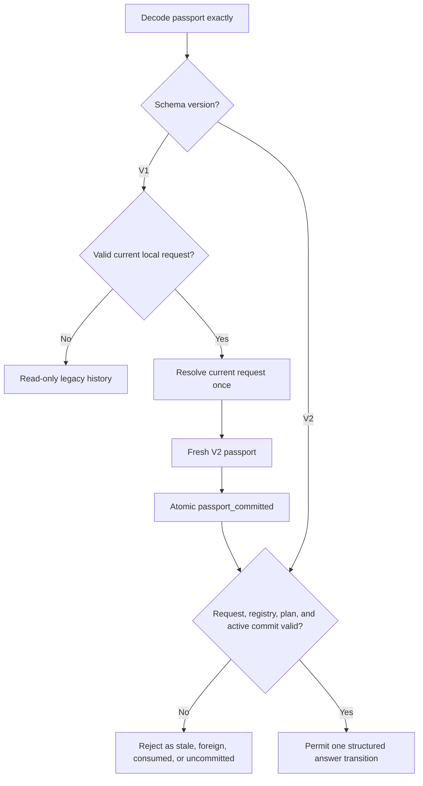

# AnalysisPassport V2 Fresh-Replan Rollout Design

**Date:** 2026-07-15
**Status:** architecture approved; revised after external review; implementation not started
**Branch:** `codex/research-os-contract-design`
**Code baseline:** `3d7f1fdad9aa84dd91d3d9b4e3a2a84432e5c664`

## 1. Decision

Modori will implement the following closed rollout:

1. introduce `modori.analysis_passport` schema version 2;
2. retain exact, read-only decoding of version 1;
3. write only version 2 for new decisions;
4. reject every new answer transition attempted with a version 1 clarify passport; and
5. recover by resolving the current valid ResearchRequest once and committing a fresh
   version 2 passport.

The implementation will activate the already-reserved `passport_committed` ledger
event. It will not activate `migration_applied`, will not add a
`provably_bound` disposition, and will not directly convert a V1 artifact into a V2
artifact.

This is not a weakened safety decision. It removes a mechanism whose only current
benefit would be a lineage edge while retaining the behaviorally important guarantees:
exact V1 readability, exact V2 question binding, drift rejection, current-state
replanning, durable V2 provenance, and imported-authority isolation.

Direct lineage-preserving migration remains a reserved future design. It may be
activated only after an inventory proves that unconsumed, verified-local V1 passports
actually exist and that preserving their object lineage has user or audit value that a
fresh replan cannot provide.

## 2. External Review Disposition

The external review was checked against the repository rather than accepted by
reputation.

| Review point | Disposition | Repository-grounded reason |
| --- | --- | --- |
| Direct V1-to-V2 migration has negligible current value | Accepted for this rollout | Current durable producers persist a V1 passport only as support for the answer that consumes it; no producer commits an unconsumed passport |
| The lineage distinction has no value in principle | Rejected as too broad | A real unconsumed historical population could have forensic or consent-lineage value, but that population is absent from the present production path |
| Consumed V1 passports need an explicit rule | Accepted | Reissuing question authority after an answer would be incorrect even if deterministic digests reproduce |
| `available_variable_ids` needs a canonical order | Accepted with correction | The existing resolver test proves tuple order is decision-irrelevant, so the binding must canonicalize the identity set rather than preserve incidental import/display order |
| `created_event_ref` construction must be explicit | Accepted | The event ID must exist before the passport is hashed; the protocol must explain why this is not a hash cycle |
| At most one concurrently valid clarify passport | Accepted | Otherwise two callers can spend the same question budget against the same request binding |
| The embedded plan can power “why this question?” | Accepted as a follow-up slice | It can expose authority-free, counterfactual rationale without raw data, free text, a model, or analysis execution |

The resulting scope keeps the useful V2 contract and removes direct-migration code,
tests, coordinator state, and audit modes that have no current eligible input.

## 3. Repository Audit Findings

The design follows these verified facts.

1. V1 `ClarifyPayload` stores only parallel `question_ids` and
   `blocking_fact_addresses` arrays.
2. `ClarificationAnswerEvent` stores `question_version` and
   `question_digest`, but its source V1 passport does not bind those values.
3. The current transition service compares a V1 answer with today's registry question.
   Reusing an ID after revising a question can therefore splice old decision authority
   onto new question content.
4. The resolver decision digest commits to the complete post-planner semantic
   signature, but V1 omits the preimage and several request inputs required for
   self-contained transition validation.
5. `passport_committed` and `migration_applied` are reserved ledger kinds, but no
   production coordinator currently emits either one.
6. The only production paths that materialize a passport artifact are
   `commit_ready_answer` and `commit_accepted_answer`. In both paths the same
   `clarification_answered` event consumes that passport.
7. No Decision Ledger database is stored in this repository. An unpersisted prototype
   value or imported bundle cannot satisfy the stronger requirement “loaded by content
   ID from a verified local ledger.”
8. The locked all-unknown P1 `ClarificationPlan` is 14,267 canonical JSON bytes and
   contains 15 root evaluations. Embedding it is small enough for the accepted local
   runtime boundary.
9. `test_available_variable_order_does_not_change_decision` establishes that
   `available_variable_ids` order is not current decision semantics. Repeated-measure
   order is separately represented in StudySpec.

Therefore the eligible direct-migration population under current production paths is
empty:

- durable local V1 passports are already consumed;
- unpersisted V1 passports have no verified-local ledger authority; and
- foreign V1 passports remain quarantined.

This conclusion is scoped to the present code and available evidence. It is not a claim
that no external copy could exist; such a copy would first have to prove the local
ledger provenance and unconsumed state that the current product never produced.

## 4. Alternatives

### A. Add optional fields to version 1

Rejected. This makes two meanings share one schema version, changes old digests, and
confuses “not captured” with “captured and empty.”

### B. Implement direct lineage-preserving migration now

Reserved, not implemented. Exact reproduction is technically possible for a narrow
post-planner V1 subset, but a fresh resolution produces the same visible decision when
those conditions hold. With no eligible current artifacts, the additional disposition
types, event verifier, audit mode, crash matrix, and coordinator branch are speculative
infrastructure.

### C. V2 dual-read plus fresh replan

Selected. It obtains the question-revision, request-binding, registry-binding,
single-search, and durable-provenance guarantees without asserting that V1 contained
evidence it never recorded.

### D. New schema ID such as `modori.analysis_passport_v2`

Rejected. `SchemaEnvelope.schema_version` is already the correct discriminator. A new
schema ID would split one concept into unrelated artifact families and duplicate ledger
and quarantine dispatch.

## 5. Version 2 Wire Contract

### 5.1 Tagged top-level contract

The decoder treats AnalysisPassport as a closed tagged union:

```text
schema_version = 1 -> exact historical fields + ClarifyPayloadV1
schema_version = 2 -> exact V2 fields + ClarifyPayloadV2
```

V2 keeps the V1 semantic fields and adds two commitments:

```text
envelope
question_ref
estimand_ref
study_ref
dataset_fingerprint
method_space_version
method_space_digest
ruleset_version
resolver_decision_digest
decision_evidence_digests[]
request_binding_digest
clarification_registry_digest
recommend_local | null
clarify | null
route_external | null
abstain | null
```

The action remains an exclusive union. Recommend, external-route, and abstain payload
shapes are unchanged. Every V2 passport uses:

```text
schema_id = modori.analysis_passport
schema_version = 2
```

The ledger artifact wrapper remains schema version 1. That number versions the ledger
artifact envelope, not the AnalysisPassport body. Tests and documentation must keep
these version domains distinct.

### 5.2 Request binding

`request_binding_digest` is the canonical digest of:

```text
schema_id = modori.research_request_binding
schema_version = 1
question_ref
estimand_ref
study_ref
current_dataset_fingerprint
available_variable_ids[]       # canonical identity-set representation
surface
question_budget_remaining
decision_evidence_refs[]       # complete canonical mappings
```

The order rules are normative:

- each available variable ID must already be valid canonical NFC;
- `available_variable_ids` is encoded as a case-sensitive ascending Unicode code-point
  list, equivalent to Python's default lexicographic ordering of the validated strings;
- input tuple, dataset-column, and display order do not affect this digest;
- `decision_evidence_refs` remains in strictly increasing event-sequence order because
  evidence order is provenance semantics; and
- if variable order ever becomes decision-relevant, the binding schema must be
  versioned rather than silently changing this rule.

This commits to the decision-relevant variable identity set without treating incidental
import order as authority. The existing explicit passport fields remain independently
validated. `clarification_registry_digest` equals the exact current
`ClarificationRegistry.digest()`.

### 5.3 Clarification reference and complete plan

V2 replaces the two parallel clarify arrays with:

```text
clarification_ref:
  question_id
  question_version
  question_digest
  fact_address
  planner_version
  clarification_plan_digest
  source_decision_digest

clarification_plan:
  complete canonical ClarificationPlan mapping
```

Field requirements:

```text
question_id: closed nonblank ID
question_version: positive integer, Boolean rejected
question_digest: lowercase SHA-256
fact_address: closed dotted fact address
planner_version: closed nonblank ID
clarification_plan_digest: lowercase SHA-256
source_decision_digest: lowercase SHA-256
```

The payload contains exactly one reference. One question per round is a schema
invariant, not a UI preference. Batch questions require a future passport version.

Cross-field invariants:

- `source_decision_digest == passport.resolver_decision_digest`;
- the reference exactly equals the selected question ID, fact address, version, and
  digest in the embedded plan;
- `clarification_plan_digest == ClarificationPlan.digest()`;
- recomputing the closed clarify decision semantic signature from the plan reproduces
  `source_decision_digest`;
- the selected question is active when the passport is created;
- the top-level request and registry commitments match the creation inputs; and
- exact-key decoders reject unknown fields, mixed V1/V2 shapes, Boolean integers,
  duplicate actions, and malformed digests.

The plan and every nested trace type receive exact `from_mapping()` contracts.
Derived values such as rank keys must recompute. The embedded trace may contain closed
question IDs, fact addresses, hashes, risk counts, and resource counters. It may not
contain raw dataset values, user free text, paths, URLs, commands, or execution
instructions.

V2 freezes planner contract `research-os-counterfactual-minimax-v1`. A future
incompatible plan format requires an explicitly versioned decoder or passport V3.

## 6. Read, Plan, and Transition Policy

### 6.1 Exact dual read and V2-only write

The tagged decoder first decodes the envelope and accepts only versions 1 and 2. Each
version selects an exact top-level field set and exact clarify payload decoder.
Re-encoding any valid V1 passport must reproduce its existing mapping and digest.
Unknown future versions fail closed.

No API creates V1. `ResearchOsService.resolve_and_plan()` accepts a V2 passport
envelope, invokes the resolver and counterfactual planner at most once, and returns one
immutable `ResolvedPassport` containing the decision and its V2 passport. Existing
`plan()` delegates to it and returns only the passport.

### 6.2 Fresh V1 recovery

A V1 clarify passport presented for a new answer raises typed
`PassportMigrationRequired` before candidate construction. Recovery is a normal,
single-pass `resolve_and_plan()` over the current valid ResearchRequest.

The resulting V2 is a fresh current decision:

- it does not copy missing V1 bindings;
- it does not claim resolver equivalence with V1;
- it does not use `migration_applied`;
- it does not supersede the V1 object merely because the schema changed; and
- when durable memory is available, it becomes authoritative for a later answer only
  through its own `passport_committed` event.

If there is no valid current local request, V1 remains readable history and no
replacement passport is created.

### 6.3 V2 answer validation

For a clarify answer the pure transition service establishes:

```text
answer question identity == V2 clarification_ref
current active registry identity == V2 clarification_ref
answer source_passport_digest == exact V2 passport digest
```

It then performs the existing project, component-revision, dataset, evidence,
question-budget, replay, answer-shape, and variable checks. It recomputes the current
`request_binding_digest`, registry digest, plan digest, and source decision digest.
The embedded plan avoids a second planner search.

Planner version is provenance, not perpetual authority. A later planner release alone
does not invalidate an issued V2, but a changed question identity, current request
binding, registry digest, or consumed state does.

Pure transition validation does not prove ledger authority. The durable coordinator
adds the active-commit precondition defined below.

## 7. Durable `passport_committed` Protocol

### 7.1 Event construction without a hash cycle

`created_event_ref` contains an opaque event ID, not an event hash or artifact digest.
The coordinator uses this exact order:

1. open and fully verify the ledger, load its current head and request snapshot, and
   check for an already-active clarify passport;
2. preallocate a new event ID and fresh passport object identity in memory;
3. construct the V2 passport envelope with
   `created_event_ref == preallocated event ID`;
4. call `resolve_and_plan()` once and canonicalize the resulting passport artifact;
5. construct `passport_committed` with the same event ID, the passport artifact, and
   the unchanged request snapshot artifacts; and
6. atomically append against the previously read expected head.

“Preallocate” does not mean inserting a placeholder database row. If construction or
append fails, no artifact or event is authoritative or stored. A retry after a head
conflict reopens the ledger; it returns an existing active passport when one now exists,
or allocates a new event ID and rebuilds the passport. It never reuses an in-memory
passport whose `created_event_ref` belongs to an abandoned attempt.

The append-time coordinator requires:

- exactly one V2 passport artifact identified by
  `payload.passport_artifact_id`;
- the payload's request snapshot artifact is the unchanged current snapshot;
- passport project and component bindings equal the snapshot;
- recomputed request, current registry, plan, and decision digests match;
- passport `created_event_ref == event.event_id`; and
- the append changes no ResearchRequest value.

Normal historical ledger opening can recompute the request binding from the stored
snapshot and the plan/decision commitments from the embedded plan. It cannot recompute
the complete registry digest without that historical registry preimage. It therefore
checks the digest's structure and the embedded selected-question identity, while a
separate semantic audit compares the complete registry when the exact catalog is
available. Missing historical catalog is audit unavailable; a mismatch when supplied is
audit failure, not silent acceptance.

No SQLite schema change is required.

### 7.2 One concurrently valid clarify passport

For each `(project_id, request_binding_digest, clarification_registry_digest)` key,
there may be at most one outstanding V2 clarify passport. This ledger-derivable
invariant entails that at most one can be active under the current request and registry.

A committed clarify passport is outstanding exactly when:

1. its `passport_committed` event is in the verified local ledger;
2. its `request_binding_digest` equals the current snapshot's binding;
3. no later `clarification_answered` event consumes its exact passport digest and
   artifact; and
4. no later `decision_retracted` event retracts its commit event.

It is active only when, in addition, its `clarification_registry_digest` equals the
coordinator's current registry and the selected question revision remains active. This
split lets the ledger derive “outstanding” without loading today's catalog while the
transition boundary derives “answerable now” with it.

A snapshot or registry change makes an old passport stale, not active. It remains
immutable history. Before planning, the coordinator returns an already-outstanding and
active passport for the same key. A new current registry forms a different key and may
receive a fresh passport; the old one still cannot answer because transition validation
requires the current registry digest. A lower-level attempt to commit a second
outstanding clarify passport for the same key is rejected with a typed conflict.

Concurrent operations are serialized by the existing expected-head comparison:

- if two commits race, one append wins;
- the loser reopens the ledger and returns the winner's outstanding active passport;
- if an answer wins first, the old passport is consumed and replanning uses the new
  snapshot; and
- two durable passports can never spend the same question budget against the same
  binding.

### 7.3 Durable answer gate and backward replay

Every new durable V2 clarification answer must reference the one active committed V2
passport. A merely decoded, imported, or ephemeral passport cannot authorize the
coordinator.

Historical V1 answer events remain replayable under their frozen event contracts. The
new active-commit prerequisite applies to creation of new durable V2 answers, not
retroactively to generic ledger replay. This separation preserves old chains without
reissuing old authority.

When memory is unavailable, pure V2 planning may still provide authority-free guidance.
It cannot claim durable provenance and cannot enter the durable answer path until a
`passport_committed` append succeeds.

## 8. V1 Disposition Matrix

| Source state | Allowed behavior | Forbidden behavior |
| --- | --- | --- |
| V1 passport already used by `clarification_answered` | Preserve and replay history; plan current request afresh if asked | Reissue, migrate, or ask the consumed question under old authority |
| Hypothetical unconsumed V1 in a verified local ledger | Typed V1 transition rejection; fresh V2 plan from current request | Direct conversion or inferred question revision |
| Unpersisted V1 object | Treat as authority-free legacy input; use current local request only | Label it verified local |
| Foreign or quarantine-origin V1 | Integrity-inspect only; independently resolve a local request | Promote it into local decision or transition authority |
| V1 with missing current request context | Read-only history | Manufacture a replacement |
| Malformed or unknown-version bytes | Reject or quarantine before object construction | Best-effort decoding |

The present durable production path populates only the first row; the pure V1
`plan()` path can produce the third row. The second row is retained as a safe
compatibility rule, not evidence that such artifacts exist.



## 9. Import and Quarantine Boundary

Evidence bundles may contain strict V1 or V2 passport artifacts for integrity
inspection. Neither version is imported as a Fact, user confirmation, decision
authority, migration candidate, or executable instruction.

The quarantine layer extracts only authority-free imported assertions. It never returns
a passport through promotion. Matching dataset, resolver, question, registry, or planner
digests does not make a foreign passport local. A separately valid local
ResearchRequest may produce a new local V2 decision, but that is not promotion of the
foreign artifact.

## 10. Failure and Recovery Semantics

| Failure | Required behavior |
| --- | --- |
| V1 presented for a new answer | `PassportMigrationRequired`; no candidate and no mutation |
| Consumed passport presented again | typed consumed/stale rejection |
| Second outstanding clarify commit for one request/registry key | return existing active passport at coordinator boundary or typed conflict below it |
| Answer and V2 reference differ | reject; no mutation |
| Registry and V2 reference differ | reject as stale; fresh plan required |
| Request binding or question budget changed | reject as stale; re-resolve current snapshot |
| Plan or source decision digest is spliced | construction/decoding or event verification rejects |
| Commit append crashes | atomic rollback; no authoritative passport artifact |
| Head changes during construction | discard attempt, reopen ledger, and re-evaluate active state |
| Foreign passport offered to local coordinator | reject; remain quarantined |
| Audit runtime unavailable | report audit unavailable, not audit failure or ledger corruption |
| Stored digest mismatch | report integrity failure; never downgrade to unavailable |
| Unknown future passport version | fail closed |

There is no silent conversion fallback. Fresh replanning is an explicit new decision
from current inputs.

## 11. Performance and Resource Policy

The ordinary V2 path executes the counterfactual planner at most once per visible
decision. Persistence may validate canonical mappings and hashes but must not invoke a
second planner search.

Predeclared gates:

- V2 construction and round-trip overhead, excluding the existing resolver/planner
  call, stays below 50 ms and 5 MiB on the locked development-machine P1 case;
- the canonical embedded P1 plan remains below 64 KiB;
- the P1 planner retains its existing 5-second development-machine and 256-MiB gates;
- no new dependency, model, network call, calculation-engine coupling, or SQLite schema
  migration;
- passport append remains inside existing ledger atomicity and crash-recovery
  guarantees; and
- one-search behavior preserves the accepted 30-second office-PC interaction budget.

If the trace exceeds 64 KiB, full embedding stops and requires a separately designed
content-addressed trace artifact. The limit is not relaxed to obtain a pass.

## 12. Verification Strategy

### 12.1 Contract and compatibility

- freeze a V1 mapping and digest as golden evidence before and after the change;
- strict V1 and V2 round-trips;
- exact-key, mixed-shape, malformed-digest, Boolean-version, and unknown-version
  rejection;
- every new service result is V2;
- every historical valid V1 remains readable with the same digest;
- reverse `available_variable_ids` input order and prove the request-binding digest is
  unchanged;
- change one variable identity and prove the binding digest changes; and
- prove evidence-reference order remains sequence-sensitive.

### 12.2 Transition attacks

- V1 rejection before candidate construction;
- answer matches today's registry but not the passport reference;
- answer matches the passport but the registry revision changed;
- question ID reuse with changed wording or branches;
- fact-address, planner-version, plan-digest, decision-digest, request-binding, and
  registry-digest splicing;
- stale component, dataset, evidence, project, replay, budget, and variable-substitution
  attacks; and
- a deliberate digest-comparison mutant that the tests must kill.

### 12.3 Consumed and concurrent state

- a consumed V1 is historical only and always triggers current-state fresh planning;
- a consumed V2 cannot authorize a second answer;
- a durable V2 answer requires a prior active `passport_committed` event;
- two concurrent commit attempts leave exactly one outstanding clarify passport;
- a head-conflict retry returns the winner rather than creating another passport;
- a snapshot or registry change makes the prior passport stale;
- retraction ends active status; and
- historical V1 ledger replay still succeeds without a synthetic commit event.

### 12.4 Event construction, crash, and import

- preallocated event ID equals both passport `created_event_ref` and commit event ID;
- crash injection before artifact creation, after artifact creation, before append, and
  at every existing append stage leaves no orphan authoritative artifact;
- wrong event reference, wrong passport artifact, changed snapshot, extra subject, and
  missing subject are rejected;
- no production call site emits `migration_applied`;
- evidence-bundle round-trip decodes both versions strictly;
- imported V2 still yields no local Fact or transition authority; and
- full ledger-chain, artifact, replay, quarantine, performance, and adversarial suites.

### 12.5 Repository gates

Before any completion claim, run fresh focused Research OS and Research Memory tests,
full Ruff, compileall, the complete pytest suite, and the locked planner evidence
benchmark. These establish implementation fidelity and compatibility only.

## 13. Success, Stop, and Future Migration Gates

This slice succeeds only if:

1. every new plan is V2 and every valid historical V1 digest is unchanged;
2. no V1 passport can authorize a new answer;
3. V2 binds one exact question revision, plan, request, and registry;
4. only one outstanding clarify passport exists per project/request/registry key;
5. every new durable answer proves a prior active local commit;
6. crash or concurrency cannot expose an orphan or duplicate authority;
7. imported passports remain authority-free;
8. ordinary planning performs at most one planner search; and
9. all focused and repository gates pass without relaxed criteria.

Stop the V2 persistence slice and retain pure fresh planning if:

- an old V1 digest or historical replay changes;
- active-state derivation cannot be made deterministic from the ledger;
- crash recovery can expose a passport artifact without its commit event;
- the single-search boundary cannot be maintained; or
- the office-PC budget fails after focused, rational optimization.

Direct migration may receive a new design only if all of these future gates are met:

1. a verified inventory contains at least one unconsumed, verified-local V1 passport;
2. the source has no consuming answer or retraction event;
3. preserving its object lineage has a stated user, legal, or audit requirement;
4. exact current request, catalog, plan, and resolver reproduction is independently
   implementable without inferred fields;
5. the additional event and crash surface remains within the local resource budget; and
6. a separately approved TDD plan demonstrates value beyond fresh replanning.

Until then `migration_applied` remains reserved and has no producer.

## 14. Authority-Free Explanation Follow-up

The embedded plan contains the counterfactual trace needed to explain why one question
outranked the alternatives. A later, separately reviewed UI slice may project it into a
closed localized explanation such as “이 질문은 후보 분석을 가장 많이 구분하고,
응답 후 남는 위험을 가장 크게 줄이기 때문에 먼저 묻습니다.”

That projector must:

- be deterministic and model-free;
- use only closed plan fields and localized templates;
- expose no raw data or user free text;
- identify the selected question and bounded comparison facts;
- never imply that question selection proves recommendation validity; and
- remain presentation-only with no transition or persistence authority.

This converts already-paid provenance cost into visible user value without expanding the
current implementation slice.

## 15. Non-Claims and Exclusions

This work does not:

- validate C1 recommendations against human or external gold;
- improve numerical calculation accuracy;
- claim expert equivalence, SPSS superiority, or broad social-science coverage;
- add analysis execution, cloud transfer, SLM, free-text persistence, or automated
  external-tool launching;
- treat resolver agreement with its own digest as independent validity evidence;
- migrate a foreign artifact into local authority; or
- preserve V1 lineage through direct schema migration.

The allowed claim is narrower: V2 closes the known question-revision and request-binding
drift gaps, while dual read plus fresh deterministic replanning avoids inventing evidence
that V1 never recorded.
