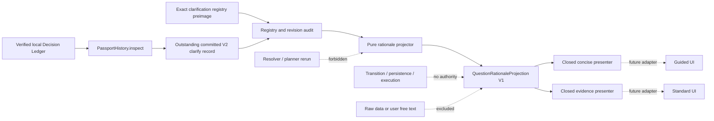

# Authority-Free Question Rationale Projection Design

**Date:** 2026-07-16
**Status:** Review candidate; scope approved in chat, implementation pending written-spec review
**Branch:** `codex/research-os-contract-design`
**Source baseline:** `9bc9269c7fa51e9d92884d915d461b370edfdb20`

## 1. Decision

Build a deterministic, model-free projection that turns the counterfactual trace in an
active, locally committed AnalysisPassport V2 into a bounded explanation of **why this
clarification question was selected before the alternatives**.

The projection is read-only. It cannot answer a question, change a StudySpec, rerun the
resolver or planner, append to the Decision Ledger, promote imported evidence, configure
an analysis, execute a calculation, access a file or network, or claim that the eventual
recommendation is valid.

This slice delivers:

1. a strict, typed `QuestionRationaleProjection` contract;
2. a pure projector over a verified, outstanding local passport record and its exact
   clarification registry preimage;
3. closed Korean and English presenters for a concise view and an evidence view;
4. adversarial, mutation, wording, architecture, and resource tests; and
5. a future UI consumption contract for the existing `guided` and `standard` modes.

It does **not** connect the projection to the current production QML. The current UI has
no Research OS clarification flow and still consumes the legacy heuristic
`RecommendationService`. Displaying V2 planner evidence beside those heuristic
candidates would create false provenance. Live rendering therefore waits for the
separately designed multi-round Research OS clarification UI.

## 2. User value and non-claim

The user should be able to distinguish these two statements:

- **Permitted:** “Among the questions the fixed planner evaluated, this question won
  under the recorded worst-case ordering for the reason shown below.”
- **Forbidden:** “Because this was the best question, the later analysis recommendation
  is academically correct.”

The first statement is reproducible from a committed trace. The second requires
recommendation-validity evidence that this projection does not possess.

The explanation converts an already-paid provenance cost into visible value without
giving prose any authority. It is analogous to translating a flight recorder into a
read-only instrument panel, not wiring the recorder into the controls.

**Analogy loss point:** an instrument panel can accurately explain what the planner did.
It cannot establish that the research construct, sampling process, causal assumptions,
or final scientific claim is true.

## 3. Repository facts that constrain the design

The implementation audit found:

1. `ClarifyPayloadV2` embeds the exact `ClarificationPlan` and binds its question,
   fact address, question revision, registry, planner, decision, request, and plan
   digests.
2. `QuestionEvaluationTrace` records every candidate question's worst-case loss,
   branch and refusal snapshot digests, response burden, dependency deficit, and a
   selected marker.
3. `ClarificationSpec` already contains closed, method-neutral `template_ko`,
   `template_en`, `why_ko`, and `why_en` fields.
4. `PassportHistory` distinguishes outstanding, consumed, and retracted committed
   passports. Only an outstanding V2 clarify record can describe the current question.
5. `audit_passport_registry` already distinguishes verified, unavailable, and failed
   registry evidence.
6. The existing `ExplanationService` resolves static knowledge-library entries. It is
   not bound to a request, decision, plan, passport, or ledger event and must not be
   reused as if it were decision provenance.
7. The production UI currently exposes `guided` and `standard` modes. It does not
   construct `QuestionSpec`, `EstimandSpec`, `StudySpec`, `ResearchRequest`,
   `ResearchOsService`, or `ResearchMemoryCoordinator` values.
8. The current guided recommendation surface consumes a different, legacy heuristic
   service. There is no honest live source for this projection in QML yet.

## 4. Alternatives considered

### 4.1 Recommended: verified projection plus thin closed presenters

Derive a small immutable read model from an outstanding local V2 record, verify its
registry and ranking evidence, and let presenters render only that read model.

Benefits:

- preserves the single-search invariant;
- keeps planner and ledger schemas out of QML;
- rejects stale, consumed, retracted, foreign, or mismatched evidence;
- makes concise and evidence views agree by construction; and
- permits future UI work without changing the authority boundary.

Cost: there is no live product surface until the Research OS question flow reaches UI.

### 4.2 Rejected: render the embedded plan directly in QML

This has the smallest apparent implementation cost but makes QML understand planner
ranking, ledger state, registry revisions, and digest failures. It can also render a
consumed or imported passport as if it described the current question. The coupling and
authority ambiguity are unacceptable.

### 4.3 Rejected: rerun the planner to generate a fresh explanation

This can produce a current-looking explanation but breaks the one-search invariant. A
catalog, request, budget, or ledger-head change between issuance and display can make the
new explanation disagree with the committed question. The explanation must describe the
recorded decision, not manufacture a second one.

## 5. Trust boundary and architecture



The projector belongs below the UI and above no execution boundary. Because it consumes
`PassportHistory`, `AnalysisPassport`, and `ClarificationRegistry`, its natural location
is `src/modori/research_memory/question_rationale.py`. Placing it in
`research_os` would reverse the current dependency direction: research memory already
depends on Research OS contracts.

The presenter belongs in `src/modori/ui/question_rationale_presenter.py`. It consumes
only the projection contract and closed localization tables. It does not inspect a
passport or ledger.

The existing static `ExplanationService` remains unchanged.

## 6. Source eligibility

The public entry point is conceptually:

```python
project_current_question_rationale(
    history: PassportHistory,
    *,
    project_id: str,
    request_binding_digest: str,
    clarification_registry_digest: str,
    registry: ClarificationRegistry | None,
) -> QuestionRationaleResult
```

The exact current key is part of the call. The projector queries
`history.outstanding_for(...)`; it does not accept a cached
`CommittedPassportRecord`. A future live adapter must build `history` with
`PassportHistory.inspect` over the fully verified local ledger immediately before
projection. A foreign evidence bundle cannot create a passport-history record because
the quarantine path produces only authority-free imported assertions.

The source is eligible only when all conditions hold:

1. exactly one outstanding record matches the current project, request-binding, and
   clarification-registry key;
2. the passport schema version is exactly 2;
3. the passport action is `clarify` and carries `ClarifyPayloadV2`;
4. the exact registry preimage is available and its digest matches the current key;
5. `audit_passport_registry` returns `verified`;
6. every evaluation trace resolves to a registry question with the exact ID, version,
   digest, and fact address recorded in the trace;
7. exactly one trace is marked selected;
8. the selected trace equals the independently recomputed minimum of
   `(worst_loss, question_id)`; and
9. the selected identity matches the `ClarificationPlan` and `ClarificationRef`.

Zero matching records means there is no current rationale to render. More than one is a
history-contract failure, even though `PassportHistory` should already make that state
unconstructable.

The projector does not accept a bare JSON mapping, bare passport, imported assertion,
legacy recommendation candidate, or user-provided explanation text. `PassportHistory`
and the resulting projection are evidence, not capability tokens; neither grants
transition rights.

The pure function cannot establish how a caller obtained a `PassportHistory` value.
The production adapter therefore has a mandatory precondition: obtain one consistent
local read after the store's integrity verification and reject a changed ledger head
before rendering. Tests may construct histories directly, but product code may not
label such synthetic values as locally verified evidence.

## 7. Result disposition

`QuestionRationaleResult` has one of four closed dispositions:

| Disposition | Meaning | Example reason codes | UI behavior |
|---|---|---|---|
| `available` | Exact explanation evidence is verified | `rationale_available` | Render projection |
| `not_applicable` | No outstanding V2 clarification matches the exact current key | `current_clarification_absent`, `passport_not_outstanding` | Show no rationale control and invalidate a cached view |
| `unavailable` | A current record exists but its exact explanatory preimage is not available | `registry_preimage_unavailable` | Show bounded unavailable text only if a rationale control was already opened |
| `failure` | Supplied evidence contradicts its binding or ranking contract | `registry_digest_mismatch`, `evaluation_question_mismatch`, `selected_rank_mismatch` | Render no rationale; report an integrity-safe error without declaring the whole ledger corrupt |

This preserves the established distinction:

`audit unavailable != audit failure != ledger corruption`.

The projector must not silently downgrade a `failure` to a generic explanation.

`QuestionRationaleResult` contains exactly `status`, `reason_code`, and
`projection`. `projection` is present if and only if status is `available`. Every other
status carries no question copy, metric, or stale cached projection.

## 8. Projection contract

### 8.1 `QuestionCopy`

Closed, registry-authored copy only:

- `question_id`
- `question_version`
- `question_digest`
- `fact_address`
- `template_ko`
- `template_en`
- `why_ko`
- `why_en`
- `not_sure_enabled` (must be true)

No raw values, selected variable labels, user answers, bounded-text contents, file paths,
or dataset cells enter this object.

### 8.2 `QuestionLossComparison`

One immutable row per recorded candidate:

- exact question identity fields;
- `worst_case_risk_vector`, ordered severity 5 through severity 1;
- `worst_case_frontier_size`;
- `worst_case_blocking_fact_count`;
- `worst_case_questions_asked`;
- `worst_case_dependency_deficit`;
- `worst_case_answer_kind_cost`;
- `guaranteed_e3_plus_blockers_removed`;
- `selected`.

Every `worst_case_*` field comes from `QuestionEvaluationTrace.worst_loss`, which is the
actual rank-key input. The trace's immediate `dependency_deficit` and
`answer_kind_cost` fields are not substituted for those cumulative worst-case values.

Branch and refusal snapshot digests stay in the passport and are not exposed as user
copy. The projection verifies their structural presence but does not reinterpret a
digest as branch content.

### 8.3 `QuestionRationaleProjection`

Required fields:

- `schema_id = "modori.question_rationale_projection"`
- `schema_version = 1`
- `source_passport_digest`
- `source_plan_digest`
- `source_commit_event_id`
- `source_commit_sequence`
- `selection_basis = "counterfactual_minimax_lexicographic"`
- `selected_question: QuestionCopy`
- `runner_up_question: QuestionCopy | None`
- `initial_risk_vector`
- `question_budget_remaining`
- `candidate_count`
- `decisive_dimension`
- `selected_decisive_value`
- `runner_up_decisive_value | None`
- `selected_guaranteed_e3_plus_blockers_removed`
- `selected_worst_case_blocking_fact_count`
- `selected_worst_case_frontier_size`
- `selected_worst_case_risk_vector`
- `comparisons: tuple[QuestionLossComparison, ...]`
- `not_sure_available = true`
- `caution_code = "question_priority_not_recommendation_validity"`

The source digests support audit display and equality tests. They do not grant lookup,
transition, or persistence authority.

## 9. Exact ranking explanation

The planner chooses the minimum of this lexicographic key:

1. remaining severity-5 blocker count;
2. remaining severity-4 blocker count;
3. remaining severity-3 blocker count;
4. remaining severity-2 blocker count;
5. remaining severity-1 blocker count;
6. worst-case remaining local/external frontier size;
7. worst-case remaining blocking-fact count;
8. questions asked in the bounded look-ahead;
9. dependency deficit;
10. response-kind cost; and
11. stable question ID.

The projector sorts the recorded traces independently and compares the selected trace
with the runner-up. `decisive_dimension` is the first differing component. Its closed
values are:

- `only_candidate`
- `remaining_severity_5` through `remaining_severity_1`
- `remaining_frontier_size`
- `remaining_blocking_fact_count`
- `questions_asked`
- `dependency_deficit`
- `answer_kind_cost`
- `stable_question_id`

This prevents a smooth but false explanation. In particular,
`guaranteed_e3_plus_blockers_removed` is useful contextual evidence but is **not part of
the current rank key**. The presenter must never say that this field caused the
selection unless the planner contract is separately revised. Likewise, it must not use
`evaluated_state_count` or `memo_hit_count` as a reason for asking the question.

If all substantive metrics tie and the stable question ID decides, the explanation must
say so. It must not invent a risk advantage.

### 9.1 Contract hardening prerequisite

The current `ClarificationPlan` validates that exactly one trace is marked selected and
that its identity matches the selected fields. It does not independently require that
the marked trace is the minimum rank key.

Before any “why this question?” claim can be trusted, the implementation must add a
no-wire-change invariant to `ClarificationPlan.__post_init__`:

```text
marked_selected == min(evaluations, key=(worst_loss, question_id))
```

This validation changes no canonical field and no digest. It rejects a semantically
forged plan that previously decoded despite marking a non-winning trace.

## 10. Closed presentation contract

The presenter creates a `QuestionRationaleView` with:

- `status`
- `title`
- `question_text`
- `base_reason`
- `selection_summary`
- `remaining_uncertainty`
- `not_sure_guidance`
- `caution`
- `evidence_rows`
- `source_identity_text`

All labels and sentence frames are fixed Korean/English catalog entries. Substitutions
are restricted to closed question copy, non-negative integers, enum labels, and short
digest prefixes. No free-form composition is permitted.

The user-approved casual/pro distinction maps to the repository's existing
`guided`/`standard` product modes. This slice does not rename modes or create a third
explanation mode.

### 10.1 Concise view

The future `guided` UI consumes:

- question text;
- the registry-authored base reason;
- one exact sentence for the decisive dimension;
- a “잘 모르겠습니다 / Not sure” explanation; and
- the validity caution.

Example when severity-4 risk is decisive:

> 가능한 답 중 가장 불리한 경우를 비교했을 때, 이 질문은 다음 후보보다
> 심각도 4의 미확인 조건을 더 적게 남겨 먼저 선택되었습니다.

Example when only the stable ID decides:

> 기록된 위험과 응답 부담이 같은 후보들이어서, 결과를 항상 재현할 수 있는
> 고정 질문 순서로 이 질문이 먼저 선택되었습니다.

### 10.2 Evidence view

The future `standard` UI consumes the same summary plus:

- selected question versus runner-up;
- the decisive dimension and both recorded values;
- initial and selected worst-case risk vectors;
- worst-case remaining blockers and frontier size;
- guaranteed removal count for severity 3 or higher, explicitly labeled as context and
  not necessarily the deciding metric;
- remaining question budget;
- candidate count; and
- passport and plan digest prefixes.

The evidence view does not show all 14 KiB of plan JSON. Full canonical evidence remains
in the ledger/export path.

### 10.3 Mandatory caution

Every available view includes this meaning in the selected language:

> 이 설명은 질문 우선순위의 근거입니다. 최종 분석 추천이나 연구 결론의
> 타당성을 보증하지 않습니다.

Tests compare the exact catalog text and scan for forbidden product claims.

## 11. Error behavior

The projector is fail-closed:

- consumed or retracted record: `not_applicable/passport_not_outstanding`;
- a history with only V1 or non-clarify records: `not_applicable/current_clarification_absent`;
- absent registry: `unavailable/registry_preimage_unavailable`;
- registry digest or selected revision mismatch: `failure`;
- any alternative trace with no exact registry question: `failure`;
- marked selection not equal to the recomputed winner: `failure`;
- malformed typed input at a programmer boundary: raise the existing typed contract
  error rather than fabricate a result.

There is no fallback to the legacy `RecommendationCandidate.reason_ko`, to an LLM, to a
generic “AI chose this” statement, or to a fresh planner run.

## 12. Security, privacy, and authority

The new projector and presenter must have no imports or calls for:

- filesystem or archive access;
- SQLite or Decision Ledger append APIs;
- network or HTTP clients;
- subprocesses or dynamic execution;
- statistical calculation packages;
- resolver, planner execution, or transition services;
- model inference, embeddings, or retrieval;
- clocks, randomness, or environment-dependent localization.

Permitted input text is limited to source-controlled `ClarificationSpec` copy. The
contract excludes raw data, free-text answers, variable values, file paths, and imported
bundle prose.

The presenter returns data. It does not emit a signal, select an answer, modify a
pipeline, or persist acknowledgement state.

## 13. Verification strategy

### 13.1 Contract and ranking tests

- strict constructor invariants for every projection type;
- exact-key rejection only if a future wire mapping is separately introduced;
- recomputed selected minimum on constructor and decoder paths;
- one-candidate disposition;
- a fixture for every decisive dimension;
- exact stable-ID tie explanation;
- sorted, unique comparison rows;
- selected and runner-up values match their traces;
- no unrecorded metric appears in `decisive_dimension`.

### 13.2 Eligibility and lifecycle tests

- history derived from an active local committed V2 clarify record succeeds;
- consumed record becomes not applicable;
- retracted record becomes not applicable;
- histories containing only V1 or non-clarify records are not applicable;
- missing registry is unavailable;
- registry digest drift is a failure;
- selected and alternative revision drift are failures;
- an imported assertion or bare passport cannot enter the public projector API;
- stale request/registry keys produce no current projection;

### 13.3 No-second-search proof

- spy or poison planner/resolver dependencies so projection fails the test if either is
  invoked;
- architecture scan forbids direct construction or invocation of planner, resolver,
  transition, store-append, network, subprocess, and model services; passive contract
  types already embedded in a passport remain permitted;
- source scan confirms the presenter consumes only the projection contract.

### 13.4 Mutation and adversarial tests

Mutate, one class at a time:

- selected marker;
- selected question ID/version/digest/fact address;
- plan digest and registry digest;
- runner-up rank component;
- an alternative question revision;
- outstanding/consumed/retracted state;
- caution code;
- Korean and English closed catalog keys.

Every mutation must either change the truthful bounded projection or be rejected. No
mutation may silently preserve a now-false explanation.

### 13.5 Wording tests

The product-wording gate forbids claims equivalent to:

- “correct analysis”;
- “expert approved”;
- “academically true”;
- “valid recommendation”;
- “AI determined”;
- “guaranteed best question”; and
- any claim that a digest proves substantive validity.

Allowed wording refers to the fixed planner, recorded candidates, worst-case ordering,
remaining uncertainty, and reproducibility.

### 13.6 Resource gate

Projection is `O(number_of_recorded_candidate_questions)` and performs no search. On
the fixed development benchmark fixture:

- p95 projection plus presentation time must be at most 10 ms over at least 1,000
  iterations after warm-up;
- peak traced allocation must be at most 512 KiB per invocation; and
- output must remain byte-for-byte deterministic across repeated runs.

If ordinary interpreter noise makes the time gate unstable, measure the pure function in
one process and report median, p95, maximum, Python version, CPU, and sample count. Do
not relax the bound merely to obtain a pass.

## 14. Implementation sequence

1. Add failing tests that mark a non-minimal trace as selected.
2. Harden `ClarificationPlan` without changing its mapping or digest.
3. Add result, projection, comparison, question-copy, and decisive-dimension contracts.
4. Add the pure projector and lifecycle/registry/rank validation.
5. Add Korean and English closed presenters.
6. Add architecture, privacy, wording, mutation, and no-second-search tests.
7. Add deterministic resource measurements and a QA evidence record.
8. Run focused tests, full Ruff, and the complete suite.

Production QML wiring is intentionally absent from this sequence.

## 15. Stop conditions and fallback

Stop this slice rather than weaken its claims if any condition holds:

- explaining the recorded winner requires rerunning the resolver or planner;
- the selected winner cannot be independently recomputed from the embedded trace;
- alternative question revisions cannot be verified against the bound registry;
- an explanation requires raw data or user free text;
- active, consumed, retracted, and imported states cannot be distinguished;
- a passport schema change is required merely to render the bounded rationale;
- the only available UI connection is the unrelated heuristic recommendation surface;
- deterministic resource gates continue to fail after focused rational optimization; or
- forbidden validity wording is required to make the explanation sound useful.

Fallback: keep the counterfactual trace available only as canonical audit evidence and
show no “why this question?” claim. Never substitute fluent unsupported prose.

## 16. Deferred live UI integration

A later multi-round clarification UI design may consume this contract only after it can
obtain the current outstanding V2 record from verified local project memory. That design
must define:

- the ResearchRequest construction flow from user-confirmed StudySpec fields;
- commit-before-display ordering;
- one active question at a time;
- answer, “not sure,” retraction, and crash-recovery interactions;
- live stale-head invalidation;
- guided versus standard rendering placement;
- keyboard and screen-reader behavior; and
- the explicit experimental recommendation boundary.

It must not retrofit the explanation onto legacy heuristic candidates.

## 17. Explicit non-claims

Passing this slice will establish only that Modori can faithfully and safely explain the
recorded question-priority decision for an eligible V2 passport.

It will not establish:

- recommendation validity;
- numerical calculation accuracy;
- human or expert equivalence;
- broad social-science coverage;
- SPSS or Minitab superiority;
- causal truth;
- office-PC performance for the future full UI flow; or
- value from an SLM or cloud teacher.
