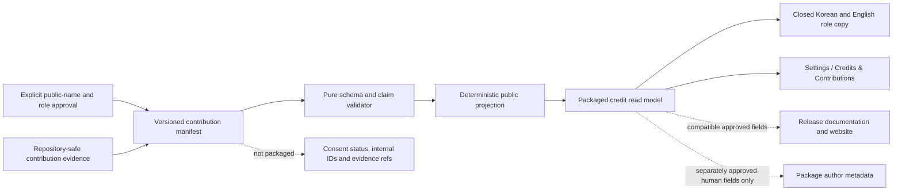

# Contribution Credits Design

**Date:** 2026-07-16

**Status:** Approved design; self-audit amendments included; implementation deferred

**Branch:** `codex/research-os-contract-design`

**Source baseline:** `fb78426671103468a67c43b1cc4dd099817c3866`

**Self-audit baseline:** `9ef7f2b26e73bb75ad97805cddffdc55d8f92a6d`

## 1. Decision

Modori will eventually expose a read-only **Credits & Contributions** surface under its
settings/about area. The product will not hard-code a single owner name or an AI model
name in QML. It will render a validated, versioned contribution manifest that supports:

- zero or more human contributors during development;
- each human contributor's self-selected public name or pseudonym;
- more human contributors being added later without a schema change;
- human and AI-system contributions in visibly separate sections;
- exact tool, model, role, and time records only when the identity is supported by
  retained evidence; and
- Korean and English presentation from one canonical engineering record.

No human public name has been selected yet. The absence of a name is a valid development
state, not an invitation to use a placeholder, private name, guessed transliteration, or
repository account name. The implementation of this surface is a later independent
slice. It does not block the approved dual-key visual-finish workflow.

## 2. Purpose and non-claims

The surface has three purposes:

1. credit people for work they agree to make public;
2. disclose material AI-system assistance precisely enough to be useful; and
3. preserve historical provenance without presenting AI systems as people or
   scientific authorities.

A credit record states that a person or system contributed to named tasks. It does not,
by itself, establish:

- legal authorship, copyright ownership, employment, or agency;
- provider sponsorship, affiliation, or endorsement;
- statistical correctness or recommendation validity;
- that an AI system independently understood or approved the research;
- that every contribution was equally large; or
- that an omitted person made no contribution.

A product credit also grants no repository permission, maintainer role, approval right,
or governance authority. It does not clear the copyright, licence, or training-data
provenance of any contributed artifact.

The surface is disclosure and attribution, not a leaderboard and not a substitute for
the repository's test, evidence, review, or licensing records.

Third-party software notices, licences, funders, institutional affiliations, academic
citations, and dataset acknowledgements remain separate records with their own legal or
scholarly semantics. They are not inserted as human or AI contributors. V1 also has no
organisation-contributor type; a future need for one requires an explicit schema
revision rather than disguising an organisation as a person.

## 3. Repository facts that constrain the design

The current repository has no checked-in Settings, About, or Credits screen. `Main.qml`
does not route to one, `EntryScreen.qml` has no settings interaction, `pyproject.toml`
does not declare package authors, and there is no canonical contributor manifest.

The application shell currently resolves UI copy only from `UI_STRINGS_KO`; the English
reporting paths elsewhere in the engine are not a general UI locale system. The English
credit copy in this contract is future localization source, not evidence that the
current application can switch its interface to English.

The self-audit also found two adjacent release facts:

1. at the self-audit baseline, all 420 reachable commits contain a non-empty Git author
   email field, so linking a public pseudonym directly to commit evidence may reveal a
   pre-existing identity; and
2. the root has no project `LICENSE` or `COPYING` file even though `entry.footer`
   currently displays `무료 · 오픈소스 · 로컬`.

Neither fact authorizes inference about the user's desired public identity or licence.
The first creates a required identity-privacy gate in this design. The second is a
separate public-release claim blocker: contribution credits cannot turn unlicensed code
into open-source software, and this design does not select a licence for the owner.
[GitHub's repository-licensing guidance](https://docs.github.com/en/repositories/managing-your-repositorys-settings-and-features/customizing-your-repository/licensing-a-repository)
explains that source without a licence remains under default copyright restrictions;
the [Open Source Definition](https://opensource.org/osd) requires distribution terms
that grant open-source rights.

`docs/POLICY.md` names the owner, Claude, and Codex as governance roles. That text is an
engineering policy, not a consented public identity register and not a product-facing
credit contract. It must not be parsed as one.

The product is Korean-first while engineering records are English. Consequently:

- schema identifiers, role codes, tests, and design records are English;
- product labels and role descriptions use the closed Korean/English localization
  registry; and
- a person's selected public name is preserved exactly and is never machine-translated
  or automatically transliterated.

## 4. Alternatives considered

### 4.1 Recommended: one validated contribution manifest

A versioned manifest is the canonical credit source. A pure validator and read model
feed the future product surface. Compatible release documents or web pages may consume
the same public projection rather than maintaining independent name lists.

Benefits:

- supports multiple present and future contributors;
- makes omissions, duplicate identities, unsupported roles, and unverified model labels
  testable;
- keeps QML presentation separate from identity and attribution data;
- prevents human and AI categories from being conflated; and
- allows exact-name consent to happen later without redesigning the UI.

Cost: a small schema, validator, localization catalog, and release check are required.

### 4.2 Rejected: use package `authors` as the canonical source

PEP 621 package metadata is useful for distribution contacts but cannot faithfully
represent task-specific AI assistance, model identity evidence, contribution periods,
localized roles, or publication consent. It also risks treating an AI system as a legal
or package author. Compatible human maintainer data may later be projected into package
metadata, but package metadata is not the credit authority.

### 4.3 Rejected: hard-code a credit paragraph in QML

This is initially simple but makes every new contributor a code change, duplicates
localized facts, encourages silent historical rewrites when a model changes, and makes
private or unapproved names easy to ship. It also cannot distinguish a tool surface from
the model used through that surface.

## 5. Architecture

The future implementation consists of five bounded units:

1. **Manifest:** identity, contribution roles, periods, and evidence references.
2. **Validator:** rejects malformed, ambiguous, unconfirmed, privacy-unsafe, or
   overclaiming record shapes.
3. **Projector:** emits a deterministic public artifact stripped of repository-only
   evidence, consent state, and internal identity keys.
4. **Read model:** supplies deterministic, presentation-safe human and AI sections from
   that public artifact.
5. **Thin UI:** renders the read model without inventing names, roles, model versions, or
   fallback biographies.

The source manifest and generated public projection are local, static product metadata.
Reading or projecting them performs no network access, telemetry, identity lookup,
model call, or mutation.

## 6. Manifest contract

The logical source V1 contract is `modori.contribution_credits`, schema version `1`. The
exact repository path and serialization mechanics belong to the later implementation
plan, but V1 uses a machine-validated data file rather than executable Python or QML
literals. It must add no runtime dependency.

Top-level fields:

| Field | Contract |
|---|---|
| `schema_id` | Exactly `modori.contribution_credits` |
| `schema_version` | Positive integer; exactly `1` for this design |
| `manifest_revision` | Positive integer; increases whenever public credit content changes |
| `display_catalog_revision` | Positive integer binding role copy and provider/surface display entries |
| `human_contributors` | Ordered source array; zero or more human records |
| `ai_system_contributions` | Ordered source array; zero or more AI-system records |

Source-array order is not display rank. The read model applies the neutral ordering in
Section 10. Identity and display fields accept no HTML, Markdown, links, email addresses,
filesystem paths, or executable content. Evidence fields accept only the bounded
repository-relative references defined in Section 6.3.

Monotonicity is a release comparison, not a claim that one isolated file can inspect its
own history. A branch, merge, or rebuilt package may equal the most recently released
revision only when its public credit content is byte-equivalent; changed public content
requires a greater revision and no package may use a lower revision.
`display_catalog_revision` changes when closed credit copy or catalog display data
changes and must match the catalog compiled into the same package.

### 6.1 Human contributor record

Each human record contains:

| Field | Contract |
|---|---|
| `contributor_id` | Stable opaque identifier; not derived from a private or public name |
| `public_name` | Exact contributor-selected public name or pseudonym |
| `public_aliases` | Optional exact contributor-selected locale aliases |
| `role_codes` | Non-empty set from the closed human-role catalog |
| `contribution_period` | Inclusive first month and optional last month in `YYYY-MM` form |
| `evidence_refs` | Non-empty repository-safe record of the credited work |
| `publication_status` | Exactly `public_record_confirmed` |

The manifest never requires or infers a legal name. It must not contain a private name,
email address, account login, home or work address, signature, or unpublished
affiliation. A contributor may use Latin script, Hangul, another script, initials, or a
pseudonym. English or Latin-script canonical names are recommended for cross-locale
stability but are not mandatory.

`public_aliases` are displayed only when the contributor explicitly selects them. The
application never generates a Korean alias from an English name or an English spelling
from a Korean name.

### 6.2 AI-system contribution record

An AI-system record describes a tool/model use, not a person:

| Field | Contract |
|---|---|
| `record_id` | Stable opaque contribution-record identifier |
| `provider_id` | Closed provider-catalog identifier |
| `surface_id` | Closed tool or product-surface identifier |
| `model_identity` | One of the structural variants below |
| `role_codes` | Non-empty set from the closed AI-role catalog |
| `contribution_period` | Inclusive first month and optional last month |
| `evidence_refs` | Non-empty repository-safe record of the credited work and identity basis |
| `publication_status` | Exactly `human_reviewed_for_publication` |

`model_identity` is structurally exclusive:

- `exact_model`: an official display name, an optional provider model identifier, and a
  required `model_identity_record` evidence reference may be shown only when a retained
  session or provider record supports the identity; or
- `surface_only`: the product names the tool surface and makes no exact-model claim.

The validator rejects an exact model label without an identity evidence reference. It
also rejects a guessed model inferred from release date, pricing tier, visible quality,
or the current default model. A later model must be a new historical record; it must not
silently replace the model named for earlier work.

A reasoning or agent setting such as `Ultra` is configuration provenance, not a model
name. If retained at all, it belongs in bounded technical evidence and is not appended
to the primary public model label.

Tool surface and model remain separate. For example, an eventual record may identify
the `OpenAI Codex` surface and the `GPT-5.6 Sol` model, or the `Anthropic Claude Code`
surface and the `Claude Fable 5` model, only when the contribution record verifies those
facts. These names are examples of the separation rule, not records created by this
design document.

The initial provider/surface catalog recognises `openai` / `openai_codex` and
`anthropic` / `anthropic_claude_code`. The display registry owns their verified official
public spelling. Supporting another provider or surface requires an explicit registry
and test revision; the manifest cannot introduce one as free text.

Once a provider or surface entry has shipped, its ID and historical meaning are
immutable. A rebrand or materially different surface receives a new ID rather than
silently changing the identity of earlier work. A spelling correction increments the
display catalog revision and is recorded as a correction.

### 6.3 Common field grammar and bounds

V1 uses these exact validation rules:

- contributor, record, provider, and surface identifiers match
  `^[a-z][a-z0-9_]{2,63}$`;
- a public name, alias, provider model display name, or optional model identifier is
  rejected if it has leading or trailing whitespace, is empty, or exceeds 80 Unicode
  scalar values; an optional model identifier is additionally restricted to printable
  ASCII letters, digits, `.`, `_`, `:`, `/`, and `-`;
- identity display fields reject C0/C1 controls, surrogate code points, line and
  paragraph separators, and explicit bidirectional-control characters U+061C,
  U+200E-U+200F, U+202A-U+202E, and U+2066-U+2069;
- `public_aliases` is a mapping with at most the `ko` and `en` keys in V1, with no alias
  equal to the canonical name under the comparison normalization below;
- periods contain real Gregorian months in zero-padded `YYYY-MM` form, and a present
  end month is not earlier than the start month;
- a human record has between 1 and 13 distinct role codes, and an AI record has between
  1 and 10 distinct role codes; and
- each record has between 1 and 32 distinct evidence references.

Names preserve the approved Unicode scalar sequence exactly; serialization escaping and
font rasterisation are not misdescribed as byte identity. Duplicate detection and
neutral sorting use Unicode NFC followed by default case folding without rewriting the
stored value. The validator rejects a canonical name or alias that collides under this
comparison with the displayed identity of a different human contributor. It does not
attempt confusable-character guessing, infer whether a plausible name is legal or
private, or silently normalize the selected public spelling. Publication approval is
the authority for those facts.

Each evidence reference has a closed `kind` and `ref` pair:

- `commit`: one full lowercase 40-hex Git object ID;
- `commit_range`: two such IDs separated by `..`;
- `design_doc`: a forward-slash repository path below `docs/superpowers/specs/` ending
  in `.md`;
- `qa_record`: a forward-slash repository path below `docs/qa/` ending in `.md`; or
- `model_identity_record`: a forward-slash repository path below
  `docs/provenance/model-identities/` ending in `.md`.

Document references reject absolute paths, backslashes, colon-prefixed drive syntax,
empty segments, `.` segments, and `..` segments. Every referenced document and commit
must exist at release validation time. A model-identity record is a sanitised engineering
attestation to inspected session/provider evidence; it does not contain the private
source artifact itself.

### 6.4 Generated public projection

The build emits schema `modori.contribution_credits.public`, version `1`, from the fully
validated source manifest. The runtime package contains this projection and not the
source manifest.

The projection contains only:

- the schema, manifest revision, and display catalog revision;
- human public names, approved aliases, role codes, and contribution periods; and
- AI provider and surface display identifiers, an approved exact model display name
  when available, role codes, and contribution periods.

It excludes source contributor and record IDs, publication-status fields, evidence
references, model-identity attestations, commit hashes, repository paths, and optional
provider-internal model identifiers. Duplicate public human identities and duplicate
public AI records are rejected before projection, so internal IDs are not required as
visible or packaged tie-breakers.

The projection uses deterministic canonical JSON: UTF-8 without BOM, no trailing
newline, object keys sorted by Unicode code-point order, compact `,` and `:` separators,
non-ASCII characters emitted directly, and arrays already ordered by Section 10. JSON
syntax still escapes quotes, backslashes, and required control characters without
changing the decoded string. The release gate regenerates the projection and requires
byte equality with the packaged resource and an exact match with the compiled display
catalog revision. A hand-edited projection, a source manifest accidentally included in
package data, a catalog-revision mismatch, or any repository-only field found in the
packaged artifact is a release failure.

## 7. Closed role catalogs

Roles describe tasks, not prestige, quality, or truth. These are the exact V1 human-role
labels:

| Code | Korean | English |
|---|---|---|
| `project_creation` | 프로젝트 창안 | Project creation |
| `project_stewardship` | 프로젝트 운영 | Project stewardship |
| `product_direction` | 제품 방향 수립 | Product direction |
| `research_design` | 연구 설계 | Research design |
| `statistical_methodology` | 통계 방법론 | Statistical methodology |
| `software_architecture` | 소프트웨어 구조 설계 | Software architecture |
| `software_implementation` | 소프트웨어 구현 | Software implementation |
| `software_test_and_verification` | 소프트웨어 시험·검증 | Software testing & verification |
| `documentation` | 문서화 | Documentation |
| `visual_design` | 시각 디자인 | Visual design |
| `accessibility_review` | 접근성 검토 | Accessibility review |
| `independent_review` | 독립 검토 | Independent review |
| `localization` | 현지화 | Localization |

These are the exact V1 AI-role labels:

| Code | Korean | English |
|---|---|---|
| `literature_research_assistance` | 문헌 조사·종합 보조 | Literature research & synthesis assistance |
| `architecture_assistance` | 구조 설계 보조 | Architecture assistance |
| `software_implementation` | 소프트웨어 구현 | Software implementation |
| `test_design` | 테스트 설계 | Test design |
| `test_execution` | 테스트 실행 | Test execution |
| `documentation` | 문서화 | Documentation |
| `specification_review` | 명세 검토 | Specification review |
| `counterargument_review` | 반론 검토 | Counterargument review |
| `visual_critique` | 시각 비평 | Visual critique |
| `technical_visual_audit` | 기술·시각 감사 | Technical visual audit |

`software_test_and_verification` is deliberately scoped to software and its declared
tests; it is not expert validation of statistical recommendations. `test_execution`
means that an AI-assisted session caused named tests or checks to be run and reported;
it does not mean the AI independently qualified the oracle, accepted the result, or
certified the product. `software_implementation` records production of or edits to
software artifacts and does not imply legal authorship or correctness.

The catalogs explicitly exclude `owner`, `human_author`, `inventor`, `final_approver`,
`scientific_validator`, `statistical_authority`, and equivalent claims for AI systems.
They also exclude marketing adjectives such as `expert`, `perfect`, or `state_of_the_art`
for every contributor type.

Adding a genuinely new role requires a catalog and localization revision plus tests;
arbitrary prose is not accepted merely to avoid that review.
After a role has shipped, a material meaning change requires a new code. A spelling-only
correction retains the code, increments `display_catalog_revision`, and is recorded as a
correction; it may not turn a historical task credit into a stronger claim.

## 8. Publication, consent, and correction lifecycle

Human publication is opt-in and exact-string based:

1. the contributor selects the public name or pseudonym;
2. the proposed public name, aliases, role codes, and contribution period are shown to
   that contributor;
3. the contributor explicitly approves that exact public record;
4. only then may the record be committed to the source manifest; and
5. the release gate verifies that every included human record has the confirmed status.

No unconfirmed record, blank placeholder, repository username, inferred real name, or
system-supplied `anonymous contributor` substitute is committed. A person may still
select an anonymous public pseudonym deliberately. During development, an empty human
array simply omits the Human contributors section.

Schema validation can require the confirmed status but cannot prove that consent
occurred. The release checklist must independently record that the exact public string
and roles were approved before the manifest commit. That approval record must not place
a private name or contact detail in the repository.

Neither role assignment nor identity is inferred from lines of code, commit authorship,
account names, an AI summary, or a model's self-assessment. An AI-assisted session may
draft a record as an untrusted proposal, but a human release authority approves the
source record from repository evidence and each named human approves their own displayed
fields. An AI system cannot be the sole evidence for its identity or roles, attest its
own model identity, or approve the generated projection. No product runtime or model
path may mutate the source manifest or projection.

As with human consent, the AI `publication_status` is a machine-checkable state claim,
not proof of who approved it. The release checklist records the separate human review;
the manifest flag merely prevents an explicitly unreviewed draft from passing validation.

A contributor may later request a public-name correction, alias change, or removal. The
next release can update or remove the current record, but already distributed binaries,
repository history, mirrors, and archived releases cannot be remotely rewritten. This
limitation must be disclosed before initial publication; the system must not promise
retroactive erasure it cannot perform.

Corrections to falsely attributed roles or model identities are allowed and must
increase `manifest_revision`. Historical replacement is not used to make old records
look as though a newer model performed earlier work.

The stable `contributor_id` exists only in the repository source manifest. It is not
packaged or displayed. Even so, Git history can connect an old and new pseudonym across
revisions; changing the identifier cannot promise unlinkability after publication. A
person seeking a pseudonym change must be told this limitation before the replacement is
committed.

## 9. Evidence and claim discipline

`evidence_refs` are provenance anchors, not proof of quality. They may identify safe
repository-relative design documents, QA records, or commit ranges. An AI exact-model
record also requires a sanitised identity record that was captured at the time of use.

Git evidence has an additional privacy hazard: a commit object exposes author and
committer metadata independently of the display name selected for this page. Before a
human record cites a commit or range, the release review must inspect all referenced
author and committer names and email fields and obtain explicit approval for the public
linkage. If that approval is absent, use a repository-safe aggregate design or QA record
that does not identify the person's commits. This reduces deliberate linkage but cannot
erase identity metadata already present in public Git history.

Evidence references must not contain:

- absolute local paths or operating-system usernames;
- cloud conversation URLs, access tokens, or account identifiers;
- raw prompts containing user or research data;
- private email or identity records; or
- unsupported assertions that the contributor validated scientific truth.

The generated public projection and UI contain no evidence path or commit identifier. A
future detailed provenance view would require a separate design because repository
records and shipped product content have different privacy and stability constraints.

Provider and model names are nominative factual references. The page includes closed
copy stating that named providers do not thereby sponsor or endorse Modori and that AI
assistance is not a statistical-validity guarantee.

## 10. Read-model and presentation rules

The future read model exposes three bounded sections:

1. **Human contributors** — selected public name, optional selected alias, localized
   task roles, and optional bounded contribution period;
2. **AI-assisted work** — provider/tool surface, separately identified model when
   verified, localized task roles, and bounded contribution period; and
3. **What these credits mean** — the non-endorsement and non-validity statement.

The Korean navigation label is `제작 및 기여`. The English label is `Credits &
Contributions`. It is a read-only About surface even if reached through Settings; it is
not an editable application preference.

Provider, surface, and model proper names use their verified official spelling in every
locale. They are not translated, stylistically rewritten, or merged into one invented
name. Only surrounding labels and role descriptions are localized.

Because the current shell has no general English UI locale, the first implementation
may render Korean only while retaining tested English catalog copy for the future. It
must not introduce a credits-only language toggle or imply application-wide English
support. English becomes visible only through an approved application-level locale
contract.

The UI uses no numbered rank, contribution percentage, star, seniority badge, avatar
generated from identity data, or visual hierarchy based on perceived importance.
Human records sort by Unicode-normalized, case-folded `public_name`, with
the normalized approved aliases ordered by locale code as the tie-breaker; duplicate
projected identities are rejected. AI records sort by provider display name, surface
display name, contribution start month, exact-model display name or the empty string,
then the lexicographically sorted role-code tuple; duplicate projected records are
rejected. This is a neutral presentation rule, not a contribution ranking.

Names render as literal text, not Markdown or rich text. Long names and aliases wrap;
they do not truncate silently. Screen-reader order follows the visible group and record
order. The page must work when either contributor array is empty and when both are empty.
It never fills an empty section with invented names or promotional copy.

Before publication, every selected name, alias, provider, surface, and model string is
rendered on the supported Windows/font configuration and checked for missing glyphs. A
glyph failure is fixed through the approved local font-fallback strategy or the release
is held; the product does not alter or transliterate the selected name to make it fit.

The closed empty-manifest copy is:

- Korean: `이 버전에는 공개된 기여자 기록이 없습니다.`
- English: `This version contains no published contributor records.`

The closed meaning copy is:

- Korean: `기여 표기는 명시된 작업에 대한 참여를 기록합니다. 법적 저자·소유권이나 기여 규모의 순위를 정하지 않습니다.`
- English: `Credits record participation in the stated tasks. They do not determine legal authorship, ownership, or a ranking of contribution size.`

When at least one AI record is visible, the page also shows:

- Korean: `표시된 AI 시스템은 명시된 작업에 사용되었습니다. 제공사 표기는 후원이나 보증을 의미하지 않으며, AI 참여는 통계적 정확성이나 연구 타당성을 보증하지 않습니다.`
- English: `The listed AI systems were used for the stated tasks. Naming a provider does not imply sponsorship or endorsement, and AI participation does not guarantee statistical accuracy or research validity.`

Package `authors` or `maintainers` fields, if later populated, may receive only explicitly
approved, semantically compatible human records. AI records are never projected into
those fields. A website or release note may consume the same credit read model but must
not maintain a contradictory independent list.

Consent to the in-product public name does not imply consent to package `authors` or
`maintainers`, a maintainer role, or publication of an email address. Each projection
requires separate explicit approval. Package email fields remain absent by default.

## 11. Validation and failure behaviour

The validator fails closed on:

- an unknown schema version;
- duplicate contributor or record identifiers;
- a canonical human name or alias that collides with another human identity under the
  defined comparison normalization;
- empty or over-limit names;
- Unicode control or bidirectional-override characters in displayed identity fields;
- markup, URLs, emails, or filesystem paths in display fields;
- unknown or forbidden role codes;
- invalid or reversed contribution periods;
- an unconfirmed human publication status;
- an AI record without `human_reviewed_for_publication` status;
- an exact AI model without identity evidence;
- a configuration label represented as a model name; or
- evidence references outside their permitted repository-safe grammar.

An invalid checked-in source manifest, a non-monotonic released revision, a projection
mismatch, a display-catalog mismatch, or a package containing repository-only credit
fields is a build and release failure. At runtime, a missing, corrupt, or catalog-
incompatible packaged public projection must not crash analysis work. The future surface
shows one closed localized unavailable message, logs a bounded non-sensitive diagnostic,
and renders no partial credit list. It does not fall back to `docs/POLICY.md`, package
metadata, hard-coded QML, or online lookup.

The unavailable copy is Korean `기여 정보를 확인할 수 없습니다.` and English
`Contribution information is unavailable.` The diagnostic may identify the schema
failure code and packaged resource name, but never displays or logs a contributor field
that failed validation.

## 12. Verification contract

The later implementation must add tests for at least:

- zero, one, and multiple human contributors;
- multiple humans with overlapping roles;
- exact preservation of selected public names and aliases;
- supported-font glyph coverage without automatic transliteration;
- neutral deterministic ordering and tie-breaking;
- complete Korean and English role-copy coverage;
- separation of human and AI read-model types;
- proof that no product runtime or model path can mutate credit data, plus a manual gate
  showing that AI records received human release approval;
- exact-model versus surface-only structural exclusivity;
- rejection of a guessed, unsupported, or configuration-contaminated model name;
- duplicate identifiers and duplicate public identities;
- invalid periods, forbidden fields, markup, paths, control characters, and long text;
- empty-section and whole-manifest empty states;
- corrupt or missing packaged-projection behaviour;
- deterministic projection and rejection of source-only fields in the package;
- display-catalog revision binding and rejection of silent role or provider redefinition;
- Git author/committer identity review for a human commit-evidence linkage;
- absence of package author, maintainer, or email projection without separate consent;
- Korean-only initial UI behaviour without a credits-specific locale switch;
- package-data inclusion without network access or a new dependency;
- keyboard, screen-reader, wrapping, minimum-window, and display-scaling behaviour; and
- a release guard that prevents unconfirmed human records from shipping.

Visual acceptance follows the approved dual-key UI visual-finish design. Synthetic
gallery fixtures use obviously fictional contributor names and models; fixtures must be
impossible to package as production credit data.

## 13. Sequencing and scope boundary

This document authorizes only the contribution-credit design record. It does not add a
Settings screen, collect a person's name, alter package metadata, or implement the
manifest.

The later slice has a strict complexity ceiling: a static source file, pure validator,
deterministic projector, packaged public resource, read model, and thin UI. It adds no
database, Decision Ledger event, cryptographic consent scheme, in-app credit editor,
runtime Git inspection, contribution-percentage algorithm, automatic identity mining,
network service, or model call. Human approval remains a release-process fact rather
than a falsely automated identity system.

The recommended sequence is:

1. finish the already approved dual-key UI visual-finish planning and its first bounded
   product slice;
2. establish the Settings/About navigation contract;
3. create a separate implementation plan for the manifest, validator, read model, and
   read-only credits surface;
4. add real human records only after each person approves the exact public entry;
5. add exact AI model records only after identity evidence has been checked; and
6. before public release, resolve the repository licence/open-source claim and inspect
   Git identity metadata under a separately approved release policy.

The user's public name decision is deliberately deferred. It is not a blocker for Steps
1 through 3.

## 14. Stop conditions

Stop the later implementation rather than weakening the contract if:

- the product cannot keep human and AI contributions structurally separate;
- a person's public identity would need to be inferred rather than selected;
- exact AI model identity cannot be supported by retained evidence;
- an AI system can authorise or publish its own credit record;
- package metadata would misclassify AI systems as human or legal authors;
- repository-only IDs, evidence refs, or consent state enter the packaged projection;
- a pseudonym would be directly linked to unapproved Git identity metadata;
- the surface requires online identity or model lookup;
- an invalid manifest can ship without a failing release gate; or
- the page encourages unsupported correctness, endorsement, or authorship claims.

The product must also stop making or shipping an `open-source` claim until the owner
selects an applicable licence and the repository and distributable contain the required
licence material. Credits are not a workaround for that separate gate.

Fallback: retain a repository-only, consented human-readable credit document, subject to
the same public-name and Git-identity privacy gate, and omit the product surface until
the validated manifest can be implemented. Do not replace missing facts with plausible
names or broader claims.

## 15. Open decisions intentionally deferred

The following are deferred without making the schema ambiguous:

- the user's selected public name or pseudonym;
- identities and roles of any future human contributors;
- whether an approved contributor supplies a locale-specific alias;
- the release in which the Settings/About surface is added;
- which exact AI model records have sufficient retained evidence for public display;
- the project's software licence and corresponding correction of the current
  `open-source` product claim;
- the public Git author-name and email policy for future commits; and
- whether any human separately approves package-author or maintainer projection.

Each deferred value has a defined omission path. None requires a placeholder or a schema
change.
