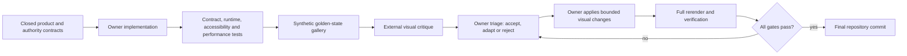
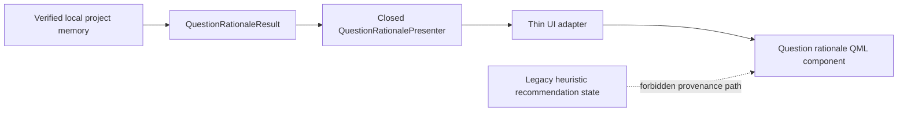

# Dual-Key UI Visual Finish Design

**Date:** 2026-07-16

**Status:** Concept approved; written-spec review pending

**Branch:** `codex/research-os-contract-design`

**Source baseline:** `83fad7a661ce3140b209b488b80dfd2f00f3660f`

## 1. Decision

Use a **dual-key finish** for Modori UI work:

1. the repository owner builds and verifies the functional UI, its first visual pass,
   all product states, and every authority boundary;
2. an external visual reviewer may critique screenshots of that running UI and propose
   bounded changes to spacing, typography, colour, density, and hierarchy; and
3. the repository owner selectively applies those proposals, reruns the product and
   verification gates, and remains the only party that commits the final change in this
   worktree.

The external reviewer may be Claude, but this design does not depend on a particular
vendor. The reviewer is an art director, not a source of statistical truth, state
semantics, application authority, or final code ownership.

This combines two different strengths without pretending they are interchangeable:

- visual critique benefits from a fresh, design-focused eye;
- a trustworthy statistical application requires repository context, executable state
  coverage, provenance boundaries, accessibility, performance evidence, and regression
  tests.

The first intended application is the future verified clarification-question and
question-rationale surface. This document defines the finishing workflow, not that
feature's still-deferred live Research OS wiring.

## 2. User value and non-claim

The user should receive a UI that is both trustworthy and deliberately finished, without
having to coordinate every implementation decision or translate between two coding
sessions.

This workflow can improve perceptual quality and reduce blind spots. It does not prove:

- recommendation validity;
- numerical accuracy;
- scientific truth;
- accessibility merely because a screen looks clean;
- office-PC performance without measurement; or
- that either reviewer is infallible.

The analogy is a building that needs both a structural engineer and a lighting designer.
The lighting designer can reveal a superb room that the engineer would leave visually
flat; the lighting designer cannot move a load-bearing wall without structural review.

**Analogy loss point:** software state, provenance, keyboard behaviour, and performance
can fail invisibly in a screenshot. Therefore the visual reviewer never replaces runtime
and contract verification.

## 3. Repository facts that constrain the design

The repository audit found:

1. `WorkScreen.qml` already provides a reusable shell: header, guided rail, central data
   surface, results panel, pipeline rail, and loading overlay.
2. `GuideRail.qml` is a large mixed-responsibility component. It combines layout,
   legacy heuristic candidates, manual configuration, experimental confirmation, and
   run preparation. It is not a safe provenance source for Research OS rationale.
3. `RecommendationControllerMixin.recommendationReason` exposes the legacy heuristic
   reason. It must never be displayed as if it came from an AnalysisPassport V2 trace.
4. The implemented `QuestionRationaleResult` and closed bilingual presenter are pure,
   typed, tested contracts, but there is no honest live UI source for them yet.
5. The current UI controller does not construct or own the Research OS request,
   StudySpec, outstanding V2 passport, or verified project-memory lifecycle.
6. `Theme.qml` centralises colour, spacing, typography, geometry, and effect tokens.
   Existing visual-contract tests reject local literal colours and layout metrics.
7. QML layout depends on `SplitView`, `ScrollView`, implicit sizing, clipping, Korean and
   English wrapping, Windows font rendering, and scaling. A single happy-path screenshot
   cannot validate these constraints.
8. The supplied light split-entry and work-screen screenshots are useful visual
   references, but the checked-in `EntryScreen.qml` is not identical to those captures.
   The repository render is the implementation baseline unless a later approved design
   explicitly replaces it.

## 4. Alternatives considered

### 4.1 Recommended: sequential dual-key finish

The repository owner delivers a runnable, state-complete first pass; the visual reviewer
critiques rendered evidence; the owner applies selected changes and verifies the result.

Benefits:

- visual review operates on the real application rather than an imagined mockup;
- authority and state semantics stay under one accountable owner;
- proposed polish can be rejected when it breaks accessibility, performance, or
  provenance;
- the external reviewer needs no project data or repository access; and
- the process has a bounded end.

Cost: the owner must render and inspect the gallery after each accepted revision.

### 4.2 Rejected as default: two independent complete designs

Having two parties independently redesign the same surface may produce more ideas, but
it doubles work, encourages incompatible component structures, and turns integration
into taste arbitration. It is reserved for a genuinely failed visual direction, not
ordinary finishing.

### 4.3 Rejected: external reviewer edits and lands final code

Direct handoff appears faster, but it transfers hidden state, QML, provenance, and test
risks to a party reviewing mainly by appearance. It also creates worktree collision and
unclear ownership. External code may be inspected as a proposal in a separate worktree,
but it is never accepted without owner-side reconstruction or line-by-line review and
full verification.

## 5. Workflow architecture

The critique path is advisory and one-way. It does not feed new product text, research
facts, runtime state, or authority into the application.

For the future question-rationale UI, the product path remains separately bounded:

The gallery may inject synthetic views into the same QML component, but fixture injection
must be impossible in production packaging.

## 6. Responsibility boundary

### 6.1 Repository owner

The repository owner controls and is accountable for:

- feature and state contracts;
- data flow and provenance;
- closed Korean and English copy;
- controller, adapter, and QML implementation;
- the separation from legacy heuristic recommendations;
- error, unavailable, loading, empty, stale, and long-text behaviour;
- keyboard, focus, screen-reader, contrast, and reduced-effects behaviour;
- low-resolution, scaling, memory, and latency gates;
- dependency and supply-chain decisions;
- test evidence; and
- the final commit.

### 6.2 External visual reviewer

The external visual reviewer may recommend:

- spacing and alignment;
- typographic scale, weight, and line length;
- colour hierarchy within the existing brand direction;
- border, surface, and card hierarchy;
- density and disclosure order;
- visual focus and rhythm; and
- bounded motion, only where `reduceEffects` remains authoritative.

The reviewer may not change:

- statistical or research meaning;
- closed rationale copy;
- `available`, `not_applicable`, `unavailable`, or `failure` semantics;
- Guided versus Standard information authority;
- controller or ledger behaviour;
- automatic-execution boundaries;
- experimental labels;
- privacy or local-only constraints;
- dependencies, fonts, icons, or packages without explicit owner review; or
- acceptance thresholds.

The reviewer does not modify this exclusive worktree. If code is exceptionally useful
as a communication artifact, it is created in a separate worktree and treated as an
untrusted proposal rather than merged or copied wholesale.

### 6.3 User

The user is not required to supervise each change. The user is asked only for:

1. written-spec approval before implementation planning; and
2. a final subjective preference decision if two verified visual variants remain
   materially equivalent.

## 7. Golden-state gallery contract

Visual review must use actual rendered components with synthetic data. A normal review
packet contains at least these canonical states when they apply to the slice:

1. Guided available question and concise rationale;
2. Standard available question and bounded evidence;
3. explicit “not sure” action and guidance;
4. `not_applicable`, with stale rationale cleared rather than hidden behind another
   layer;
5. `unavailable`, using the closed bounded message;
6. `failure`, using the closed integrity-safe message;
7. loading or project-memory opening;
8. maximum supported Korean text;
9. maximum supported English text;
10. minimum supported window size;
11. supported Windows display scaling; and
12. the component beside the results panel and pipeline rail in the real work shell.

When a slice has collapsed and expanded disclosure, both forms are included. When an
interaction changes focus, the keyboard-focused state is included.

Every gallery item records:

- state identifier;
- locale;
- mode;
- viewport size;
- scale factor;
- reduced-effects setting;
- synthetic fixture identifier;
- source commit; and
- expected visible and absent regions.

Before the first render, the slice manifest must name the exact minimum viewport,
tested scale factors, locale set, and pre-change performance baseline. “Supported” may
not be reinterpreted after a defect appears.

No real filenames, research titles, raw data, project identifiers, ledger identifiers,
free-text answers, or user paths may appear in the packet.

## 8. Review and iteration protocol

### 8.1 Round zero: owner pass

Before external review, the owner must produce a runnable first pass that satisfies all
state and authority tests. The reviewer does not design around missing states or broken
behaviour.

### 8.2 Visual critique packet

The reviewer receives:

- the synthetic gallery images;
- a one-page visual brief;
- immutable-copy and forbidden-change lists;
- theme-token inventory;
- minimum window and scaling constraints; and
- a request for proposals in measurements or annotated images, not unrestricted code.

Recommendations must identify the affected state and observable problem. “Make it more
modern” is not actionable.

### 8.3 Owner triage

Each proposal receives one of three dispositions:

- **accept:** visually useful and contract-safe as proposed;
- **adapt:** useful intent, but implementation changes to preserve product constraints;
- **reject:** conflicts with meaning, authority, accessibility, performance, brand, or
  verified state behaviour.

The disposition record is concise. It is design provenance, not a new product authority
system.

### 8.4 Bounded loops

Use at most two external critique loops for one implementation slice:

1. composition and hierarchy;
2. final spacing, typography, and edge-state polish.

If a major problem remains after the second loop, classify it as a structural design
failure. The owner revisits the component boundary or information architecture instead
of continuing unbounded cosmetic iteration.

## 9. Visual acceptance gates

A surface is not finished until all applicable gates pass:

1. no clipping, overlap, inaccessible off-screen action, or accidental horizontal
   scrolling at supported sizes;
2. Korean and English closed copy is byte-for-byte unchanged unless its owning contract
   is separately revised;
3. all canonical states render and stale content is cleared on disposition changes;
4. Guided mode exposes research facts in ordinary language and does not leak internal
   severity or E1-E5 vocabulary;
5. Standard mode shows only the bounded evidence authorised by its presenter;
6. keyboard traversal, visible focus, accessible names, and reading order are coherent;
7. colour contrast and non-colour state cues remain sufficient;
8. reduced-effects mode disables optional motion and costly effects;
9. office-PC UI responsiveness and memory do not regress beyond the slice's predeclared
   gate;
10. no network, external font, icon pack, telemetry, or new runtime dependency is added;
11. no fixture or gallery injection path reaches production; and
12. focused tests, QML runtime loading, visual-contract tests, Ruff, and the full suite
    pass.

Pixel-perfect image equality is not a sole acceptance test. Windows font rasterisation,
graphics backends, and scaling can create irrelevant pixel differences. Use geometry and
state assertions for objective invariants, then side-by-side human review for perceptual
quality.

## 10. Error and mismatch behaviour

- If the visual reference conflicts with a closed product contract, the contract wins
  and the mismatch is reported.
- If the external proposal requires unsupported QML effects or a new dependency, adapt
  it using existing primitives or reject it.
- If a screenshot looks correct but a runtime, accessibility, state, or performance gate
  fails, the surface is not finished.
- If a fixture renders differently from production because it bypasses the real adapter,
  discard that fixture architecture; the gallery must exercise the same presentation
  component and property contract.
- If the checked-in UI and a historic screenshot disagree, do not silently reconstruct
  the screenshot. Record which source is canonical for the slice.
- If external review is unavailable, the owner completes the same gallery and rubric
  internally. Lack of a second visual reviewer must not block functional delivery.

## 11. Security, privacy, and supply chain

The external visual path is outside the trusted local product boundary. Therefore:

- only synthetic screenshots and the bounded brief leave the worktree;
- screenshots are inspected for accidental path, filename, project, and ledger leakage;
- repository archives, source trees, databases, benchmark evidence, and user datasets
  are not uploaded for visual review;
- reviewer-supplied code is treated as untrusted input;
- reviewer-suggested assets require licence and integrity review;
- external fonts, icon libraries, analytics, CDN assets, and network calls are forbidden
  by default; and
- the final implementation remains local and reproducible from the repository.

## 12. Verification strategy

The future implementation plan must include tests before implementation for:

- the state-to-view mapping and stale-state clearing;
- strict separation from `recommendationReason` and other legacy heuristic properties;
- Guided and Standard disclosure differences;
- closed-copy preservation;
- QML runtime loading for every canonical state;
- component geometry at minimum size and supported scaling;
- long Korean and English wrapping;
- keyboard focus and accessible names;
- `reduceEffects` behaviour;
- absence of network and new external assets;
- fixture exclusion from production packaging; and
- a measured resource comparison against the pre-change baseline.

The visual review record must link its rendered images to a source commit and state
manifest. A polished image without a reproducible state is illustration, not evidence.

## 13. Implementation sequence boundary

After this written spec is approved, the detailed implementation plan should sequence:

1. state manifest and failing contract tests;
2. a thin UI adapter over the existing closed presenter contract;
3. isolated, reusable rationale/question-card QML components;
4. a synthetic gallery harness excluded from production;
5. runtime, accessibility, geometry, privacy, and resource verification;
6. owner-side first visual pass;
7. first external screenshot critique and owner triage;
8. bounded visual revision and complete rerender;
9. optional second critique loop;
10. full verification and final evidence record.

Production visibility remains gated on an honest live Research OS source for the current
outstanding V2 passport. The plan must not connect the rationale component to legacy
heuristic candidates merely to make the new UI visible sooner.

Do not build an unconnected production adapter or card solely to create attractive
screenshots. Steps 2 through 4 begin only as part of a separately approved live
clarification UI slice with a truthful source contract. Until then, this document is the
finishing protocol for that future slice, not authority to add dead product UI.

## 14. Stop conditions and fallback

Stop or reduce the visual slice rather than weaken product guarantees if:

- a clean composition requires hiding unavailable, failure, caution, or experimental
  status;
- the only live data source is the unrelated legacy recommendation service;
- the design requires raw user data to be sent to an external reviewer;
- visual effects make the office-PC target materially slower after focused optimisation;
- low-resolution or scaling defects persist after a structural revision;
- reviewer proposals repeatedly alter closed meaning or authority; or
- a gallery cannot exercise the same component contract as production.

Fallback: ship the simpler verified owner implementation, keep the visual review packet
as non-product research evidence, and defer additional polish. Never trade provenance,
state honesty, accessibility, or local-only operation for visual smoothness.

## 15. Explicit non-claims

Passing this workflow establishes only that a UI slice has reproducible visual coverage,
bounded external critique, and owner-side technical verification.

It does not establish:

- recommendation validity;
- calculation accuracy;
- human or expert equivalence;
- broad social-science coverage;
- SPSS superiority;
- the usability of the entire multi-round research flow; or
- the value of an SLM or cloud model.
