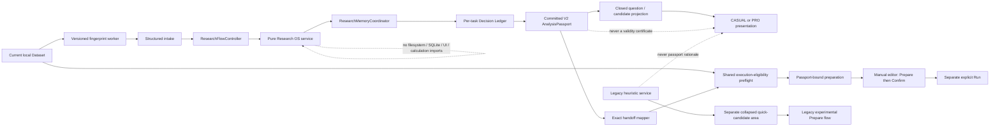
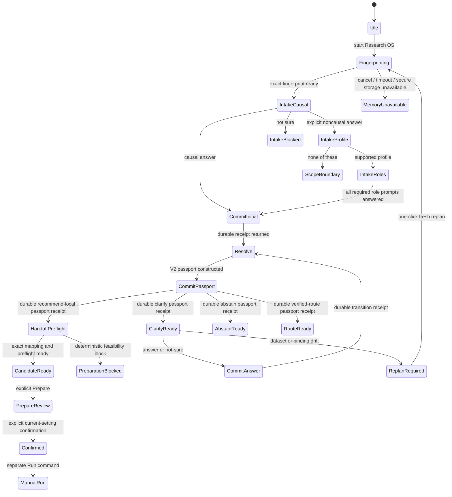

# Live Multi-Round Research OS UI and Exact Handoff Design

**Date:** 2026-07-17

**Status:** architecture approved; written specification draft for owner review

**Implementation baseline:** `codex/research-os-release-integration` at
`fc00d82a1fc7e53b32808d2a895239ee42782eb4`

## 1. Decision

P1 will connect the integrated deterministic Research OS to the product through a
separate, durable, multi-round research-task flow. It will coexist with, but never be
blended with, the legacy data-shape heuristic candidate surface.

The live path is deliberately narrow:

- six local analysis capabilities;
- one structured question per screen;
- a bounded initial intake followed by at most three passport-backed clarification
  rounds;
- one application-owned SQLite Decision Ledger per research task;
- commit before any Research OS question, candidate, abstention, or route is displayed;
- an exact, typed passport-to-step mapping;
- a deterministic execution-eligibility preflight that may reject, but never upgrade,
  a Research OS candidate; and
- Prepare -> Confirm -> separate manual Run, with no automatic analysis execution.

Both CASUAL MODE (`guided`) and PRO MODE (`standard`) consume the same committed
AnalysisPassport and research-task state. They change presentation depth, not the
decision, method identity, variable roles, question budget, or authority.

No SLM, LLM, cloud teacher, model inference, free-form statistical recommender, or new
runtime dependency is introduced. P1 is a conditional go for the six named tasks only.
It is not a general social-science recommendation system.

## 2. Repository-grounded findings

The P0 integration is complete and independently recorded in
`docs/qa/research-os-release-integration-evidence.md`. P0 intentionally did not expose
Research OS as a live UI source.

The P1 source contracts currently contain:

| Contract fact | Verified value |
| --- | ---: |
| Local capabilities | 6 |
| C1 hard rules | 67 |
| Active clarification questions | 15 |
| Verified external routes | 0 |
| Question budget | at most 3 |

The six capabilities require 10, 10, 11, 11, 12, and 13 hard predicates respectively.
An all-unknown request cannot become a supported recommendation by asking only three
single-fact clarification questions. A structured initial intake is therefore a
mathematical prerequisite, not a cosmetic onboarding choice.

A direct walk through the current `ResearchOsService` and
`ClarificationTransitionService` using the proposed intake mappings confirmed the
closure bound. Numeric summary, category frequency, Pearson, and Spearman reached their
exact single capability after `cluster -> dependence -> weight` safe answers; Welch and
paired t reached theirs after `cluster -> weight`. The order is the current deterministic
planner result, not UI-authored sequencing. Unsafe or `Not sure` branches remain free to
abstain.

The live release UI currently obtains its candidate and reason from the legacy
`RecommendationService`. That reason is not passport evidence and cannot populate a
Research OS rationale surface. The current correlation command also fixes
`method="auto"`, which loses the Pearson/Spearman identity selected by Research OS.
The current comparison command defaults to `routing_policy.preset="modern"`, which can
route away from Welch. The current UI has no paired-comparison command.

The calculation engine already has the exact paired-t representation needed by P1:
`stats.paired_comparison` with `routing_policy.preset="classic"` returns `paired_t`
unconditionally. No paired-engine schema extension is required. Likewise,
`stats.compare_groups` with `preset="always_welch"` fixes Welch. P1 needs a new exact
handoff adapter, not a new inferential engine.

One further boundary is required. C1 currently represents research meaning and design
facts, but it does not encode every execution-feasibility condition enforced by the
calculation steps, such as actual two-group cardinality, numeric storage, minimum
complete-pair count, or nonzero variance. A passport recommendation is therefore not
yet sufficient authority to promise that a step can execute. Section 11 adds a shared,
non-inferential preflight that can block preparation without changing the passport.

## 3. Alternatives and disposition

### 3.1 Adopted: separated coexistence

Research OS receives its own live state, controller, persistence, provenance, and card
source. The legacy heuristic candidates remain available in a collapsed, explicitly
separate “data-shape quick candidates” area. Direct analysis remains continuously
available.

This preserves current breadth while allowing the six Research OS tasks to carry much
stronger decision provenance. The two sources never share reasons, confidence words,
selection state, or preparation objects.

### 3.2 Rejected: replace the legacy surface now

Replacement would reduce the visible product from the legacy catalog's broader set to
six local tasks and zero verified external routes. That is a functional regression,
not a principled simplification.

### 3.3 Rejected: blend or rank both sources in one list

A mixed list would make a legacy heuristic candidate appear passport-backed merely
because it is adjacent to Research OS output. Shared titles or apparent agreement do
not create shared provenance. This would be false provenance and is forbidden.

## 4. External review disposition

The external review was checked against the integrated source rather than accepted by
reputation.

| Review item | Disposition | Repository-grounded result |
| --- | --- | --- |
| Research OS also needs experimental wording | Accepted | All six capabilities have `RecommendationEvidence.EXPERIMENTAL`; ledger integrity is not recommendation validity |
| Guide users to finish transformations first and make drift replanning easy | Accepted with authority guard | One click enters a fresh replan, but prior answers are drafts until explicitly reconfirmed against the new fingerprint |
| Paired t may require a new engine policy | Rejected as unnecessary | `PairedComparisonStep._route()` already maps `preset="classic"` exactly to `paired_t` |
| Make the capability-to-step mapping executable | Accepted | Section 12 is the sole mapping oracle and is mutation-tested |
| Keep experimental wording on the legacy collapsed area | Accepted | Visual separation does not waive the existing experimental boundary |
| Clarify whether 30 seconds includes fingerprinting | Accepted | Initial fingerprint, initial decision, and later decision waits are separately measured and each has the same 30-second p95 ceiling |

## 5. Architecture and authority boundaries



The pure `modori.research_os` package remains structure-only and imports no filesystem,
SQLite, UI, network, subprocess, or calculation modules. `modori.research_memory`
remains the sole authority-bearing ledger layer. A composed `ResearchFlowController`
owns the UI-facing state and exposes one QObject from `UiController`; P1 must not expand
the already budgeted `UiController` facade with a second large mixin.

QML receives closed presentation models and commands. It never receives a raw passport
mapping, a SQLite connection, a mutable ResearchRequest, or direct Dataset access.

## 6. Research-task identity and durable location

The current Decision Ledger stores one materialized ResearchRequest per `project_id`.
P1 therefore assigns one closed `project_id` to each research task rather than forcing
unrelated questions into one mutable request history.

A minimal application-owned `ResearchTaskIndex` groups tasks without granting
decision authority. Its only permitted fields are:

```text
task_project_id
fingerprint_contract_id
dataset_fingerprint
task_ordinal
state = active | readonly
created_at_utc | null
```

It stores no path, filename, user free text, variable label, research fact, answer,
passport, reason, raw value, URL, command, or imported assertion. A task ID is a fresh
closed local identifier and does not encode the source path or dataset. The ordinal is
allocated transactionally as the next integer within the exact fingerprint contract
and dataset fingerprint. Concurrent allocation cannot produce two active tasks with
the same ordinal.

The index is a separate STRICT SQLite database at
`%LOCALAPPDATA%\Modori\research-task-index.sqlite3`. It uses the same local-path,
symlink/junction, remote-drive, defensive-connection, WAL, `synchronous=FULL`, schema
fingerprint, full-integrity, and atomic-transaction controls as the Decision Ledger.
It has one closed table, one application ID, one user version, no trigger or view, no
import path, and a 10,000-row resource limit. Reaching the limit produces typed memory
unavailability; it never evicts an authoritative ledger or silently reuses an ordinal.
The index schema is independently versioned because it is a locator schema, not a
Decision Ledger schema migration.

The index is a locator, not evidence. Opening a located ledger still performs the full
Decision Ledger verification. A forged, missing, or corrupt index can make history
temporarily undiscoverable but cannot make a ledger authoritative. If the index is
unavailable, direct analysis and the existing calculation pipeline remain usable; the
passport-backed live flow reports typed memory unavailability and does not silently
switch to an uncommitted imitation.

Each task ledger continues to use the hardened application-owned path derived by
`default_ledger_path(task_project_id)`. Starting a corrected task or replanning after
data drift creates a new task ledger. The earlier ledger becomes read-only and is never
overwritten, merged, or relabelled as current.

## 7. Dataset and schema fingerprint contract

P1 implements the already approved full-current-dataset identity contract, with an
explicit fingerprint contract ID. The digest covers ordered schema, row count,
variable metadata, normalized missing masks, typed values, and row order. Text uses
Unicode NFC; missingness has one explicit marker; numeric/date values use stable typed
encodings rather than locale-formatted text.

The source-schema fingerprint remains separate and binds source type, selected
sheet/layout, canonical source columns, and column order. A schema-only digest is never
substituted for an incomplete dataset digest.

Fingerprint work runs in the existing serialized worker boundary, not the QML thread.
It is cached only by the exact pipeline version plus fingerprint contract ID. A worker
result is discarded if the captured pipeline version is no longer current. Processing
remains chunked and cancellable; the previously approved 10-second fingerprint worker
budget is not weakened merely because the overall visible-wait ceiling is 30 seconds.

A dataset fingerprint is a content commitment, not anonymization. A person who already
possesses a small candidate dataset may test guesses against its digest. Fingerprints
are not shown in ordinary CASUAL UI or included in visual-review screenshots. Exported
evidence retains the existing explicit privacy warning and quarantine rules.

Before intake starts, the UI says, in closed copy:

> 역코딩·척도 구성·결측 처리처럼 분석 전에 필요한 데이터 변환을 먼저 마친 뒤
> 연구과업을 시작하세요. 데이터가 바뀌면 현재 답변은 다시 확인해야 합니다.

The user can return to transformation without creating a ledger.

## 8. Bounded structured intake

The initial intake builds a typed ResearchRequest; it is not a hidden expansion of the
three-question clarification budget. It is bounded to one causal-intent question, one
task-profile question, and one or two role-binding questions. Thus a supported path has
three or four intake screens, followed by at most three planner questions. One screen
asks one research-fact question.

Tentative intake selections may be displayed as editable form state, but they have no
Research OS authority. No Research OS question, candidate, abstention, or route is
displayed until the initial request snapshot and its resulting passport are committed.
A crash before that commit restarts intake and cannot leave an authoritative partial
answer.

### 8.1 Causal-intent gate

The first question uses the existing neutral causal-intent meaning:

`관찰된 차이나 관계를 원인에 따른 효과로 해석하려 합니까?`

- `No` records `question.causal_intent=noncausal` and continues.
- `Yes` creates a minimal valid request with the confirmed causal fact, commits it,
  obtains a passport-backed `unsupported_causal_target` abstention, and displays no
  local candidate.
- `Not sure` keeps causal intent typed `unknown` and shows a bounded intake block:
  `인과효과로 해석할지 먼저 확인해야 이 범위의 후보를 검토할 수 있습니다.` It
  creates no candidate or route and does not misuse resource-unavailable vocabulary.

P1 has zero verified external routes. The causal abstention may say that an external
causal workflow is required, but it must not fabricate a provider, link, procedure, or
round-trip guarantee. The previously approved product ambition to guide unsupported
analyses externally therefore remains a later verified-route slice; P1 does not claim
that feature is complete.

### 8.2 Task profiles and exact facts

Every profile card states the research meaning and the noncausal claim boundary. A
profile selection marks only the facts visibly included in that card as
`user_confirmed`. Unmentioned StudySpec fields stay typed `unknown`; variable types,
names, or distributions never silently become research intent.

| Profile ID and user meaning | Explicit fact mapping | Explicit role binding | Remaining C1 blockers after intake |
| --- | --- | --- | --- |
| `numeric_distribution` — summarize the distribution of one or more numeric variables; no causal interpretation | goal `describe`; template `summary`; claim `descriptive`; scale `distribution`; association target `not_applicable`; dependence remains unknown | one or more `outcome` variables | dependence, weight use, cluster use |
| `category_frequency` — summarize counts and proportions of one or more categorical variables; no causal interpretation | goal `describe`; template `frequency_distribution`; claim `descriptive`; scale `distribution`; association target `not_applicable`; dependence remains unknown | one or more `outcome` variables | dependence, weight use, cluster use |
| `independent_two_group_mean` — compare the mean of a numeric outcome between two non-overlapping groups; the difference is not a causal effect | goal `compare`; template `group_contrast`; claim `associational`; scale `difference`; association target `not_applicable`; contrast `pairwise`; dependence `independent` | exactly one `outcome` and one `group` | weight use, cluster use |
| `paired_two_time_mean_change` — compare the mean change between two ordered measurements from the same person or unit; the change is not a causal effect | goal `compare`; template `within_unit_change`; claim `associational`; scale `difference`; association target `not_applicable`; contrast `pairwise`; dependence `paired`; layout `wide_repeated`; temporal structure `repeated_panel` | choose `before` then `after`; bind `outcome=(after,)`, `repeated_measure=(before, after)`, and repeated order `(before, after)` | weight use, cluster use |
| `linear_co_movement` — summarize straight-line co-movement while preserving numeric spacing; do not interpret it as causation | goal `associate`; template `association`; claim `associational`; scale `correlation`; association target `product_moment`; dependence remains unknown | exactly one `outcome` and one `focal_predictor` | dependence, weight use, cluster use |
| `rank_co_movement` — summarize one-direction co-movement from ranks; do not interpret it as causation | goal `associate`; template `association`; claim `associational`; scale `correlation`; association target `rank_monotonic`; dependence remains unknown | exactly one `outcome` and one `focal_predictor` | dependence, weight use, cluster use |

For non-comparison profiles, contrast is explicitly `not_applicable`; it is not treated
as an answered comparison fact. For P1 weight and cluster support, an explicit “none”
answer creates the corresponding StudyRole binding with a user-confirmed empty tuple.
Omitting the role binding is not equivalent to confirming absence.

For the two association profiles, `outcome` and `focal_predictor` fix the reporting
orientation and exact pair order only. They do not assert temporal order, prediction,
or causation; the card repeats that boundary.

The “none of these tasks” action shows a static, closed scope boundary: P1 supports
only the six listed tasks and currently has no verified external route. It creates no
fake passport or candidate. This action is not labelled as a statistical decision.

## 9. State machine and commit-before-display



The order is normative:

1. allocate the next event ID;
2. construct and validate the request or V2 passport;
3. atomically append it with the resulting snapshot;
4. receive the durable ledger receipt;
5. re-read or verify the committed artifact; and only then
6. publish a closed presentation projection to QML.

An append failure, conflict, injected crash, stale worker result, or verification error
must leave the previous visible committed state intact. There is no optimistic question
or candidate that appears before durability and is retracted after failure.

Exactly one unconsumed clarify passport may be active for a task. A repeated click,
second window, or racing worker either returns the same verified committed passport or
fails closed; it never spends the same question budget twice.

## 10. Clarification, correction, and drift

Question cards use the existing authority-free `QuestionCopy` and rationale projection
from the committed V2 passport. The presenter does not run a second planner search.
CASUAL shows the concise question and plain-language “why this question” projection.
PRO may additionally show evidence rows, source identities, and closed decision fields.
Both views bind the same passport digest.

`Not sure` is an ordinary typed branch. It never becomes an inferred answer. After the
third clarification, unresolved hard predicates produce abstention rather than a fourth
question or a guessed fact.

The existing `decision_retracted` contract retracts a passport-commit decision while
preserving the current request snapshot; it does not reverse an already consumed
clarification answer. P1 keeps that exact meaning. Retracting a current candidate or
outstanding question appends `decision_retracted` and closes that passport authority
without deleting any event.

Correcting an already committed answer starts a new research task instead of pretending
the old answer never existed. The old task becomes read-only; its visible profile and
roles may seed editable drafts in the new intake, but every carried fact must be
explicitly reconfirmed. The new task receives fresh component, passport, and event
identities. Consumed question authority is never reissued as if unused.

Before accepting an answer, preparing a candidate, confirming settings, or running the
prepared step, P1 compares the captured pipeline version and full current fingerprint
with the request and passport binding. Drift disables the action and produces
`replan_required`; it is not reported as corruption or ordinary audit failure.

The drift action is one click: `현재 데이터로 다시 계획`. It computes a fresh
fingerprint and starts a new task ledger. Prior profile and role selections may be shown
as editable draft defaults, but they do not retain `user_confirmed` authority until the
user reviews and confirms the new intake summary. The old ledger remains read-only.
This follows the current-state replanning principle of the V2 migration design without
pretending that a changed dataset preserves the old passport binding.

## 11. Deterministic execution-eligibility preflight

The Research OS core may recommend a capability whose selected variables cannot be
executed by the current engine. P1 inserts a local deterministic preflight after the
passport commit and before either a ready candidate card or Prepare is exposed.

The preflight:

- receives only the committed passport, exact mapped params, current Dataset, and
  captured pipeline version;
- validates variable existence, distinct roles, measure/storage compatibility,
  required cardinality, minimum complete observations, and other conditions already
  enforced by the corresponding calculation step;
- may compute bounded feasibility predicates and counts, such as nonmissing count,
  unique-group count, numeric finiteness, and whether variance is zero, but does not
  compute or retain a test statistic, p-value, effect estimate, confidence interval,
  assumption-test result, chart, or report;
- does not add or modify a pipeline step;
- can return only `prepare_ready`, `prepare_blocked`, `stale`, or `failure`;
- can downgrade preparation but cannot create or upgrade a Research OS recommendation;
  and
- is discarded if the pipeline version changes while it runs.

The implementation must extract or share the engine's existing validation primitives.
It must not maintain a second hand-written approximation that can drift from the Run
path. A parity test proves that every preflight-accepted fixture reaches the same
validation boundary on explicit Run, and every shared structural rejection has the
same closed reason code.

The profile-specific feasibility floor is:

| Profile | Required preflight facts |
| --- | --- |
| Numeric distribution | nonempty Dataset; unique selected variables; each selected variable is SCALE with at least one finite numeric nonmissing value |
| Category frequency | nonempty Dataset; unique selected variables; every selected variable is NOMINAL or ORDINAL with at least one nonmissing value |
| Linear co-movement | distinct SCALE variables; finite numeric values; at least three complete pairs; nonzero variance in each variable |
| Rank co-movement | distinct SCALE or ORDINAL variables accepted by the current engine; finite numeric values; at least three complete pairs; nonzero variance in each variable |
| Independent two-group mean difference | distinct numeric SCALE outcome and NOMINAL/ORDINAL group variable; exactly two nonmissing groups; current engine minimum group sizes and nonzero within-group variance |
| Paired two-time mean change | two distinct numeric SCALE variables with distinct display labels; at least three complete pairs; nonzero variance in paired differences |

These are execution-feasibility conditions, not a complete statistical-assumption or
recommendation-validity test. In particular, P1 preflight does not run Shapiro-Wilk,
choose a method from a normality result, or claim that a study design is substantively
valid.

P1 adds one stricter semantic condition: the `product_moment` profile requires SCALE,
finite numeric variables because the user explicitly selected preservation of numeric
spacing. Spearman permits the engine's supported SCALE or ORDINAL inputs. This stricter
gate may block preparation; it does not silently substitute Spearman for Pearson.

A blocked preparation is rendered instead of a ready candidate card as
`현재 데이터에서는 구성을 준비할 수 없음`, with the closed failed condition. It is
not called a failed analysis because no analysis ran. The user may edit metadata/data,
choose another research task, or use direct analysis; Modori does not auto-switch
methods.

## 12. Exact passport-to-step handoff oracle

This table is the only permitted Research OS mapping. `language` comes from the
passport-bound QuestionSpec. Ordered roles come from the passport-bound EstimandSpec and
StudySpec. All parameter mappings are canonicalized before a preparation digest is
computed.

| Capability identity suffix | Exact step type | Exact params |
| --- | --- | --- |
| `descriptive_summary:unweighted_summary:summary:independent_unweighted:roles-v1` | `stats.descriptives_table1` | `schema_version=1`; `variables=list(outcome)`; `group=null`; `include_missing_counts=true`; `language=question.language` |
| `frequency_distribution:unweighted_frequency:frequency_distribution:independent_unweighted:roles-v1` | `stats.frequency_crosstab` | `schema_version=1`; `mode="frequency"`; `variables=list(outcome)`; `language=question.language` |
| `bivariate_association:pearson_product_moment:association_correlation:independent_unweighted:roles-v1` | `stats.correlation` | `schema_version=1`; `pairs=[[outcome[0], focal_predictor[0]]]`; `method="pearson"`; `missing_policy="pairwise"`; `p_adjust="none"` |
| `bivariate_association:spearman_rank_monotonic:association_correlation:independent_unweighted:roles-v1` | `stats.correlation` | `schema_version=1`; `pairs=[[outcome[0], focal_predictor[0]]]`; `method="spearman"`; `missing_policy="pairwise"`; `p_adjust="none"` |
| `compare_two_groups:welch_mean_difference:group_contrast_mean:independent_unweighted:roles-v1` | `stats.compare_groups` | `schema_version=1`; `dv=outcome[0]`; `group=group[0]`; `routing_policy={"preset":"always_welch"}` |
| `compare_two_groups:paired_t_mean_change:within_unit_mean_change:paired_unweighted:roles-v1` | `stats.paired_comparison` | `schema_version=1`; `before=repeated_measure_order[0]`; `after=repeated_measure_order[1]`; `routing_policy={"preset":"classic"}` |

Additional assertions are mandatory:

- summary/frequency outcomes are nonempty and unique;
- Pearson/Spearman have exactly one outcome and one distinct focal predictor;
- Welch has exactly one outcome and one distinct group role;
- paired comparison has exactly two repeated-measure variables;
- repeated-measure role and repeated order contain the same two IDs in the same order;
- paired outcome is exactly the `after` variable; and
- the current fingerprint equals the request, passport, and preparation fingerprint.

Any mapping mismatch, missing role, extra role, changed method, `auto` method, `modern`
routing preset, before/after swap, unknown capability, future step schema, or changed
fingerprint returns a typed handoff failure. It does not fall back to a nearby method.

The resulting `PassportBoundPreparation` contains:

```text
passport_artifact_id
passport_digest
capability_key
dataset_fingerprint
step_type
canonical_step_params
preflight_disposition
experimental = true
requires_explicit_configure_confirm_run = true
preparation_digest
```

It is separate from the legacy `RecommendationPreparation` type. Reusing the legacy
type would erase the passport binding and recreate the false-provenance problem.

## 13. Product presentation and experimental vocabulary

Research OS rigor does not exempt it from the experimental recommendation boundary.
Every Research OS candidate card shows:

- `실험적 후보`;
- a `검토 상태`, never a confidence or trust level;
- persistent `검증 중인 분석 후보 · 자동 실행 안 함`; and
- primary action `구성 검토로 이동`.

The card follows conflict resolutions 3 and 4 of
`2026-07-15-guided-surface-reconciliation.md`: selection and Prepare do not mutate the
pipeline; Confirm occurs in the exact manual configuration; Run remains a separate
explicit action. No card says “best,” “correct,” “expert,” a percentage, or an accuracy
claim.

Candidate explanation uses a closed capability-copy catalog plus passport-bound facts.
For example, it may say that the confirmed task is a mean difference between two
non-overlapping groups and that the prepared method identity is Welch. It may not say
Welch is correct for the study, that assumptions were satisfied beyond the preflight,
or that the recommendation was validated. Legacy `recommendationReason` is never an
input.

CASUAL presents research meaning, the next action, and a concise closed explanation.
PRO additionally exposes method identity, role mapping, claim boundary, passport digest
abbreviation, and evidence details. Switching modes preserves the task and passport but
invalidates any pending manual confirmation, as required by the existing experimental
boundary.

The collapsed legacy quick-candidate area remains visually and semantically separate.
Its cards keep their existing experimental badge, review status, Prepare action, and
no-auto-run boundary. It is never renamed “Research OS,” and agreement with a Research
OS candidate is not displayed as validation.

Direct analysis remains available in PRO and through the existing manual editor in all
states, including memory unavailable, abstention, unsupported scope, preflight block,
and planner failure.

## 14. Loading, cancellation, and performance gates

All fingerprint, ledger verification/append, resolver, planner, passport audit, and
preflight work runs outside the UI thread. The main thread must acknowledge a user
action and enter a visible busy state within 100 ms on the target machine.

Closed stage copy distinguishes work rather than implying model thought:

- `데이터 버전을 확인하는 중`;
- `연구과업 기록을 준비하는 중`;
- `다음 확인 항목을 결정하는 중`; and
- `분석 설정이 현재 데이터에서 가능한지 확인하는 중`.

Cancellation before a commit leaves no authoritative partial state. Cancellation after
a successful commit leaves the last committed state recoverable. No automatic retry
loop is permitted.

Performance is reported as separate contiguous user-visible waits on the same low-cost
HP office laptop used for the Decision Ledger study:

1. **initial identity wait:** full current-dataset and source-schema fingerprinting;
2. **initial decision round:** task-index allocation + ledger creation/open + initial
   commit + resolve/plan + passport commit + exact handoff/preflight when applicable +
   projection; and
3. **later decision round:** answer commit + resolve/plan + passport commit + exact
   handoff/preflight when applicable + projection, reusing the exact cached fingerprint.

Human reading and answer time is excluded. Each contiguous wait must be at or below
30 seconds p95 under the frozen target fixture and run protocol. The three rows and
their components are reported separately so fingerprint cost cannot hide a planner
regression, an initial-open cost cannot hide later-round drift, or vice versa. A combined
average is forbidden. At least one cold-process series and one warm-process series are
recorded, with CPU, RAM, storage, dataset dimensions, repetitions, and cache state.

The previous HP benchmark establishes only ledger/import-memory feasibility. It does
not satisfy this P1 end-to-end gate. Thresholds are not weakened to obtain a pass.

## 15. Error taxonomy and recovery

The UI preserves the existing distinctions:

- **unavailable:** a required local resource or secure memory path is unavailable;
- **failure:** the requested operation failed without authoritative corruption;
- **corruption:** ledger, artifact, schema, or hash-chain integrity failed;
- **stale/replan required:** valid prior state no longer binds the current data; and
- **unsupported/abstain:** the committed decision has no safe supported action.

These states use closed bilingual copy. None is replaced by free-form prose. Audit
unavailable is not audit failure; either is distinct from ledger corruption. A corrupt
task ledger is quarantined and never repaired heuristically. The calculation pipeline
and direct manual analysis remain available.

## 16. Security, privacy, and supply chain

- The runtime remains local-only and makes no network request.
- No actual user data is sent to a cloud teacher, external reviewer, or model.
- No raw values, free text, source paths, filenames, URLs, commands, or execution
  instructions enter the Decision Ledger or ResearchTaskIndex.
- Variable IDs may enter typed contracts; ordinary CASUAL presentation uses local
  labels already visible in the dataset UI but does not export them by default.
- The task index cannot import foreign rows and cannot grant fact authority.
- Evidence bundles continue through strict JSON quarantine; imported assertions cannot
  satisfy local P1 predicates without the existing local promotion process.
- Fingerprint and ledger roots remain local, absolute, application-owned, and protected
  by the existing symlink/junction, remote-drive, SQLite, and runtime controls.
- No plugin, font, icon pack, telemetry, archive parser, dynamic loader, or package is
  added by this slice.
- Visual-review captures are cropped to application content, exclude operating-system
  chrome, strip metadata, and contain only synthetic fixtures.

## 17. Verification contract

Implementation follows TDD after this written specification is approved. At minimum,
the verification matrix must include:

### 17.1 Contract and closure

- assert the exact 6 capability, 67 rule, 15 question, 0 route inventory;
- prove each profile mapping sets only its declared facts;
- prove a safe fully answered path reaches exactly the intended capability within the
  remaining three-question budget;
- prove `Not sure`, nonempty weight, nonempty cluster, causal intent, and out-of-scope
  paths abstain or block without substitution; and
- mutation-test profile fact mappings, method-space identity, registry identity, and
  question budget.

### 17.2 Durability and concurrency

- prove fingerprint determinism and typed separation for text NFC, missingness,
  booleans, integers, floating point, dates, metadata, column order, and row order;
- prove a row reorder changes identity while the resulting recommendation is tested
  separately for the expected metamorphic equivalence;
- prove cancellation or budget exhaustion never falls back to a schema-only digest and
  a late worker result cannot bind a newer pipeline version;
- poison every append boundary and prove nothing uncommitted is displayed;
- crash at each initial, passport, answer, retraction, and replan stage, reopen, fully
  verify, and recover the last committed state;
- prove at most one active clarify passport under racing callers;
- reject duplicate event IDs, replayed answers, consumed passports, stale bindings,
  modified artifacts, external database changes, and forged task-index rows; and
- prove passport retraction preserves the request snapshot, while correction of a
  consumed answer starts a fresh task and never overwrites either ledger.

### 17.3 Handoff and preflight

- assert every row of Section 12 byte-for-byte after canonicalization;
- kill mutants for `pearson -> auto`, `spearman -> auto`, `always_welch -> modern`,
  `classic -> modern`, role swaps, before/after swaps, omitted language, extra params,
  and fingerprint changes;
- prove mapped params pass the corresponding current step schema validator;
- prove preflight and explicit Run share structural validation primitives;
- prove preflight executes no inferential routine and adds no pipeline step; and
- prove a preflight block cannot be converted into a different method candidate.

### 17.4 UI and provenance

- CASUAL and PRO show the same passport digest and action;
- Research OS questions use only the committed QuestionCopy projection;
- Research OS candidate reasons contain no legacy recommendation reason;
- legacy and Research OS candidates never share a list, selected state, preparation
  type, or provenance label;
- all candidate surfaces retain `실험적 후보`, `검토 상태`, and no-auto-run wording;
- Prepare does not mutate the pipeline; Confirm is invalidated by relevant drift; Run is
  a separate command; and
- keyboard, focus, screen-reader, 200% scaling, long Korean/English, reduced-effects,
  hover, disabled, pressed, busy, unavailable, failure, stale, abstain, blocked, and
  successful states use the existing dual-key visual-finish protocol.

### 17.5 Performance and release regression

- measure all three p95 waits in Section 14 on the target HP machine;
- keep main-thread response below 100 ms;
- run focused Research OS, Research Memory, controller, QML, experimental-boundary,
  statistics-step, security/privacy, package, and crash suites;
- extend the audited file-operation allowlist only for the exact application-owned task
  index operation; a broad directory or arbitrary caller path is forbidden;
- run Ruff, Bandit, compile/import checks, QML runtime loading, package smoke, and the
  complete pytest suite; and
- explain every new skip, warning, resource increase, or package-content change.

## 18. Stop conditions and fallback

P1 stops rather than weakening its contract if any of the following remains after a
focused, evidence-backed repair attempt:

- a supported profile cannot reach the intended recommendation or an honest abstention
  within the three clarification rounds;
- any displayed Research OS state lacks a verified durable passport receipt;
- a stale, replayed, consumed, foreign, malformed, or tampered answer is accepted;
- multiple active clarify passports can exist;
- legacy heuristic text reaches a Research OS rationale or preparation;
- passport identity and actual step type, roles, method, routing policy, or params can
  diverge;
- preflight duplicates and drifts from the Run validator or performs inferential work;
- an unverified external route is displayed;
- a candidate is automatically applied or run;
- any visible-wait p95 remains above 30 seconds on the target HP laptop after focused
  optimization;
- the main thread blocks materially; or
- security, privacy, accessibility, packaging, or full-suite gates regress.

Fallback is not a looser Research OS. The live passport-backed flow remains disabled;
direct analysis and the separately labelled legacy experimental quick-candidate flow
remain. The deterministic Research OS core, ledger, and benchmark evidence stay
available for further research. No SLM is introduced to conceal a failed deterministic
path.

## 19. Claims and nonclaims

If all P1 gates pass, Modori may claim that it has a local, deterministic, durable,
inspectable multi-round flow for six named research tasks, with exact configuration
handoff and no automatic execution.

P1 does **not** establish:

- recommendation validity or a public accuracy percentage;
- expert equivalence;
- superiority to SPSS in general or across social-science research;
- numerical accuracy beyond the separate calculation evidence;
- validity of causal interpretation;
- correctness of an external method or provider;
- tamper-proof or non-repudiable history;
- coverage beyond the six named capabilities; or
- that a passport, ledger, model agreement, self-score, or external review is human
  gold.

Recommendation-validity promotion remains a later independently locked human benchmark
decision. Until then every candidate-emitting Research OS path is experimental.

## 20. Cross-references and implementation boundary

This design is subordinate to, and must preserve, the stronger clauses of:

- `2026-07-11-experimental-recommendation-boundary-design.md`;
- `2026-07-12-research-os-method-space-c1-design.md`;
- `2026-07-12-decision-ledger-import-quarantine-design.md`;
- `2026-07-15-analysis-passport-v2-explicit-migration-design.md`;
- `2026-07-15-guided-surface-reconciliation.md`;
- `2026-07-16-authority-free-question-rationale-design.md`;
- `2026-07-16-dual-key-ui-visual-finish-design.md`; and
- `2026-07-16-research-os-release-integration-design.md`.

This document authorizes no product-code change by itself. After owner review and
approval of this written specification, a separate implementation plan will sequence
failing tests, contracts, worker/persistence adapters, handoff/preflight, QML, visual
finish, target-HP measurement, and final gates. Implementation does not begin before
that review.

## 21. Design self-review record

The owner session performed the following independent checks against the implementation
baseline before committing this draft:

- rebuilt the P1 catalog and verified 6 capabilities, 67 rules, 15 active questions,
  and 0 external routes;
- walked all six proposed intake states through the current service and transition
  contracts, reproducing three safe clarification rounds for summary, frequency,
  Pearson, and Spearman and two for Welch and paired t, each ending in the exact single
  capability named by Section 12;
- passed every Section 12 parameter mapping through the current calculation step's
  schema migrator and validator, including `method="pearson"`, `method="spearman"`,
  `preset="always_welch"`, and `preset="classic"`;
- inspected the current retraction fold and corrected this design so
  `decision_retracted` preserves the request snapshot rather than pretending to undo a
  consumed answer;
- verified that all nine cross-referenced documents exist, Markdown fences are paired,
  headings are unique, and no unresolved draft marker remains; and
- ran the focused architecture, catalog, service, transition, passport-state,
  experimental-boundary, integration-boundary, and documentation suites: 132 passed in
  12.71 seconds.

These checks validate the internal consistency of this design against the current code.
They are not recommendation-validity, numerical-accuracy, target-HP performance, or
release evidence.
